# Lecture 1.3 CMOS and MOS Transistor

> 合并 Lecture 1.3.1、1.3.2：CMOS 工艺基础器件与 MOS transistor。
>
> Source notes:
- DIC/DIC_part1_lecture_notes/lec5_what_is_cmos.md
- DIC/DIC_part1_lecture_notes/lec6_mos_transistor.md

---

## Lec.5 CMOS 工艺中的基础器件

> **_What is CMOS? A Designer Perspective_**

这讲不是从 semiconductor physics 推导电子和空穴，而是从 designer perspective 看 CMOS process：在 IC 上，diode、resistor、capacitor 这些基础器件是如何由 pn junction、well、poly、oxide 和 metal layers 形成的。

### Designer Perspective

设计者关心的是器件的 functional operation：

- 哪些结构可以当 diode；
- 哪些区域可以做 resistor；
- 电容由哪些 layers 形成；
- reverse-biased junction 如何隔离不同区域；
- process variation 会如何影响 resistance/capacitance；
- layout matching 如何提高相对精度。

换句话说，DIC 里不是问“电子如何扩散”，而是问“这个结构在 circuit/layout 中能不能稳定实现目标功能”。

### pn Junction 是 IC 的基本边界

几乎所有 IC component 都由 pn junction 定义或影响。pn junction 的关键点：

- forward bias 时像 diode 一样导通；
- reverse bias 时阻断电流；
- reverse breakdown 限制 process 的 maximum voltage，常与 $V_{DD}$ 有关；
- 除 Zener diode 等特殊结构外，IC 中通常避免进入 breakdown。

### Reverse-Biased Diode Isolation

CMOS 中不同 well / diffusion region 之间常依赖 reverse-biased pn junction 隔离。

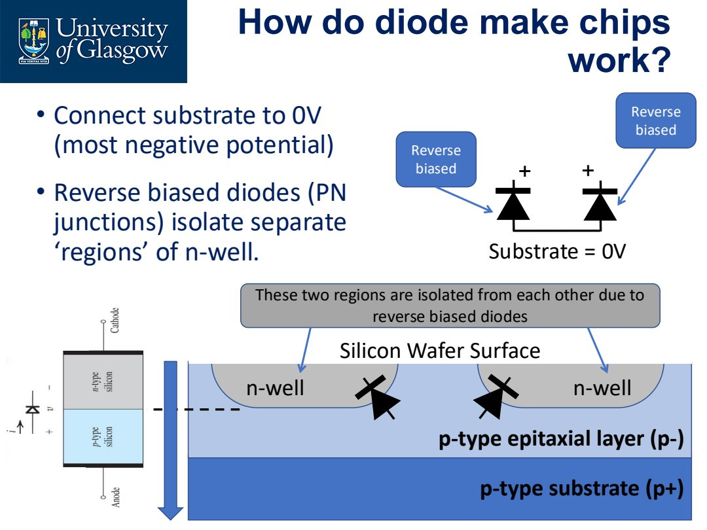

典型连接方式：

- p-type substrate 接最低电位，通常是 0 V；
- n-well 与 p-substrate 之间形成 pn junction；
- 当 junction reverse-biased 时，不同 n-well 区域被电隔离。

这解释了为什么 substrate / well bias 对 IC 正常工作很重要。如果 junction 不再 reverse-biased，隔离就会失效，可能出现 leakage、latch-up 或错误导通。

### Integrated Resistor

在 CMOS 中，resistor 可以由 n-well、polysilicon、metal 等材料实现。课件主要讲 n-well resistor。

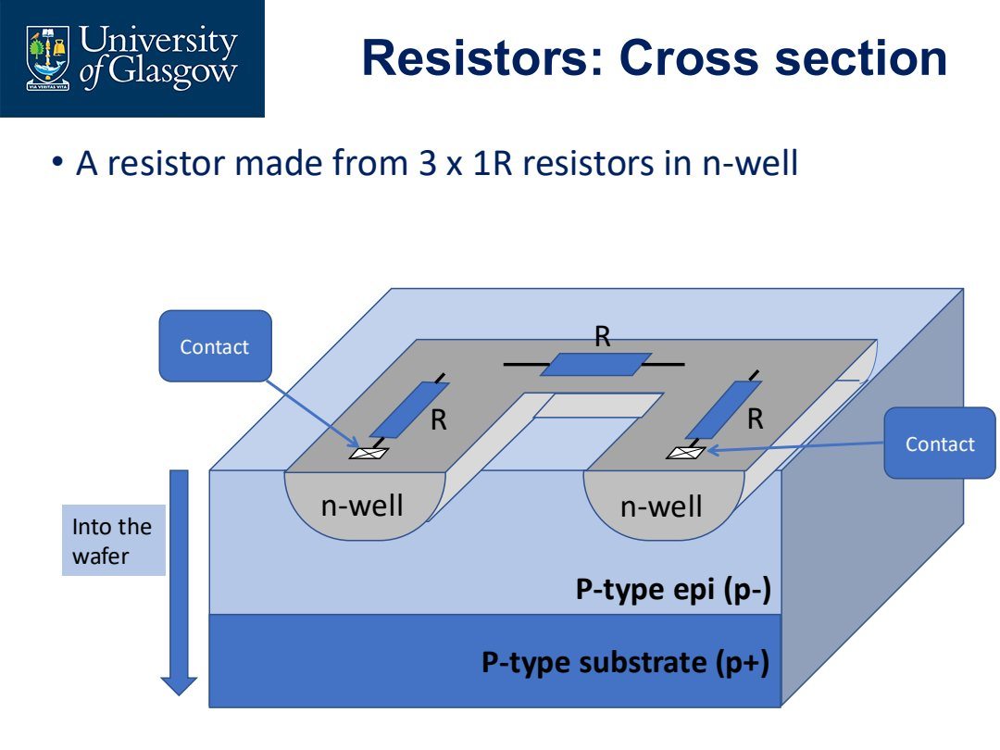

电阻基本公式：

$$
R=\rho\frac{L}{A}
$$

对于薄层材料，通常用 sheet resistance：

$$
R=R_{sheet}\frac{L}{W}
$$

其中：

- $R_{sheet}$ 单位是 $\Omega/\square$；
- $L/W$ 可以理解为 number of squares；
- 只要形状按比例缩放，square 数不变，电阻值就近似不变。

### Count the Squares

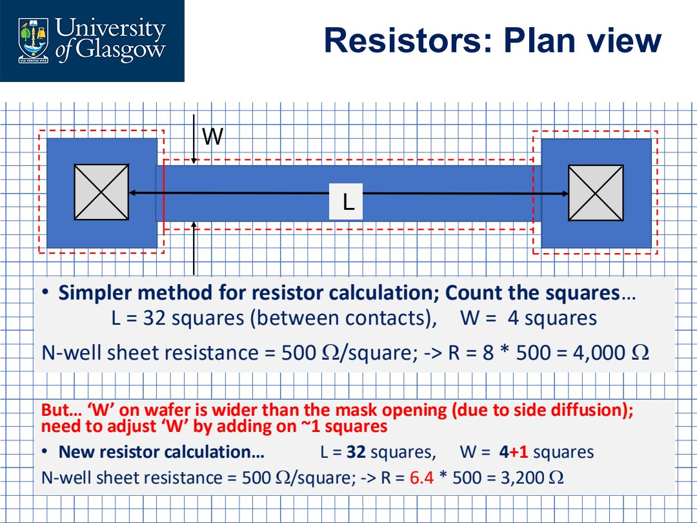

例如：

- $L=32$ squares；
- $W=4$ squares；
- $R_{sheet}=500\Omega/\square$。

理想计算：

$$
R=500\times\frac{32}{4}=4000\Omega
$$

但实际 layout 中，side diffusion 会让 wafer 上的 effective width 比 mask opening 更宽。若 $W$ 需要加约 1 square：

$$
R=500\times\frac{32}{5}=3200\Omega
$$

这个例子说明：layout geometry 和 process effect 会直接改变电气参数。

### Temperature and Process Tolerance

Integrated resistor 的 absolute value 很难精确：

- n-well sheet resistance 可能有 $\pm 20\%$ variation；
- doping 和 width variation 会改变 $R_{sheet}$；
- temperature coefficient 会带来温度漂移；
- -40°C 到 155°C 的范围内，resistance 可能变化明显。

因此 analog IC 中常常更依赖 **ratio / matching**，而不是 absolute resistor value。

### Serpentine Resistor

高阻值 resistor 需要更长路径，但 chip area 有限，所以常用 serpentine shape。

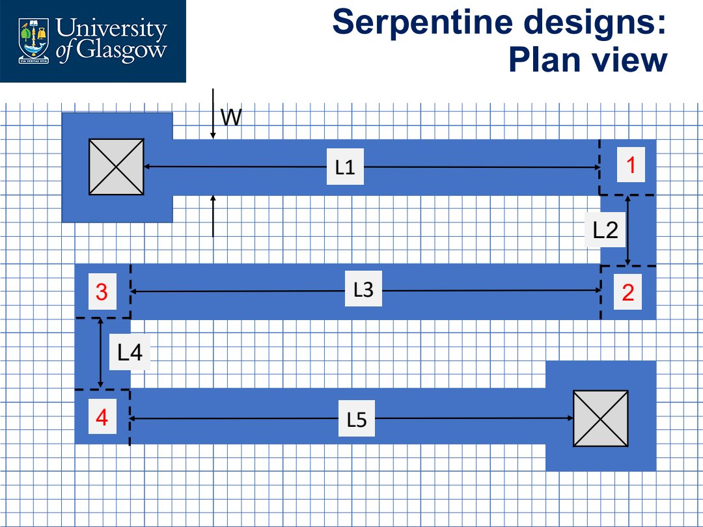

计算时不能只加直线长度，corner 也要计入。课件给出的规则是每个 corner 约等于 0.5 squares：

$$
R=R_{sheet}\frac{L_1+L_2+L_3+L_4+L_5+4\times0.5}{W+1.0}
$$

这个公式的意义是：版图不是几何画图而已，corner、diffusion、contact 都会进入电路参数。

### Resistor Matching

Absolute resistor 难精确，但 identical resistors 可以 match 得很好。好的 matching 需要：

- same length；
- same width；
- same orientation；
- same edge environment；
- same nearby features；
- symmetrical placement。

如果 adjacent features 不同，side diffusion 会不同，导致两个 nominally identical resistors 实际值不同。

### Dummy Resistors

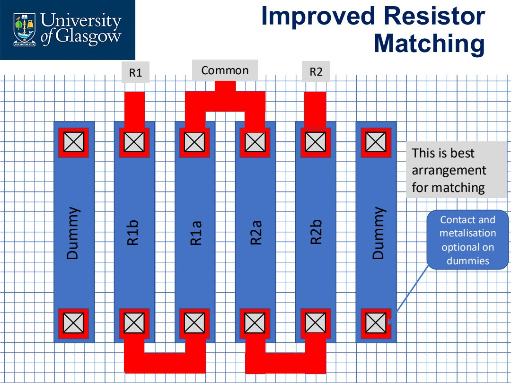

Dummy resistor 没有电气功能，目的是让真正使用的 resistor 看到相同的边缘环境。

例如 R1 和 R2 两边都放 dummy，可以减少边缘 diffusion 差异，使 matching 更好。

### Common Centroid

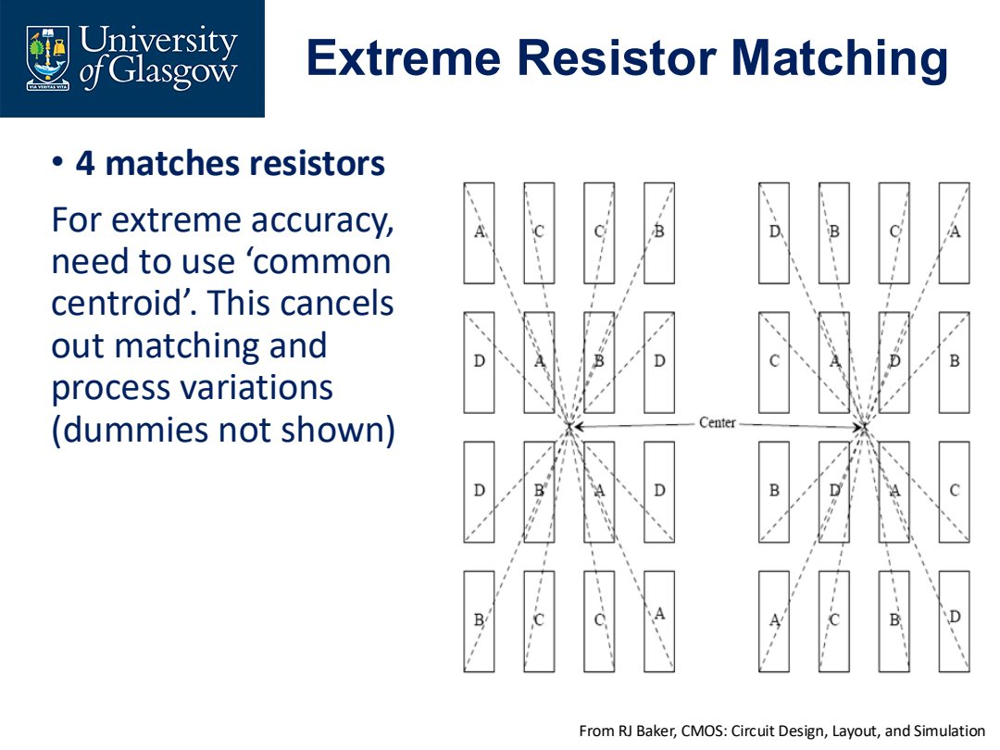

Common centroid 用于更高精度 matching。核心思想是把多个单元交错、对称放置，使线性 process gradient 被抵消。

例如四个 matched resistors 如果直接排成一排，左到右的工艺梯度会让它们不同。Common-centroid layout 通过空间平均让每个 resistor 受到相似的工艺环境。

### Integrated Capacitor

CMOS 中 capacitor 通常由两层 conductive plates 和中间 dielectric 形成。

基本公式：

$$
C=\epsilon_0\epsilon_r\frac{A}{d}
$$

其中：

- $A$ 是 plate area；
- $d$ 是介质厚度；
- $\epsilon_r$ 对 $SiO_2$ 约为 3.9；
- oxide 越薄，capacitance density 越大。

课件例子：

- $t_{ox}=20nm$ 时约 $1.75fF/\mu m^2$；
- $100\mu m \times 100\mu m$ 面积约 $17.5pF$；
- oxide 更薄时 capacitance density 可显著提高。

### Poly-Poly Capacitor 与 Parasitics

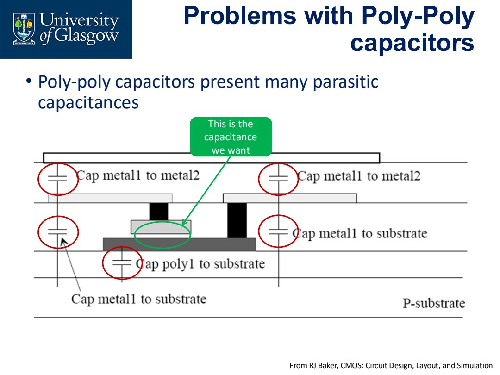

Poly-poly capacitor 的目标 capacitance 是两层 poly 之间的电容。但实际结构还会产生 parasitic capacitance，例如 plate 到 substrate、plate 到邻近层之间的电容。

这对 analog circuit 很重要：

- compensation capacitor 的 parasitics 会改变 pole/zero；
- switched-capacitor circuit 中 parasitics 会影响 charge transfer；
- layout 中 shield、bottom plate、routing 都会影响实际电容。

### On-Chip Inductor

课件总结提到：on-chip inductor 很少见，但在 multi-layer metal process 中可以实现。

原因：

- 占面积大；
- quality factor 受 metal resistance 和 substrate loss 限制；
- parasitic capacitance 会降低高频性能。

所以普通 analog/mixed-signal IC 中，resistor/capacitor 更常见，inductor 只在 RF 等场景更常见。

### 本讲要点

- pn junction 既是 diode，也定义 IC 中很多 isolation boundary。
- Reverse-biased junction 是 CMOS 区域隔离的基础。
- Integrated resistor 常用 sheet resistance 和 square counting 计算。
- Absolute resistance 很难准，matching 往往更重要。
- Dummy 和 common-centroid 是提高 matching 的重要 layout 技巧。
- Integrated capacitor 由 plate area、oxide thickness 和 dielectric 决定。
- Parasitic capacitance 是 capacitor layout 中必须考虑的问题。

---

## Lec.6 MOS 晶体管

> **_MOS Transistor_**

上一讲看的是 CMOS process 中的 passive / structural components：diode、resistor、capacitor。这一讲进入 active device：MOS transistor。后面所有 digital logic、analog amplifier、current source、switching delay 都建立在 MOSFET 的符号、结构、工作区和电气特性上。

### MOS Transistor 的端口

MOSFET 有四个重要端口：

- **Gate (G)**：控制端，理想情况下 gate current 很小；
- **Source (S)**：载流子进入 channel 的参考端；
- **Drain (D)**：载流子离开 channel 的端；
- **Body / Bulk (B)**：衬底或 well，影响 threshold voltage。

在很多简化电路中 body 被省略，但在 IC 设计中 body effect、well connection、substrate isolation 都不能完全忽略。

### NMOS 和 PMOS 的电压约定

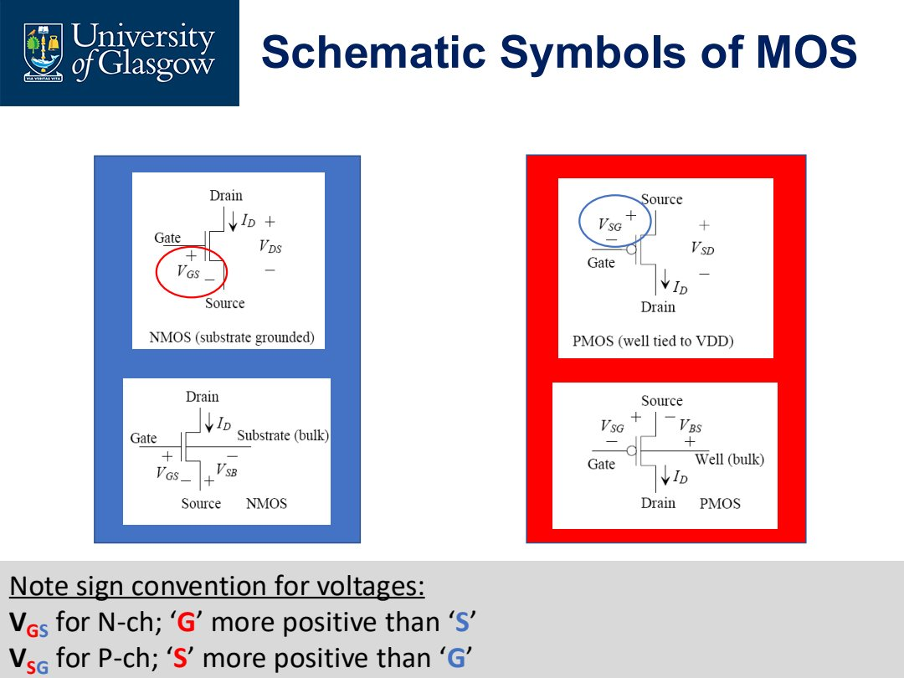

NMOS 通常用：

$$
V_{GS}=V_G-V_S
$$

导通需要 gate 比 source 更正：

$$
V_{GS}>V_T
$$

PMOS 通常用：

$$
V_{SG}=V_S-V_G
$$

导通需要 source 比 gate 更正：

$$
V_{SG}>|V_T|
$$

记忆方式：

- NMOS：gate high turns on；
- PMOS：gate low turns on。

### Common Source 视角

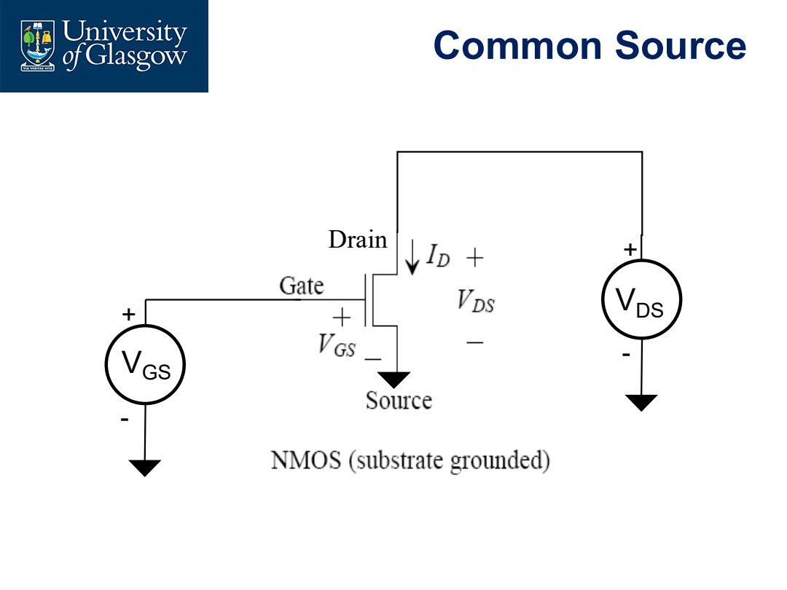

Common Source 是理解 MOSFET 的基本连接方式。以 NMOS 为例：

- source 常接 low potential / ground；
- drain 接输出或 load；
- gate 控制 channel；
- $V_{GS}$ 控制是否形成 channel；
- $V_{DS}$ 决定 channel 中电流和工作区。

后续 amplifier、switch、inverter 的分析都会反复回到 common-source intuition。

### Enhancement NMOS 的物理结构

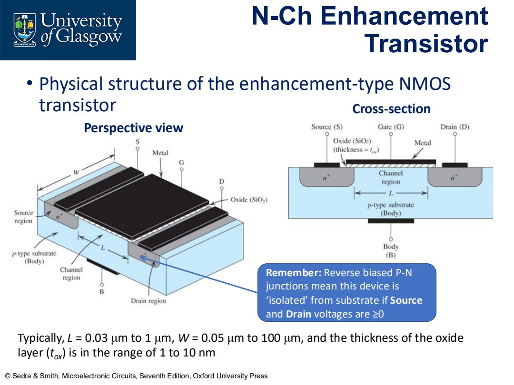

Enhancement-type NMOS 的典型结构：

- p-type body / substrate；
- n+ source 和 n+ drain；
- gate oxide；
- gate electrode。

source/drain 与 p-body 之间形成 pn junction。只要 source/drain 电压不低于 substrate，这些 junction 保持 reverse-biased，器件与 substrate 隔离。

典型尺寸范围：

- $L$：约 $0.03\mu m$ 到 $1\mu m$；
- $W$：约 $0.05\mu m$ 到 $100\mu m$；
- oxide thickness：约 1 到 10 nm。

这些数字说明 MOSFET 是一个强烈依赖 geometry 和 process 的器件。

### NMOS 导通行为

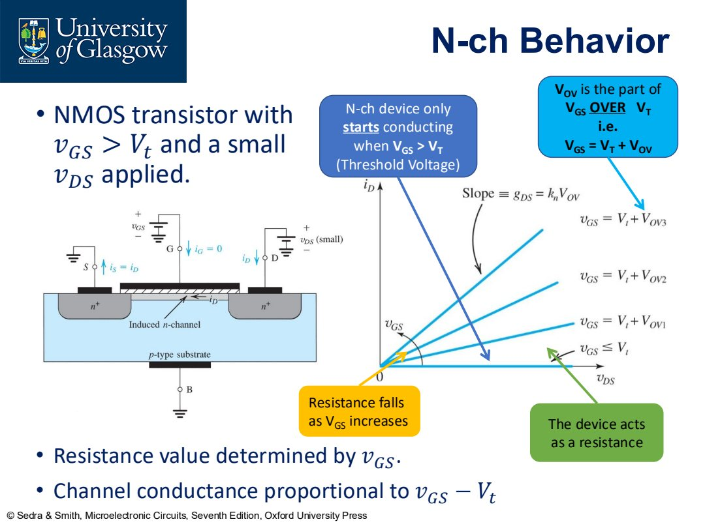

NMOS 开始导通的条件：

$$
V_{GS}>V_T
$$

Overdrive voltage 定义为：

$$
V_{OV}=V_{GS}-V_T
$$

当 $V_{GS}$ 刚超过 threshold 时，channel 形成，器件开始像 voltage-controlled resistance。$V_{GS}$ 越高，channel conductance 越大，等效 resistance 越低。

可以用一句话抓住直觉：

> NMOS gate 越高，source-drain 通路越容易导电。

### NMOS I-V Curves

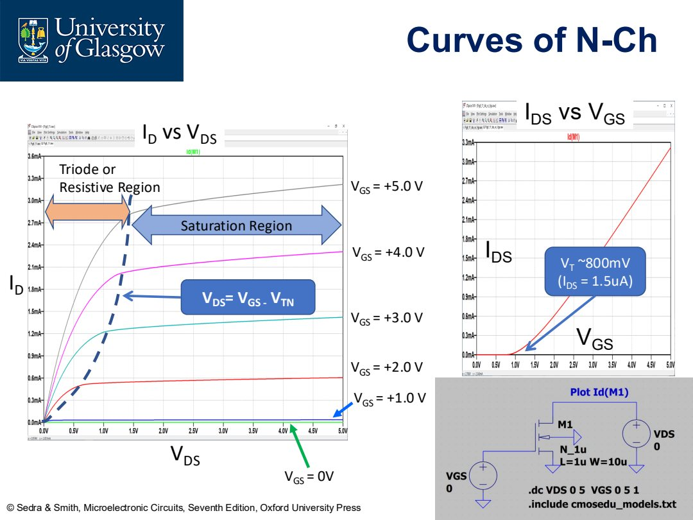

NMOS 的 $I_D$-$V_{DS}$ 曲线分两个主要区域：

#### Triode / Resistive Region

当 $V_{DS}$ 较小，器件像一个受 $V_{GS}$ 控制的 resistor。

特点：

- $I_D$ 随 $V_{DS}$ 增加；
- channel 尚未 pinch off；
- 常用于 MOS switch / pass transistor 近似。

#### Saturation Region

当：

$$
V_{DS}\ge V_{GS}-V_T
$$

器件进入 saturation。理想长沟道模型下，$I_D$ 主要由 $V_{GS}$ 决定，对 $V_{DS}$ 不太敏感。

Saturation 是 analog amplifier 和 current source 最常用的工作区。

### Process Transconductance Parameter

课件给出：

$$
k'_n=\mu_n C_{ox}
$$

其中：

- $\mu_n$ 是 electron mobility；
- $C_{ox}$ 是 oxide capacitance per unit area；
- $W$ 是 transistor width；
- $L$ 是 transistor length。

MOSFET 电流能力与 $W/L$ 有关。粗略地说：

- 增大 $W$：电流能力变强，电阻变小，capacitance 也变大；
- 增大 $L$：电流能力变弱，但输出电阻、matching、analog behavior 可能改善。

这就是为什么 IC 设计里经常说 “sizing transistor”。

### PMOS 与 NMOS 的关系

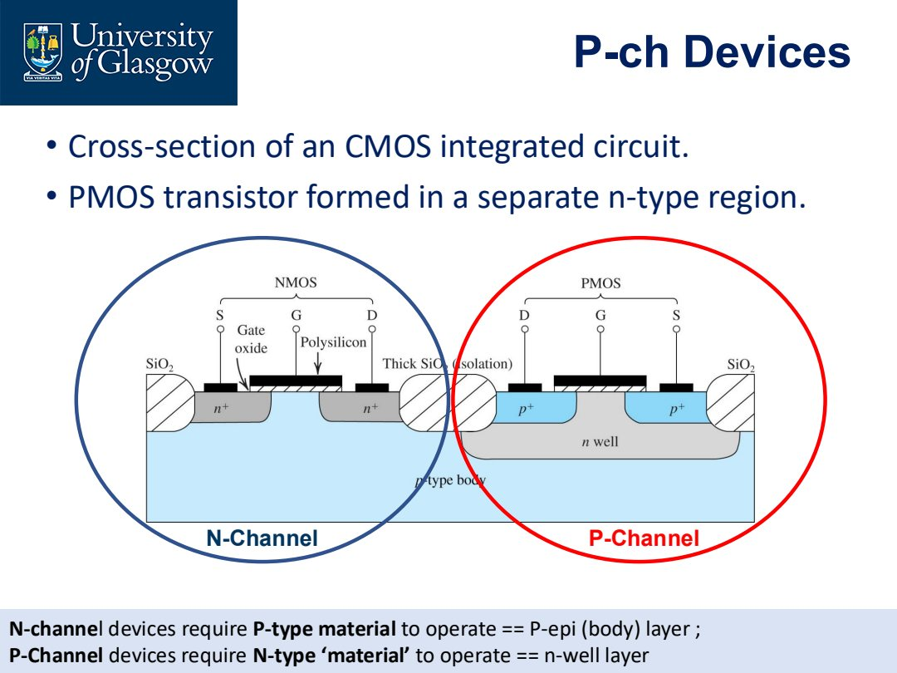

CMOS process 中：

- NMOS 通常做在 p-type body / p-epi 中；
- PMOS 做在 n-well 中；
- PMOS 的 source 通常接 $V_{DD}$；
- NMOS 的 source 通常接 ground。

PMOS 和 NMOS 的操作类似，但电压方向上下颠倒。

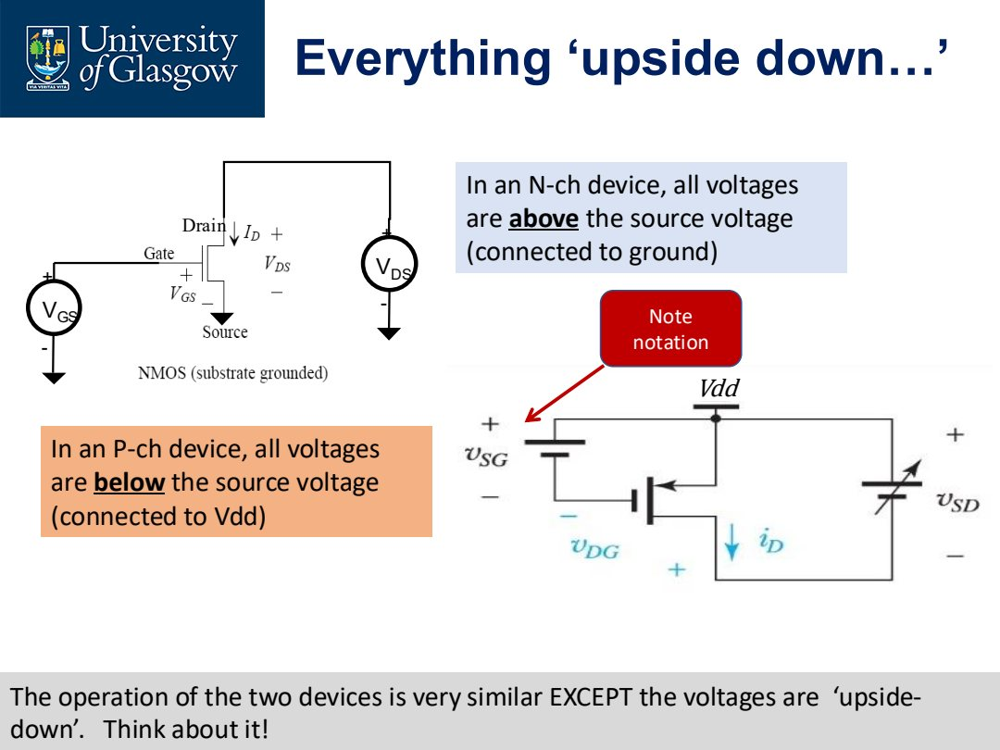

记忆：

- NMOS：所有关键电压通常相对 source 向上；
- PMOS：所有关键电压通常相对 source 向下；
- NMOS 用 $V_{GS}$、$V_{DS}$；
- PMOS 常用 $V_{SG}$、$V_{SD}$。

### Body Effect

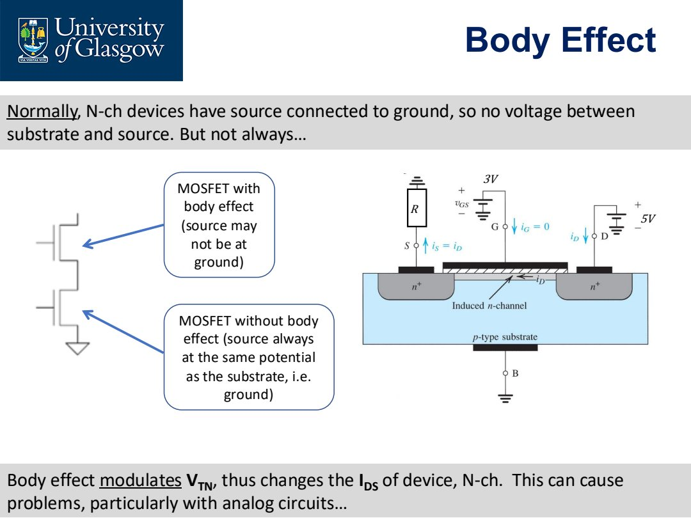

如果 source 和 body 不在同一电位，threshold voltage 会改变，这叫 **body effect**。

直觉：

- NMOS source 通常接 ground，body 也接 ground，此时 body effect 小；
- 如果 source 不在 ground，而 body 仍在 ground，$V_{SB}$ 不为 0；
- $V_T$ 被调制，进而改变 $I_D$；
- analog circuit 中这会改变 bias current、gain、operating point。

Body effect 在以下场景尤其重要：

- source follower；
- stacked transistors；
- pass transistor；
- analog switches；
- current mirror；
- substrate/well bias 不理想的 layout。

### 本讲要点

- MOSFET 的四端口是 G/D/S/B，body 不能总是假装不存在。
- NMOS gate high turns on，PMOS gate low turns on。
- $V_{OV}=V_{GS}-V_T$ 是理解导通强度的重要量。
- Triode region 像可变电阻，saturation region 常用于 amplifier/current source。
- $k'_n=\mu_n C_{ox}$，器件能力与 $W/L$ 强相关。
- PMOS 和 NMOS 电压方向相反，但工作逻辑类似。
- Body effect 会调制 threshold voltage，是 analog IC 中的重要非理想因素。

