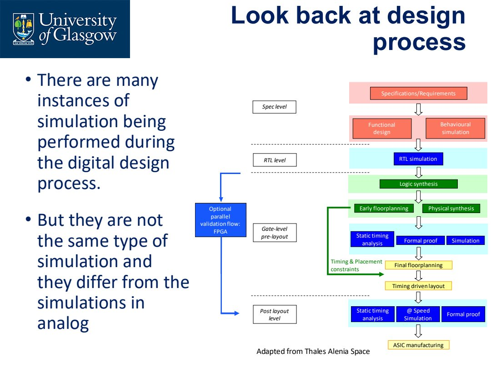

# Lecture 2.2 VHDL Fundamentals

> 对应 Lecture 2.2 VHDL 1。
>
> Source notes:
- DIC/DIC_part2_lecture_notes/lec3_vhdl_fundamentals.md


---

## Lec.3 VHDL Fundamentals

> Source: `PPT/2/Lecture 2.2_VHDL 1_2026.pdf`

这一讲的目标是建立 VHDL 的基本思维：**VHDL 不是普通程序语言，而是硬件描述语言**。写出来的语句最终要对应电路、寄存器、组合逻辑或仿真结构。

### 1. HDL 在数字 IC 流程中的位置

数字设计会经历多层次仿真：spec/behavioral、RTL、gate-level、post-layout。不同阶段的仿真对象不同，不能混为一谈。



常见层次：

| 层次 | 设计对象 | 主要验证 |
|---|---|---|
| Specification / Behavioural | 功能意图 | 功能是否符合需求 |
| RTL | registers + combinational logic | 时钟周期级行为 |
| Gate-level pre-layout | synthesis 后的 gates | 逻辑等价、粗略 timing |
| Post-layout | 带布局布线寄生 | timing closure、速度、物理效应 |

**RTL simulation** 不是“随便跑一下代码”，而是在寄存器传输级检查时序电路的周期级行为。

### 2. VHDL 的背景

VHDL 全称是 **VHSIC Hardware Description Language**，其中 VHSIC 是 *Very High Speed Integrated Circuit*。它是工业标准 HDL 之一，常见标准包括：

- IEEE 1076：VHDL 语言标准；
- IEEE 1164：`std_logic` / `std_logic_vector` 等多值逻辑；
- VHDL-AMS：扩展到 mixed-signal simulation。

常见工具厂商包括 Synopsys、Cadence、Mentor/Siemens、Xilinx/AMD、Intel/Altera 等。

### 3. 为什么普通编程语言不适合直接描述电路

以 half-adder 为例，C 语言会顺序执行：

```c
sum = xor(a, b);
Cout = and(a, b);
```

但真实电路中，XOR gate 和 AND gate 是同时响应输入变化的。硬件描述语言必须表达这种并行传播。

VHDL 的核心差异：

- concurrent statements 表示硬件并行存在；
- statement 顺序不一定代表执行顺序；
- 信号变化和传播延迟可以被建模；
- `process` 内部才是顺序执行结构。

### 4. Concurrent statements

在 `process` 之外的 signal assignment 是 concurrent 的。例如 half-adder：

```vhdl
sum   <= x xor y after 5 ns;
carry <= x and y after 5 ns;
```

下面两段等价：

```vhdl
sum   <= x xor y after 5 ns;
carry <= x and y after 5 ns;
```

```vhdl
carry <= x and y after 5 ns;
sum   <= x xor y after 5 ns;
```

因为它们描述的是两块同时存在的硬件，而不是两行顺序执行的程序。

### 5. Entity 与 Architecture

完整 VHDL module 通常由两部分构成：

- `entity`：定义模块边界，也就是 ports；
- `architecture`：定义模块内部如何实现功能。

基本模板：

```vhdl
entity entity_name is
  port (
    A : in  std_logic;
    F : out std_logic
  );
end entity_name;

architecture Behavioral of entity_name is
begin
  -- circuit description
end Behavioral;
```

port declaration 的一般形式：

```vhdl
signal_name : mode type [:= initial_value];
```

常见 `mode`：

| Mode | 含义 |
|---|---|
| `in` | 输入，只从模块外部进入 |
| `out` | 输出，给外部读取 |
| `inout` | 双向端口，谨慎使用 |

初学时不要滥用 `inout`。如果只是内部需要读某个输出，通常应使用内部 signal 或较新的 VHDL 支持，而不是随便把端口改成 `inout`。

### 6. 基本语法规则

VHDL 的几个容易丢分规则：

- 不区分大小写；
- identifier 必须以字母开头；
- identifier 可以包含字母、数字、underscore；
- identifier 不能以下划线结尾；
- 每条语句以 semicolon `;` 结束；
- `--` 后面是注释；
- 所有输入/输出 signal 都要声明 type；
- `1Sig`、`Sig_` 这类 identifier 不合法。

### 7. Library 与 package

常见开头：

```vhdl
library IEEE;
use IEEE.STD_LOGIC_1164.ALL;
```

含义：

- `library IEEE;` 让 IEEE library 可见；
- `use IEEE.STD_LOGIC_1164.ALL;` 引入 `std_logic`、`std_logic_vector` 等定义；
- 没有显式 `use` 的 package 不会自动可用。

如果需要算术运算，常见还会使用：

```vhdl
use IEEE.NUMERIC_STD.ALL;
```

但要注意课程强调的是硬件描述，不是把 VHDL 当高级程序语言写。

### 8. 三种 description style

同一个电路可以用不同层次描述。

| Style | 描述重点 | 常见形式 | 适用场景 |
|---|---|---|---|
| Behavioural | 电路做什么 | `process`、`if`、`case` | 复杂行为、顺序逻辑 |
| Data flow | 信号如何通过逻辑表达式传播 | Boolean expression | 组合逻辑 |
| Structural | 电路由哪些组件连接而成 | `component` + `port map` | gate/register level、模块复用 |

以 2-to-1 MUX 为例，data flow 写法很直接：

```vhdl
architecture DataFlow of MUX2to1 is
begin
  Y <= ((not S) and I0) or (S and I1);
end DataFlow;
```

Behavioural 写法通常放在 `process` 里：

```vhdl
architecture Behavioral of MUX is
begin
  process (S, I0, I1)
  begin
    if S = '0' then
      Y <= I0;
    elsif S = '1' then
      Y <= I1;
    else
      Y <= I1;
    end if;
  end process;
end Behavioral;
```

Structural 写法则显式声明并实例化组件：

```vhdl
architecture Structural of MUX_2to1 is
  signal S1, S2, S3 : std_logic;

  component INV
    port (O : out std_logic; I : in std_logic);
  end component;

  component NAND2
    port (O : out std_logic; I0, I1 : in std_logic);
  end component;
begin
  G1: INV   port map (O => S1, I => S);
  G2: NAND2 port map (O => S2, I0 => I0, I1 => S1);
  G3: NAND2 port map (O => S3, I0 => I1, I1 => S);
  G4: NAND2 port map (O => Y,  I0 => S2, I1 => S3);
end Structural;
```

### 9. Process：顺序语句的容器

组合逻辑可以用 concurrent assignment；但 flip-flop、register、counter 这类顺序电路需要状态记忆，通常用 `process` 描述。

基本结构：

```vhdl
process (sensitivity_list)
begin
  sequential_statements;
end process;
```

运行机制：

- sensitivity list 中任一信号变化时，process 被触发；
- process 内语句按顺序执行一次；
- 之后等待下一次触发。

组合逻辑 process 的 sensitivity list 应包含所有读入信号；时序逻辑 process 通常只包含 clock 和 asynchronous reset。

### 10. `IF ... THEN`

`if` 只能写在 `process` 或类似 sequential context 中：

```vhdl
if expression then
  statement;
elsif expression then
  statement;
else
  statement;
end if;
```

注意关键字是 `elsif`，不是 `elseif` 或 `else if`。

### 11. `CASE ... WHEN`

`case` 也必须写在 `process` 中：

```vhdl
case variable is
  when value_1 =>
    statement;
  when value_2 =>
    statement;
  when others =>
    statement;
end case;
```

对于 `std_logic` 或 `std_logic_vector`，`others` 很重要，因为信号可能不只有 `'0'` 和 `'1'`，还可能有 `'U'`、`'X'`、`'Z'` 等仿真值。

### 12. 写 VHDL 时的硬件意识

课程特别提醒：VHDL 是 **hardware description language**，不是普通 programming language。

这意味着：

- 不要随便写 loop，以为综合器会“自动理解”；
- 每个 signal assignment 都应能想象出对应硬件；
- process 描述的不是 CPU 执行程序，而是触发后的电路行为；
- 能综合不代表电路好，能仿真不代表能综合。

### 13. 本讲必须带走的结论

- VHDL 的外部接口由 `entity` 定义，内部实现由 `architecture` 定义。
- process 外的 assignment 是 concurrent，process 内语句是 sequential。
- Behavioural、Data Flow、Structural 是三种描述风格，不是三种不同电路。
- `if` 和 `case` 必须在 process 中使用。
- 写 VHDL 时要一直问：这行代码最终对应什么硬件？

