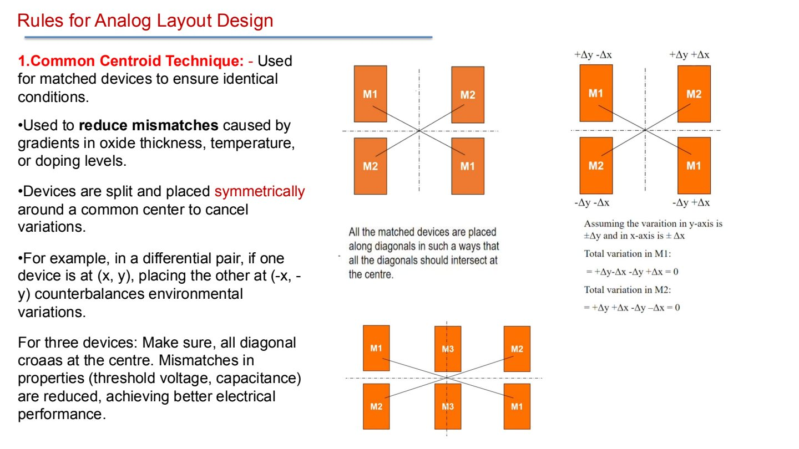
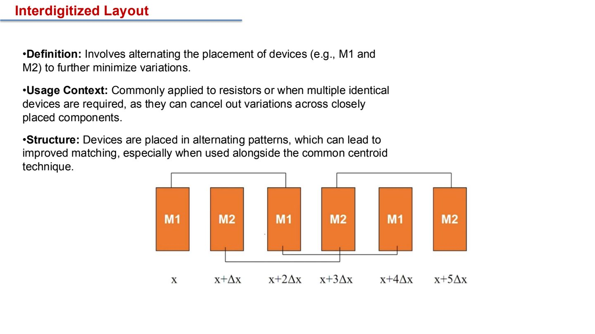
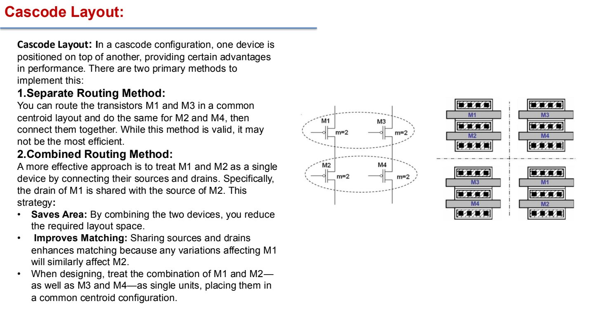
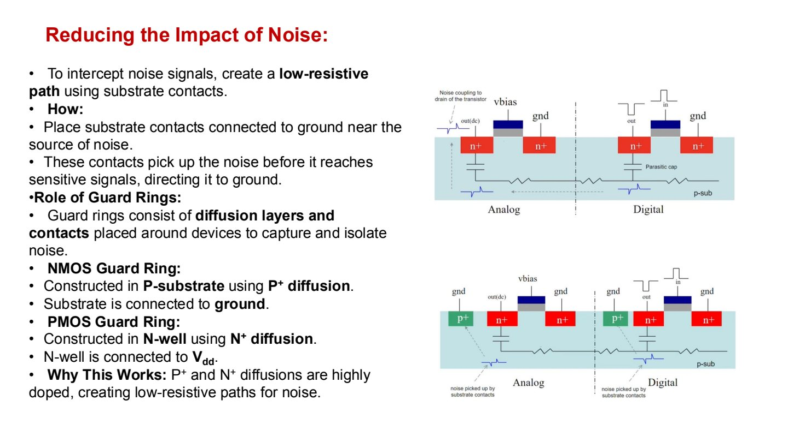
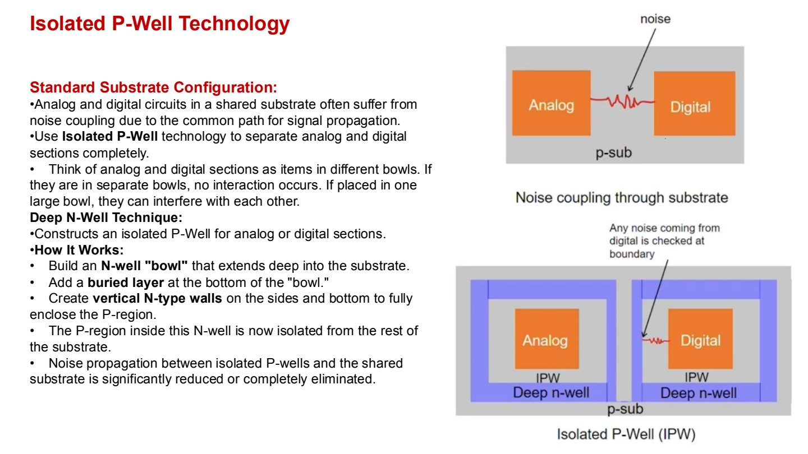
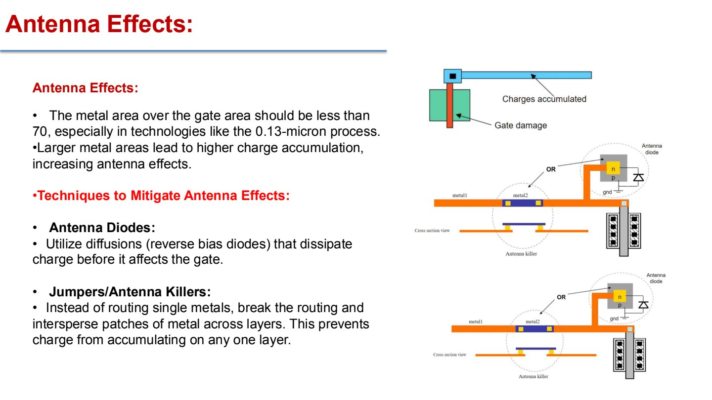

# Lecture 2.3 Analog Layout Design Guidelines

> 课件文件名没有显式 2.3 编号；这里按 Part 2 结构归入 2.3。
>
> Source notes:
- DIC/DIC_part2_lecture_notes/lec5_analog_layout_guidelines.md


---

## Lec.5 Analog Layout Design Guidelines

> Source: `PPT/2/Analog Layout DesignGuidelines Lecture 2025.pdf`

这一讲从 analog layout 的角度回答一个核心问题：**为什么原理图正确还不够？** 版图是 fab 真正能理解的物理制造信息，包含 diffusion、poly、metal、contact、via、spacing、device dimensions 等几何规则。模拟电路性能常常由 mismatch、noise coupling、IR drop、parasitics、latchup、antenna effect 等版图问题决定。

### 1. Layout 是电路意图的物理翻译

Layout 是用多层几何图形描述芯片如何制造。它定义：

- 哪些 mask/layers 被使用，例如 diffusion、poly、metal；
- layers 之间的 spacing；
- MOSFET 的 $W/L$、contacts 数量、finger 数；
- metal routing 宽度和走线层；
- contact/via 如何连接不同层。

Fab 不理解“这是一个高精度差分对”这种设计意图。它只按 layout mask 制造。因此 analog layout 的任务是把电路意图转化成能抵抗工艺误差和噪声的几何结构。

### 2. Matching 的核心：让误差变成共同误差

Analog matching 的目标不是让器件“绝对正确”，而是让匹配器件受到尽可能相同的工艺环境影响。常见 mismatch 来源包括：

- oxide thickness gradient；
- doping gradient；
- temperature gradient；
- etching / CMP edge effect；
- routing resistance / parasitic capacitance 差异。

#### Common centroid

Common centroid 把匹配器件拆分后围绕同一个几何中心对称摆放，使一阶空间梯度互相抵消。



直觉理解：

- 如果 M1 某一半处在 `+dx` 区域，另一半应尽量处在 `-dx` 区域；
- M2 也经历相同的平均环境；
- 对称中心相同，梯度造成的平均误差趋向相等；
- 三个或奇数个器件时，单个器件通常放在中心，其他器件围绕中心平衡。

#### Interdigitized layout

Interdigitized layout 交替摆放器件单元，例如：

```text
M1 M2 M1 M2 M1 M2
```

它适合多个相同 unit device 或 matched resistors，可以进一步平均局部变化。常与 common centroid 结合使用。



#### Dummy devices

Dummy devices 是不参与电路功能的复制单元，放在 matched devices 边缘，用来消除边界环境差异。

用途：

- 减少 etching / doping / CMP 的 edge effect；
- 让最外侧 active devices 和中间 devices 看到相似邻居；
- 改善 resistor、capacitor、MOS array 的匹配。

Dummy 通常不接信号，或接到安全电位，具体取决于工艺规则和电路需求。

### 3. Orientation 与 routing matching

匹配器件不仅要尺寸相同，还应具有相同 orientation 和 current direction。

例如一对匹配 MOS：

- source/drain 方向尽量一致；
- 电流方向一致；
- gate routing 层和长度尽量一致；
- matched signals 使用相同 metal layer 并一起走线；
- 不要让其中一个器件多绕远路，另一个直接连接。

如果某个器件必须多经过一段 route，常用 dummy route 让另一个器件看到类似的寄生环境。

### 4. Cascode layout

Cascode 结构中，上下两个 transistor 串接。版图上可以分开 route，也可以把上下管当作一个组合单元，共享 diffusion。



更推荐的思路：

- 把 M1/M2 组合成一个单元，M3/M4 组合成一个单元；
- 共享 drain/source diffusion，减少面积；
- 减少寄生电容和串联电阻；
- 再把组合单元做 common centroid。

这体现了 layout 的一个重要原则：**电路拓扑相邻的器件，物理上也尽量用共享 diffusion 的方式减少寄生。**

### 5. Fingering

当 MOSFET 很宽时，单个巨大 transistor 不利于布线和寄生控制。Fingering 把大 W 拆成多个 fingers：

```text
total W = finger_width x number_of_fingers
```

好处：

- 每个 gate segment 更短，gate resistance 更低；
- source/drain 可以共享 diffusion；
- 便于并联多层 metal 承载大电流；
- 有利于电源 pad 或 output driver 连接；
- 大功率 FET 更容易满足 electromigration 要求。

但 finger 数也会改变寄生电容和 layout density，不能只看面积。

### 6. Analog / Digital 隔离

Mixed-signal IC 中，digital switching 会通过 substrate、supply、ground、capacitive coupling 干扰 analog blocks。因此布局上通常：

- analog blocks 集中放置；
- digital blocks 集中放置；
- analog 与 digital 保持距离；
- 电源/地尽量分区并在合适位置汇接；
- 使用 guard ring、substrate contact、deep N-well / isolated P-well。

### 7. Guard ring 与 substrate contacts

Substrate 是噪声传播路径之一。低阻 substrate contact 可以把噪声先导到 ground，减少它到达敏感 analog node。



常见规则：

- NMOS 在 P-substrate 中，guard ring 常用 P+ diffusion 接 ground；
- PMOS 在 N-well 中，guard ring 常用 N+ diffusion 接 $V_{DD}$；
- P+ / N+ 高掺杂区提供低阻路径；
- guard ring 要靠近噪声源或敏感电路边界；
- 对 precision analog block，guard ring 不是装饰，而是隔离结构。

### 8. Isolated P-Well / Deep N-Well

普通 shared substrate 中，analog 和 digital 可能通过共同 p-sub 发生 substrate coupling。Isolated P-Well 技术通过 deep N-well 形成“碗状隔离”。



结构理解：

- deep N-well 包围内部 P-well；
- 底部/侧壁形成 N-type 隔离边界；
- 内部 P-region 与外部 substrate 的噪声路径被切断或大幅增加阻抗；
- 常用于把 sensitive analog 与 noisy digital 分开。

### 9. Supply / Ground routing 与 decoupling

电源和地线不是理想节点。长金属线有 resistance，会产生 IR drop；switching current 会造成 ground bounce 和 supply noise。

设计原则：

- 不要在本地随意把多个模块电源短在一起再接 pad；
- 尽量使用 star connection 或明确的 power tree；
- high-current route 要加宽，必要时多层 metal stack；
- decoupling capacitor 放在被服务模块附近；
- analog 与 digital 的 return current path 要分清楚；
- matched devices 的 bias voltage 不要绕很远。

一句话：**电源线也是电路的一部分。**

### 10. Resistor layout

Matched resistors 常用 unit resistor 组合，但不能只追求 interdigitized。复杂 routing 会引入额外 resistance，反而破坏匹配。

实用原则：

- 优先使用相同 unit size；
- 用 series 连接简化路径；
- 必要时成对 common centroid；
- 避免某些 resistor 多出很长 routing；
- matched resistor 周围加 dummy；
- 高精度电路如 bandgap reference 中尤其注意 route-induced mismatch。

### 11. Latchup 与 ESD

Latchup 来自 CMOS 中寄生 PNP-NPN 结构。一旦寄生双极晶体管导通，可能形成从 $V_{DD}$ 到 ground 的低阻通路，导致芯片失效。

降低 latchup 风险：

- P-type / N-type diffusion 保持适当隔离；
- 使用 well/substrate ties；
- 增加 guard ring；
- 遵守 ESD device 的版图间距与连接规则；
- pad 附近 ESD NMOS/PMOS 要按工艺建议布局。

ESD 保护用于把外部高压放电导向安全路径，避免击穿 gate oxide。它本身也可能影响寄生结构，所以 pad-ring layout 不能随意摆放。

### 12. Antenna effect

制造过程中，长 metal 连接到 MOS gate 时可能积累电荷。若 metal area 相对 gate area 太大，电荷会损伤薄 gate oxide，这就是 antenna effect。



缓解方式：

- antenna diode：给电荷提供泄放路径；
- jumper / antenna killer：把长 metal 分段并切换到不同金属层；
- 避免超长 metal 直接挂在敏感 gate 上；
- 对 matched devices，避免 antenna diode 或 routing 差异造成 $V_T$ mismatch。

### 13. Electromigration 与 tiling

Electromigration 是高电流密度下金属原子迁移，可能导致开路或短路。

版图规则：

- 根据 peak current 和 average/DC current 计算 metal width；
- high-current route 尽量短；
- supply / ground 用高层 metal 或多层并联；
- 大电流转角避免 90 degree sharp bend，优先 45 degree 或圆滑过渡；
- 多模块供电时，主干线宽度要承载总电流。

Tiling / metal fill 用于满足 CMP 和密度规则：

- fill 要均匀分布；
- critically matched devices 附近避免随机 automatic tiling；
- matched resistor/capacitor 周围最好手动控制 fill；
- metal stacking 可以帮助满足 density requirement。

### 14. Packaging 与 bonding

芯片最终还要连接到 package。常规 wire bonding 中，die pad 通过 bond wire 连到 lead frame。Wafer-Level Package (WLP) 则让 package 尺寸更接近 die。

需要记住：

- pad placement 会影响 bond wire 长度和寄生；
- package 和 bond wire 有电感/电阻，不是理想连接；
- 多 metal layers 提供不同层级的 routing 资源；
- IC layout 类似 multilayer PCB，但额外包含 diffusion、well、poly 等器件层。

### 15. Analog layout checklist

| 问题 | 检查点 |
|---|---|
| Matching | same unit size、common centroid、interdigitized、dummy |
| Orientation | source/drain/current direction 是否一致 |
| Routing | matched signals 是否同层、同长度、同环境 |
| Noise | analog/digital 是否隔离，guard ring/substrate contacts 是否足够 |
| Power | IR drop、star connection、decap placement |
| Reliability | latchup、ESD、antenna、electromigration |
| Density | tiling/fill 是否影响 matched devices |

### 16. 本讲必须带走的结论

- Layout 是 fab 真正制造的输入，不是 schematic 的附属品。
- Analog matching 靠几何对称、相同环境和相同 routing。
- Guard ring、substrate contact、deep N-well 用于降低 substrate noise。
- Power/ground route、decap、IR drop 会直接影响 analog 性能。
- Antenna、latchup、ESD、electromigration 是 layout 必须处理的可靠性问题。

