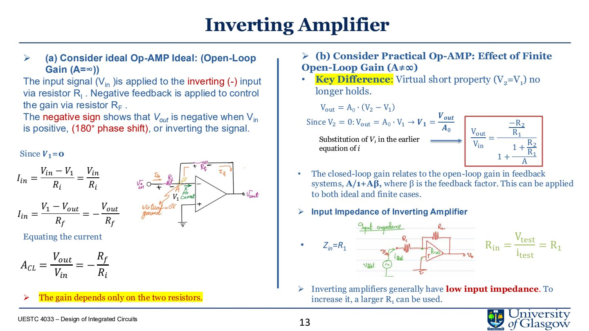
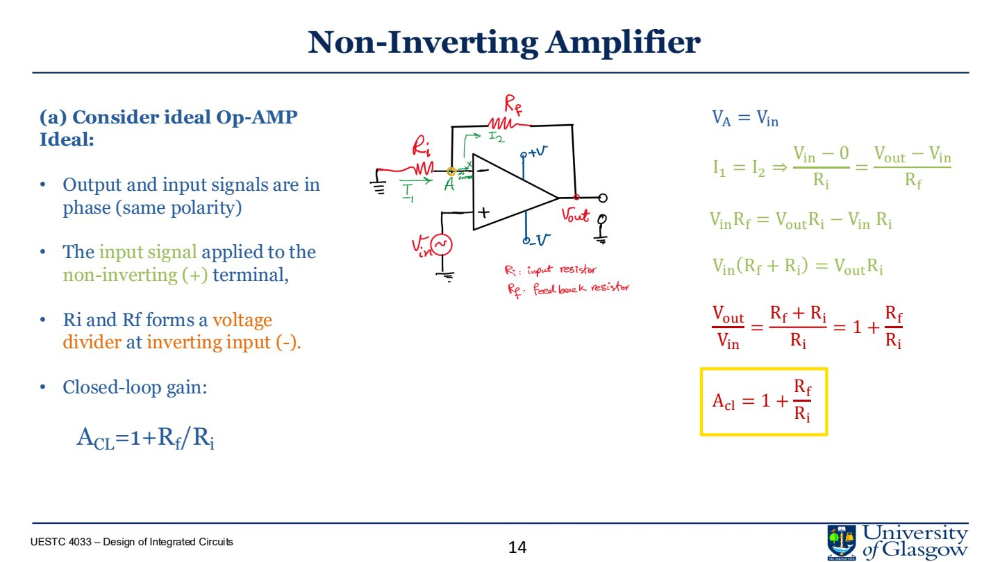
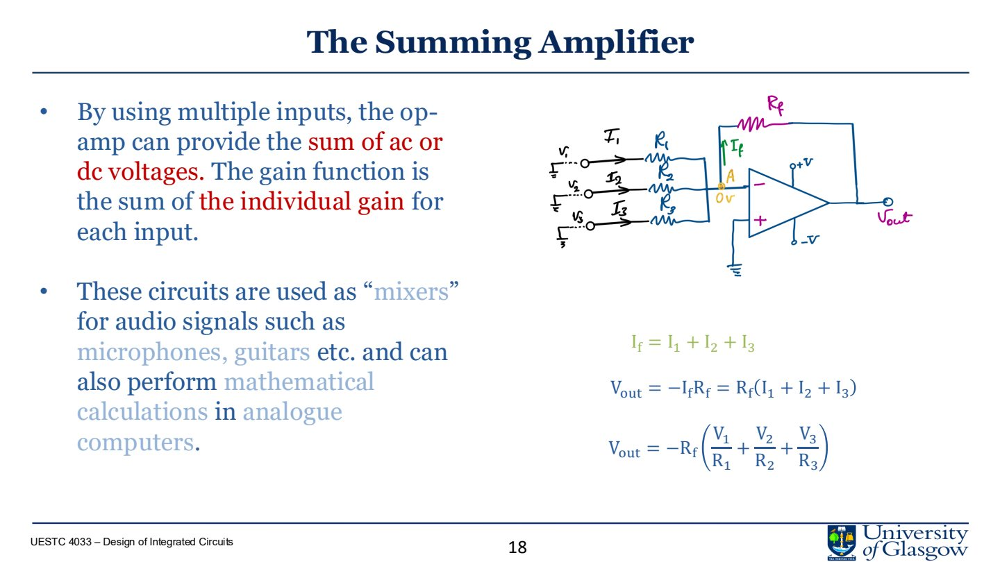
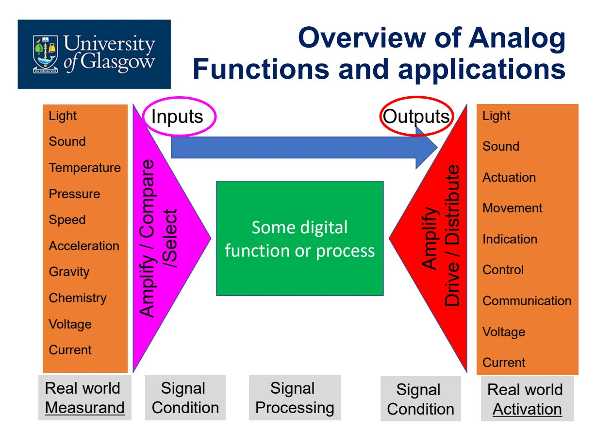
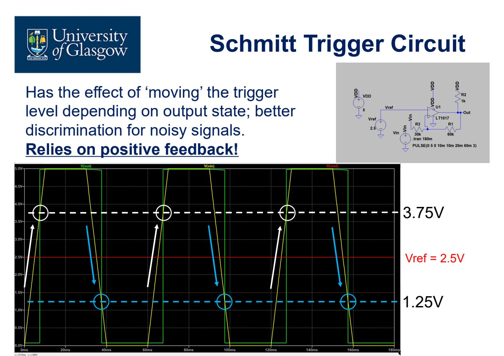
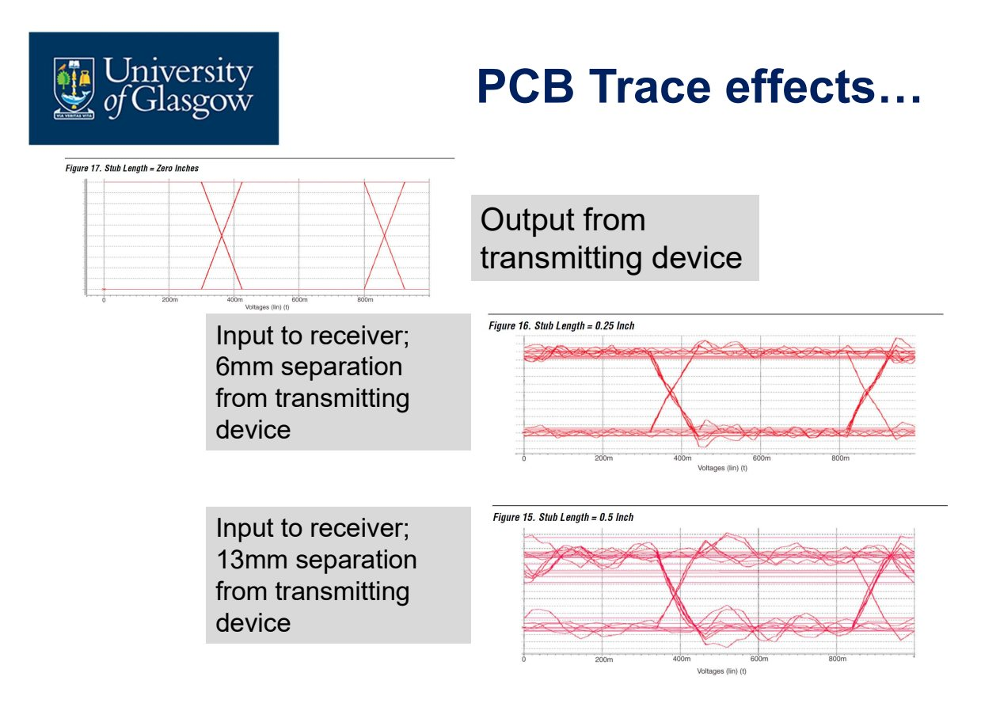

# Lecture 3.1 Signal Conditioning and Schmitt Trigger

> 合并 Lecture 3.1.1、3.1.2 相关笔记：op-amp/input-output conditioning 与 Schmitt trigger。
>
> Source notes:
- DIC/DIC_part3_lecture_notes/lec1_op_amp_signal_conditioning.md
- DIC/DIC_part3_lecture_notes/lec2_input_output_signal_conditioning.md
- DIC/DIC_part3_lecture_notes/lec3_schmitt_trigger_design.md

---

## Lec.1 Op-Amp Signal Conditioning

> Sources: `PPT/3/Lecture 3.1.1 Signal Conditioning.pdf`

Signal conditioning 的任务是把真实世界的模拟量整理成后级电路能可靠处理的信号。常见操作包括 amplification、attenuation、filtering、linearization、isolation。Op-amp 是其中最常用的 active building block。

### 1. 为什么需要 signal conditioning

传感器输出通常不是“直接可用”的：

- 电压太小，需要 amplification；
- 电压太大，需要 attenuation；
- 混有 noise/interference，需要 filtering；
- 传感器输出非线性，需要 linearization；
- 两个系统之间可能互相影响，需要 isolation。

数字处理有精度和存储优势，但现实信号首先是 analog。IC 设计者要解决的是：**如何把 analog signal 变成后级可识别、可处理、可转换的形式**。

### 2. Ideal op-amp 假设

理想 op-amp 的常用分析假设：

| Assumption | 含义 |
|---|---|
| $A_{OL}\to\infty$ | open-loop gain 无限大 |
| $R_{in}\to\infty$ | 输入端不吸收电流 |
| $R_{out}\to 0$ | 输出像理想电压源 |
| negative feedback 下 $V_+=V_-$ | virtual short |

实际 op-amp 不是理想的。741 这类器件会有有限 open-loop gain、有限 bandwidth、input bias current、output resistance、slew rate、CMRR 等限制。选 op-amp 时要按应用关注点取舍：

- high-speed：bandwidth、slew rate；
- precision：offset、input resistance、CMRR；
- low-noise：input noise、bias current；
- drive load：output current、output swing。

### 3. Open-loop vs closed-loop

Open-loop op-amp 没有 feedback：

$$
V_{out}=A_v(V_+-V_-)
$$

因为 $A_v$ 极大，open-loop 更像 comparator，而不是线性放大器。要做准确 gain，必须用 negative feedback。

Closed-loop 的核心好处：

- gain 由外部 resistor ratio 决定；
- 对 op-amp open-loop gain 变化不那么敏感；
- 改善 input/output resistance；
- 扩展可用 frequency response；
- 让电路更适合 precision amplification。

### 4. Inverting amplifier

理想情况下，反相端为 virtual ground：

$$
I_{in}=\frac{V_{in}}{R_i},\qquad I_f=-\frac{V_{out}}{R_f}
$$

输入端电流约等于反馈电流，因此：

$$
A_{CL}=\frac{V_{out}}{V_{in}}=-\frac{R_f}{R_i}
$$

要点：

- 输出相位反转 $180^\circ$；
- gain 主要由 $R_f/R_i$ 决定；
- input impedance 约等于 $R_i$，所以反相放大器输入阻抗不一定高；
- finite open-loop gain 会带来闭环增益误差。

### 5. Non-inverting amplifier

输入信号接到 non-inverting terminal，反馈分压回 inverting terminal：

$$
A_{CL}=1+\frac{R_f}{R_i}
$$

特点：

- 输出与输入同相；
- input impedance 很高；
- 适合高阻传感器或不能被加载的信号源；
- gain 最小为 1。

例：若传感器输出 $100\,\text{mV}$，需要 $6\,\text{V}$ 触发信号，则所需 gain 为：

$$
A=\frac{6}{0.1}=60
$$

若选择 $R_i=10\,\text{k}\Omega$：

$$
R_f=(A-1)R_i=590\,\text{k}\Omega
$$

### 6. Voltage follower / buffer

Voltage follower 是 gain = 1 的 non-inverting amplifier：

$$
V_{out}=V_{in}
$$

它看似没有放大电压，但能提供 impedance transformation：

- 输入阻抗很高，不加载前级；
- 输出阻抗很低，可以驱动后级或电容性负载；
- 常用于 sensor output 与 ADC input 之间的隔离。

### 7. Summing amplifier

多个输入通过电阻汇入反相节点：

$$
V_{out}=-R_f\left(\frac{V_1}{R_1}+\frac{V_2}{R_2}+\frac{V_3}{R_3}\right)
$$

如果 $R_1=R_2=R_3=R$：

$$
V_{out}=-\frac{R_f}{R}(V_1+V_2+V_3)
$$

它可以用于 analog mixing、weighted sum、模拟计算，也可以作为 DAC 输出级思想的一部分。

### 8. Differential amplifier

Differential amplifier 的目标是：

- 放大 differential input；
- 抑制 common-mode input。

定义：

$$
V_{id}=V_2-V_1,\qquad V_{cm}=\frac{V_1+V_2}{2}
$$

输出可写成：

$$
V_{out}=A_dV_{id}+A_{cm}V_{cm}
$$

理想情况 $A_{cm}=0$。实际用 Common Mode Rejection Ratio 衡量：

$$
CMRR=\frac{A_d}{A_{cm}}
$$

差分放大器中电阻匹配很关键。若电阻 ratio 不匹配，common-mode noise 会被转换成 output error。

### 9. Instrumentation amplifier

普通 differential amplifier 的输入阻抗有限，gain 和 input impedance 之间有 trade-off。Instrumentation amplifier 用前级 buffer/增益级提高输入阻抗，再用差分级相减。

特点：

- high input impedance；
- low output impedance；
- high CMRR；
- accurate differential gain；
- 适合 thermocouple、ECG、EEG、bridge sensor 等低幅度信号。

三 op-amp instrumentation amplifier 的核心思想是：

1. 两个输入先分别经过高阻 buffer/gain stage；
2. 中间电阻控制 differential gain；
3. 后级 differential amplifier 抑制 common-mode。

### 10. 本讲必须带走的结论

- Open-loop op-amp 更像 comparator；准确放大依赖 negative feedback。
- Inverting gain 为 $-R_f/R_i$，input impedance 约为 $R_i$。
- Non-inverting gain 为 $1+R_f/R_i$，input impedance 高。
- Buffer 不放大电压，但完成阻抗隔离。
- Differential / instrumentation amplifier 的关键是 common-mode rejection 和 resistor matching。

---

## Lec.2 Input and Output Signal Conditioning

> Source: `PPT/3/Lecture 3.1.1_Input_Output Signal Conditioning.pdf`

这一讲把 signal conditioning 放进系统接口中：信号从传感器进入 IC，也要从 IC 输出到另一个芯片、memory、PCB trace、actuator 或 LED。课程里的关键句可以记成：**IC designer 的工作不是到 chip edge 结束，而是到信号可靠到达目的地结束。**

### 1. Analog system 的输入输出链

真实世界的 measurand 经过 sensor element 变成 electrical signal，进入 conditioning、processing，再输出到 actuator 或通信接口。

常见输入：

- light、sound、temperature；
- pressure、movement、speed、acceleration；
- chemistry、voltage、current。

常见输出：

- actuation；
- indication/display；
- control；
- communication；
- voltage/current drive。

### 2. 输入信号调理

输入信号通常需要至少一种处理：

| 处理 | 目的 |
|---|---|
| Amplification | 小信号放大到 ADC/comparator 可识别范围 |
| Attenuation | 大信号缩小到安全输入范围 |
| Comparison | 和 reference 比较，形成 logic-level decision |
| Filtering | 去除高频/低频噪声和干扰 |

即使是“digital signal”，通过 cable 或 PCB 后也会表现出 analog 行为：rise/fall time、ringing、overshoot、threshold uncertainty 都会影响逻辑判断。

### 3. Logic input 不是理想 0/1

最简单的逻辑检测可以用 MOS inverter。但真实 inverter 有：

- threshold voltage；
- transition region；
- NMOS/PMOS 同时部分导通的区域；
- process/temperature variation；
- input noise。

因此，所谓 logic high/low 不是抽象的 1/0，而是带有 $V_{IH}$、$V_{IL}$、noise margin 的 analog voltage range。

### 4. Comparator input

Comparator 是 open-loop op-amp 或专用比较器，用于判断：

$$
V_{in}>V_{ref}\quad \text{or}\quad V_{in}<V_{ref}
$$

优点：

- 把缓慢或小幅变化的 analog signal 变成 clean high/low；
- reference voltage 可设定阈值；
- 可以作为 1-bit ADC；
- 常用于 threshold detection、ADC front-end、alarm trigger。

局限：

- 输入靠近 threshold 时，noise 会造成 false transitions；
- 慢变化信号会在阈值附近停留较久；
- 输出可能在高低电平间抖动。

### 5. Schmitt trigger 用 hysteresis 抗噪声

Schmitt trigger 通过 positive feedback 让 switching threshold 取决于当前输出状态。

图中阈值窗口为：

- upper threshold：约 $3.75\,\text{V}$；
- lower threshold：约 $1.25\,\text{V}$；
- center reference：约 $2.5\,\text{V}$。

当输入上升时，要超过 upper threshold 才翻转；当输入下降时，要低于 lower threshold 才翻转。只要噪声幅度小于 hysteresis window，就不会触发多次假翻转。

### 6. Filtering

如果 noise 与 wanted signal 在频率上可分离，可以使用 filter。比如：

- low-pass：去除高频干扰；
- high-pass：去除 DC drift 或低频漂移；
- band-pass：只保留目标频段；
- second-order Butterworth：较平坦的通带响应。

Schmitt trigger 解决的是 threshold 附近的抖动；filter 解决的是频谱上可分离的干扰。两者可以一起用。

### 7. 输出信号调理

输出端问题往往比输入端更复杂，因为输出必须驱动真实负载。常见场景：

- driving another IC；
- connecting to memory；
- driving actuator / LED；
- driving PCB trace / cable；
- serial 或 parallel interface。

设计问题包括：

- 另一个 IC 在同一 package、同一 PCB，还是长 cable 后面？
- 信号是 analog、digital、differential、serial、parallel？
- 连接介质是 on-chip wire、FR4 PCB trace、balanced cable 还是 unbalanced cable？
- 频率是 DC、100 MHz，还是 GHz？
- load 的 input capacitance / resistance / package parasitic 是多少？

### 8. PCB trace effect

同一个 transmitter 输出，到 receiver 端会因为 trace length/stub/parasitics 产生波形劣化：

- ringing；
- overshoot / undershoot；
- edge distortion；
- eye opening 变小；
- threshold crossing 时间不稳定。

高速数字信号本质上是模拟传输线问题。设计者应在发送端和接收端都观察 waveform，而不是只看芯片输出引脚。

### 9. Memory bus 与 parallel interface

Memory connection 通常是 massively parallel bus：

- 32-bit、64-bit、128-bit address/data bus；
- bidirectional data flow；
- clock skew；
- setup/hold timing；
- distributed memory placement。

并行线越多，layout、skew、capacitance、power、simultaneous switching noise 就越重要。芯片内部 memory 分布常常是为了避免长总线延迟和负载问题。

### 10. Driving actuator or LED

驱动负载时，输出级要按负载类型选择：

- simple logic output；
- pull-down；
- pull-up；
- inductive load driver。

对 actuator、LED、relay、motor 这类负载，还要关心：

- drive current；
- chip power dissipation；
- inductive kick；
- output transistor safe operating area；
- SPICE load model 是否包含真实负载。

### 11. 本讲必须带走的结论

- 输入信号即使看起来 digital，也会在物理连接后表现为 analog。
- Comparator 能清理信号，但 noisy threshold crossing 会造成 false transitions。
- Schmitt trigger 用 hysteresis window 抑制阈值附近噪声。
- 输出设计要包括 receiver、PCB/cable、load model，不是只画芯片输出。
- Mixed-signal IC 设计者必须同时理解 on-chip 和 off-chip behavior。

---

## Lec.3 Schmitt Trigger Design

> Sources: `PPT/3/Lecture 3.1.2 Analogue Signal Conditioning Schmitt Trigger.pdf`, `PPT/3/Lecture 3.1.2_Design a Schmidt Trigger (2).pdf`

Schmitt trigger 是带 **hysteresis** 的 comparator。它通过 positive feedback 生成两个不同的 switching thresholds，解决普通 comparator 在 noisy/slow input 附近反复翻转的问题。

### 1. Comparator 的问题

普通 open-loop comparator 判断：

$$
V_{out}=+V_{sat}\quad \text{if }V_{signal}>V_{ref}
$$

$$
V_{out}=-V_{sat}\quad \text{if }V_{signal}<V_{ref}
$$

如果输入信号缓慢穿过 $V_{ref}$，或阈值附近叠加了 $\mu\text{V}$ 到 $\text{mV}$ 级噪声，输出会多次乱跳。这在 alarm、logic input、zero crossing detector 中很危险。

### 2. Hysteresis 的概念

Schmitt trigger 设置两个阈值：

- **UTP** (*Upper Threshold Point*)：输入上升超过此值时输出翻转；
- **LTP** (*Lower Threshold Point*)：输入下降低于此值时输出翻转；
- **hysteresis window**：$V_H=UTP-LTP$。

在 UTP 和 LTP 之间，输出保持原状态，这个区域也叫 dead band。

### 3. Inverting Schmitt trigger

输入接到 inverting terminal，输出通过电阻网络反馈到 non-inverting terminal。参考端电压由输出状态决定：

$$
V_{ref}=V_{out}\frac{R_2}{R_1+R_2}
$$

当输出饱和为 $+V_{sat}$：

$$
UTP=+V_{sat}\frac{R_2}{R_1+R_2}
$$

当输出饱和为 $-V_{sat}$：

$$
LTP=-V_{sat}\frac{R_2}{R_1+R_2}
$$

若需要对称阈值，例如 $UTP=1\,\text{V}$、$LTP=-1\,\text{V}$、$V_{sat}=12\,\text{V}$：

$$
\frac{R_2}{R_1+R_2}=\frac{1}{12}
$$

取 $R_2=1\,\text{k}\Omega$，则 $R_1=11\,\text{k}\Omega$。

### 4. 非对称阈值

如果 UTP 和 LTP 不以 0 为中心，就需要引入 nonzero reference voltage。基本设计思路：

1. 先确定输出电平：例如 $\pm 15\,\text{V}$ 或 $0/5\,\text{V}$；
2. 决定输入信号范围和噪声大小；
3. 选择 UTP/LTP，使 hysteresis window 大于噪声；
4. 由两个阈值方程反解 $R_1,R_2,V_{ref}$。

例如同极性阈值 $UTP=2\,\text{V}$、$LTP=1\,\text{V}$ 时，必须使用偏置 reference，否则对称电源下电阻反馈只能给出关于 0 对称的阈值。

### 5. 0-5 V Schmitt trigger 设计步骤

课程例子：输出为 $+5\,\text{V}$ 和 $0\,\text{V}$，参考中心为 $2.5\,\text{V}$，输入低于 $0.8\,\text{V}$ 算 low，高于 $4.2\,\text{V}$ 算 high。可选阈值：

$$
LTP=1.5\,\text{V},\qquad UTP=3.5\,\text{V}
$$

这样阈值关于 $2.5\,\text{V}$ 对称，hysteresis window 为：

$$
V_H=3.5-1.5=2.0\,\text{V}
$$

设计时检查两个输出状态：

- 输出为 $5\,\text{V}$，输入从 high 向 low 下降，计算 $1.5\,\text{V}$ 阈值；
- 输出为 $0\,\text{V}$，输入从 low 向 high 上升，检查 $3.5\,\text{V}$ 阈值。

课件示例给出一组可行值：

$$
R_1=25\,\text{k}\Omega,\qquad R_3=10\,\text{k}\Omega
$$

### 6. 设计 checklist

设计 Schmitt trigger 时按这个顺序：

1. 明确输出电平：$\pm V_{sat}$、$0/5\,\text{V}$、$0/3.3\,\text{V}$ 等；
2. 明确输入范围和噪声幅度；
3. 选择 UTP/LTP，保证 window 大于噪声；
4. 选择 reference voltage；
5. 计算反馈电阻 ratio；
6. 检查两个方向的 switching threshold；
7. 用 SPICE transient 验证 noisy input 下不会 false trigger。

### 7. 本讲必须带走的结论

- 普通 comparator 对 threshold 附近 noise 很敏感。
- Schmitt trigger 用 positive feedback 生成 UTP 和 LTP。
- Hysteresis window 必须大于预期噪声幅度。
- 对称阈值可由电阻比例直接得到；非对称阈值需要 reference/bias。
- 设计时要分别检查 rising input 和 falling input 两个方向。

