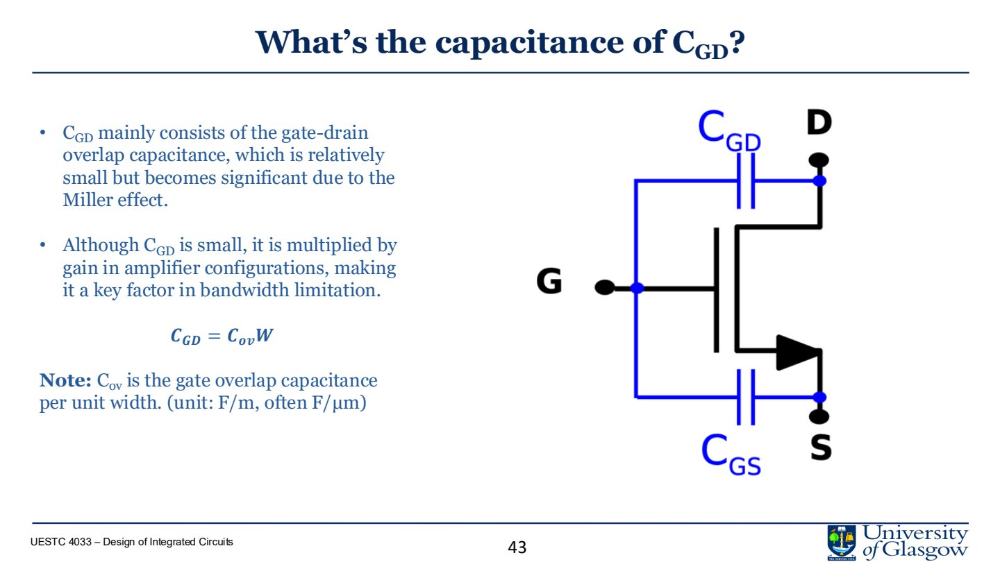
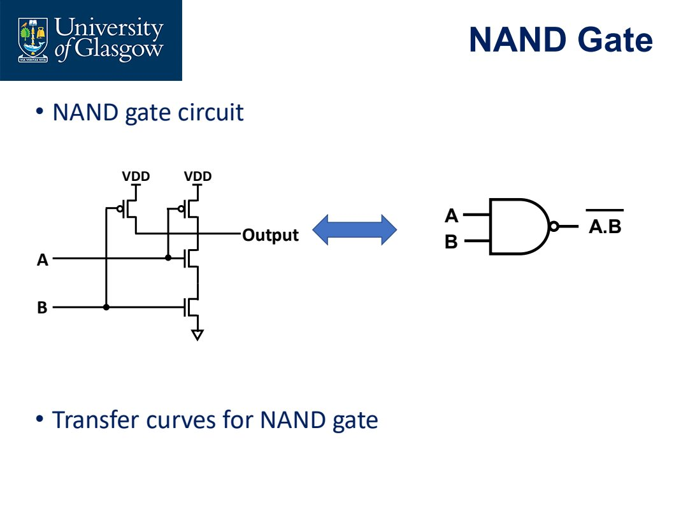
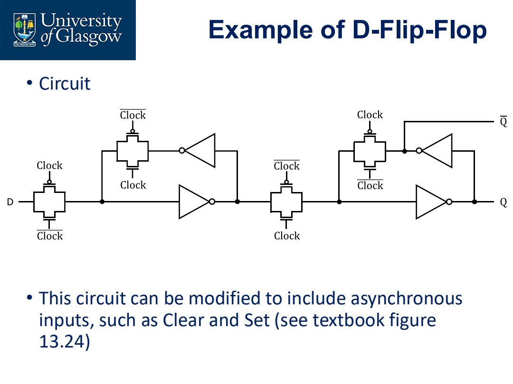

# Lecture 3.2 Current Sources and Digital Blocks

> 合并 Lecture 3.2 系列：current source、differential pair、MOSFET frequency-domain intuition、logic gates、pass gates、flip-flops。
>
> Source notes:
- DIC/DIC_part3_lecture_notes/lec4_current_sources_and_mirrors.md
- DIC/DIC_part3_lecture_notes/lec5_differential_pairs.md
- DIC/DIC_part3_lecture_notes/lec6_mosfet_frequency_domain.md
- DIC/DIC_part3_lecture_notes/lec8_cmos_logic_gates.md
- DIC/DIC_part3_lecture_notes/lec9_pass_gates.md
- DIC/DIC_part3_lecture_notes/lec10_latches_and_flip_flops.md

---

## Lec.4 Current Sources and Current Mirrors

> Source: `PPT/3/Lecture 3.2 Current Source 2.pdf`

Current source/current mirror 是 analog IC 的核心 building block。它们用于 biasing、active load、current scaling 和提高 amplifier gain。本讲主线是：**MOSFET small-signal → common-source gain limit → 用 current source 替代 resistor → current mirror → beta multiplier → cascode mirror**。

### 1. MOSFET 小信号复习

NMOS saturation 条件：

$$
V_{GS}\ge V_{TH},\qquad V_{DS}\ge V_{GS}-V_{TH}
$$

令 overdrive voltage：

$$
V_{OD}=V_{GS}-V_{TH}
$$

长沟道近似下：

$$
I_D=\frac{1}{2}\mu_n C_{ox}\frac{W}{L}(V_{GS}-V_{TH})^2
$$

Transconductance：

$$
g_m=\frac{dI_D}{dV_{GS}}=\beta_n(V_{GS}-V_{TH})=\frac{2I_D}{V_{OD}}
$$

小信号分析的前提是：信号变化足够小，使 MOSFET 仍围绕同一个 operating point 工作。此时可以把非线性器件线性化。

### 2. Common-source amplifier 的增益限制

Common-source stage 的小信号电压增益近似为：

$$
A_v=-g_mR_{out}
$$

若用电阻 $R_D$ 作负载：

$$
R_{out}=R_D\parallel r_o
$$

Channel length modulation 使 saturation 区的电流不是完全恒定：

$$
I_D=\frac{1}{2}\beta_n(V_{GS}-V_{TH})^2(1+\lambda V_{DS})
$$

对应输出电阻：

$$
r_o\approx \frac{1}{\lambda I_D}=\frac{V_A}{I_D}
$$

因此增大 $R_D$ 并不能无限提高增益，还会带来两个问题：

- $R_D$ 上压降变大，MOSFET 可能离开 saturation；
- 需要更高 $V_{DD}$，功耗和热增加，输出摆幅变小。

### 3. 为什么需要 current source

理想 current source 的 I-V 曲线是水平线，输出电流不随端电压变化：

$$
R_{out}\to\infty
$$

在 amplifier 中，它可以作为 active load：

- 提供较高 small-signal resistance；
- 不像大电阻那样占据大量面积；
- 有利于提高 gain；
- 可以复制 bias current 到多个支路。

但真实 MOS current source 仍受 $V_{DS}$、$V_{TH}$、mobility、temperature、process 影响。

### 4. Basic current mirror

Current mirror 的核心思想：

1. 用一个 diode-connected MOS 产生 $V_{GS}$；
2. 把同一个 gate voltage 施加到另一个匹配 MOS；
3. 若两个管子 $W/L$ 相同且都在 saturation，则输出电流近似复制参考电流。

若两个 MOS 尺寸不同：

$$
\frac{I_{out}}{I_{ref}}=
\frac{(W/L)_2}{(W/L)_1}
$$

因此 current mirror 不只复制电流，也可以通过 sizing 做 current scaling。

### 5. Current mirror 的误差来源

实际 current mirror 不是理想复制，主要误差来自：

- channel length modulation：$V_{DS1}\ne V_{DS2}$ 时电流不同；
- threshold mismatch：$V_{TH}$ 不匹配；
- geometry mismatch：$W/L$、layout、temperature gradient；
- finite output resistance；
- supply variation；
- startup condition。

含 channel length modulation 时：

$$
\frac{I_{D2}}{I_{D1}}
=
\frac{(W/L)_2}{(W/L)_1}
\cdot
\frac{1+\lambda V_{DS2}}{1+\lambda V_{DS1}}
$$

如果要提高精度，一个关键目标就是让 $V_{DS2}\approx V_{DS1}$。

### 6. Supply-independent biasing

简单用 resistor + MOS 产生 $I_{ref}$ 会受 $V_{DD}$ 影响：

$$
I_{ref}\approx \frac{V_{DD}}{R+1/g_m}
$$

这意味着 supply fluctuation 会直接变成 current fluctuation。Analog IC 设计希望 bias 对 PVT variation 尽量不敏感。

Supply-independent biasing 的思路是让 $I_{ref}$ 从复制电流本身 bootstrap 出来，而不是直接由 $V_{DD}$ 决定。

### 7. Beta multiplier current reference

Beta multiplier 通过两支路 MOS 尺寸比例 $K$ 和 source resistor $R$ 设定电流。它给设计者一个明确调节参数，而不是完全依赖 threshold/mobility。

典型结果形式：

$$
I_{ref}\propto
\frac{1}{R^2\mu C_{ox}(W/L)}
\left(1-\frac{1}{\sqrt{K}}\right)^2
$$

要点：

- $K$ 是 MOS 尺寸比例；
- $R$ 控制电流大小；
- 对 $V_{DD}$ 更不敏感；
- 仍受 process 和 temperature 影响；
- 可能存在零电流稳定状态，因此需要 startup circuit。

### 8. Startup circuit

Beta multiplier 可能有两个稳定点：

- 所有管子电流为 0；
- 目标 $I_{ref}$ 正常工作点。

真实电源是 ramp up，不是瞬间从 0 到目标值。如果没有 startup circuit，电路可能停在零电流状态。课程强调：**current reference 必须仿真 startup transient**，确认每次上电都能进入正确工作点。

### 9. Cascode current mirror

Cascode mirror 用额外 MOS shield 输出管，使其 $V_{DS}$ 更稳定，从而提高 output resistance 并减少 channel length modulation error。

优点：

- output resistance 大幅提高；
- current 更接近理想；
- 对 output voltage variation 更不敏感；
- amplifier active load gain 更高。

代价：

- 需要更高 voltage headroom；
- 输出摆幅变小；
- 不适合低电源电压下盲目堆叠；
- layout matching 更关键。

简单比较：

| Configuration | Output resistance | Voltage headroom | 适用 |
|---|---|---|---|
| Simple mirror | 低 | 好 | 粗略 bias、电流复制 |
| Cascode mirror | 高 | 差 | 高增益、高精度 current source |
| Low-voltage cascode | 中高 | 改善 | 低电源模拟设计 |
| Wilson mirror | 高 | 中等 | feedback 提高精度 |

### 10. 本讲必须带走的结论

- Current source 的价值来自高 output resistance。
- Current mirror 用相同 $V_{GS}$ 复制电流，电流比例由 $W/L$ 决定。
- Channel length modulation 和 mismatch 是 current mirror 的主要误差。
- Beta multiplier 用 resistor 和 device ratio 生成更独立的 bias current，但需要 startup。
- Cascode mirror 提高 output resistance，但牺牲 voltage swing/headroom。

---

## Lec.5 Differential Pairs

> Source: `PPT/3/Lecture 3.2.2- Differential Pairs and MOSFETs in Frequency domain.pdf` pages 1-25

Differential pair 是 op-amp input stage 的核心。它把两个输入的差值转成电流差/电压差，同时尽量拒绝 common-mode noise。

### 1. Differential pair 的结构

基本结构：

- 两个 matched MOSFET：M1、M2；
- 相同 $W/L$、$V_{TH}$、工艺环境；
- 两个 drain load 通常相同；
- source 连接在一起；
- tail current source 提供 $I_{SS}$。

直流平衡时：

$$
I_{SS}=I_{D1}+I_{D2}
$$

若两边完全对称且输入相同：

$$
I_{D1}=I_{D2}=\frac{I_{SS}}{2}
$$

### 2. Differential signal 与 common-mode signal

对两个输入 $V_{G1},V_{G2}$，定义：

$$
V_{id}=V_{G1}-V_{G2}
$$

$$
V_{cm}=\frac{V_{G1}+V_{G2}}{2}
$$

也可以写成：

$$
V_{G1}=V_{cm}+\frac{V_{id}}{2}
$$

$$
V_{G2}=V_{cm}-\frac{V_{id}}{2}
$$

这很重要：differential mode 是两边等幅反向变化；common mode 是两边同向变化。

### 3. Common-mode operation

Common-mode 下两个 gate 连接到同一个 $V_{cm}$：

$$
V_{id}=0
$$

理想情况下两边完全对称，输出差分电压：

$$
V_{od}=V_{D1}-V_{D2}=0
$$

所以 common-mode gain：

$$
A_{cm}=\frac{V_{od}}{V_{cm}}=0
$$

实际电路中 tail current source output resistance、load mismatch、layout mismatch 会让 $A_{cm}$ 非零。

### 4. Differential operation

若 $V_{G1}$ 上升、$V_{G2}$ 下降，tail current 会从一边 steering 到另一边：

- M1 电流增加；
- M2 电流减少；
- 对应 drain voltage 一边下降，一边上升；
- 输出形成差分信号。

当 differential input 太大时，几乎所有 tail current 都流入一侧，另一侧关断。这时电路不再线性放大，而是进入 saturated/current-steering limit。

### 5. CMRR

输出可写成：

$$
V_o=A_dV_{id}+A_{cm}V_{cm}
$$

Common Mode Rejection Ratio：

$$
CMRR=\frac{A_d}{A_{cm}}
$$

通常用 dB：

$$
CMRR_{dB}=20\log_{10}\left(\frac{A_d}{A_{cm}}\right)
$$

高 CMRR 表示对电源噪声、substrate noise、外部干扰等 common-mode signal 更不敏感。

### 6. Half-circuit analysis

小信号 differential operation 下，tail node 可视为 AC ground。于是完整差分对可拆成两个 half-circuit，每边近似一个 common-source stage。

课程给出的核心结果：

$$
A_v=-g_mR_D
$$

其中：

$$
g_m=\frac{2I_D}{V_{OD}}
$$

Half-circuit 的价值是把对称差分电路简化为单边分析。只要电路严格对称、输入是纯 differential signal，这个近似非常有用。

### 7. Active load differential pair

电阻负载有两个问题：

- 输出是双端的；
- 电阻占面积、限制 gain。

把负载换成 PMOS current mirror 可以得到 single-ended output。电流镜会把左支路电流变化复制到右侧，与右支路 NMOS 电流变化叠加，使输出节点电流变化变大。

理解方式：

- 输入差分信号导致左右支路电流一增一减；
- PMOS mirror 把一侧变化复制到输出侧；
- 输出节点同时受到 “push” 和 “pull” 的变化；
- single-ended gain 因此更高。

### 8. Cascaded stages

实际 op-amp 不只一个差分对。常见结构是：

1. differential input stage；
2. gain stage；
3. output/buffer stage。

多级总增益近似为各级增益相乘：

$$
A_{total}=A_1A_2\cdots A_n
$$

但多级也会引入多个 poles，稳定性和 compensation 会成为后续重点。

### 9. 设计注意点

Differential pair 的性能强依赖：

- transistor matching；
- common centroid layout；
- tail current source output resistance；
- input common-mode range；
- load matching；
- output swing；
- device saturation margin。

如果 M1/M2 不匹配，differential pair 会出现 input offset；如果 tail source 不理想，common-mode rejection 会下降。

### 10. 本讲必须带走的结论

- Differential pair 放大差模、拒绝共模。
- Tail current 决定两边总电流，差分输入负责 current steering。
- 小信号 differential analysis 可用 half-circuit。
- Active load/current mirror 可以把 differential current 转成 single-ended high-gain output。
- Matching 和 layout 是 differential pair 性能的一部分，不是后处理。

---

## Lec.6 MOSFETs in the Frequency Domain

> Source: `PPT/3/Lecture 3.2.2- Differential Pairs and MOSFETs in Frequency domain.pdf` pages 26-80

这一讲回答两个问题：MOSFET 本身能多快？一个含 MOSFET 的放大电路能多快？答案由 transconductance、寄生电容、Miller effect、load capacitance、poles/zeros 共同决定。

### 1. MOSFET 不是理想受控电流源

实际 MOSFET 有寄生电容：

- $C_{GS}$：gate-source capacitance；
- $C_{GD}$：gate-drain overlap capacitance；
- $C_{DB}$：drain-bulk junction capacitance；
- $C_{SB}$：source-bulk capacitance。

这些电容和电路电阻一起形成 time constants，限制频率响应。

### 2. $C_{GS}$ 与 $C_{GD}$

在 saturation 下：

$$
C_{GS}\approx \frac{2}{3}C_{ox}WL+C_{ov}W
$$

其中 $C_{ox}$ 是单位面积 gate oxide capacitance，$C_{ov}$ 是 overlap capacitance per unit width。

$C_{GD}$ 主要来自 gate-drain overlap：

$$
C_{GD}=C_{ov}W
$$

$C_{GD}$ 数值可能不大，但在 amplifier 中会被 Miller effect 放大，因此常常成为 bandwidth limitation 的关键。

### 3. Cutoff frequency

若只考虑 $C_{GS}$，gate 电流：

$$
i_G=v_GsC_{GS}
$$

drain 小信号电流：

$$
i_D=g_mv_G
$$

当 current gain 降为 1，即 $i_G=i_D$：

$$
v_G(2\pi f_c)C_{GS}=g_mv_G
$$

得到：

$$
f_c=\frac{g_m}{2\pi C_{GS}}
$$

这表示 MOSFET 的 intrinsic speed limit。实际设计中，工作频率通常要显著低于这个频率。

### 4. Gain-speed tradeoff

由于：

$$
g_m=\sqrt{2\beta I_D}
$$

所以：

$$
f_c\propto \sqrt{I_D}
$$

提高 bias current 可以提高速度。但最大电压增益：

$$
A_{max}=g_mr_o
$$

又因为：

$$
r_o\approx \frac{1}{\lambda I_D}
$$

所以较大的 $I_D$ 会降低 $r_o$，进而降低可获得的最大增益。结论：**高速通常需要更大电流，但高增益往往喜欢较小电流和较大输出电阻。**

### 5. Miller effect

当电容连接在 amplifier 输入和输出之间时，它不等效于普通接地电容。若：

$$
v_{out}=-Av_{in}
$$

流过反馈电容 $C$ 的电流：

$$
i_{in}=(v_{in}-v_{out})sC=(1+A)sCv_{in}
$$

因此输入端看到的等效电容约为：

$$
C_{in,eq}\approx (1+A)C
$$

这就是 Miller effect。它解释了为什么很小的 $C_{GD}$ 在高增益 common-source amplifier 中会显著降低输入 pole 频率。

### 6. Load capacitance

放大器总要驱动真实负载：下一级 gate、电容、wire、PCB trace、pad。Load capacitance $C_L$ 与输出电阻形成高频 pole：

$$
f_H\approx \frac{g_m}{2\pi C_L}
$$

如果 $C_L$ 很大，output node 会成为 dominant high-frequency limitation。

### 7. 两个 poles 和一个 zero

含 feedback capacitance $C_F$ 和 load capacitance $C_L$ 的 common-source amplifier 通常会出现：

- low-frequency pole：Miller 等效输入电容；
- high-frequency pole：load capacitance；
- zero：输入到输出之间的 capacitive feedforward path。

课件给出的直观近似：

$$
p_L\approx \frac{1}{2\pi R_1G_0C_L}
$$

$$
p_H\approx \frac{g_m}{2\pi C_L}
$$

$$
z\approx \frac{g_m}{2\pi C_F}
$$

其中 $G_0$ 是低频增益相关项。具体系数依赖拓扑，但设计直觉是：**最大 time constant 形成 dominant pole，feedforward capacitance 可能引入 zero。**

### 8. 什么时候不能只靠手算

完整电路包含 nonlinear capacitance、MOSFET 方程、KCL、KVL，严格求解会很复杂。手算的价值不是取代 SPICE，而是提供判断：

- 哪个 node 可能是 dominant pole；
- 哪个电容被 Miller 放大；
- 提高 bias current 会改善速度还是破坏 gain/power；
- load capacitance 是否已经主导响应。

### 9. 本讲必须带走的结论

- $C_{GS}$、$C_{GD}$、$C_{DB}$、$C_{SB}$ 限制 MOSFET 高频行为。
- $f_c=g_m/(2\pi C_{GS})$ 给出一个 intrinsic speed intuition。
- $C_{GD}$ 虽小，但会被 Miller effect 放大。
- 频率响应和增益/功耗有 tradeoff。
- MOSFET amplifier 通常至少有 low-frequency pole、high-frequency pole 和 zero。

---

## Lec.8 CMOS Logic Gates

> Source: `PPT/3/Lecture 3.2.1_Digital Blocks_Logic gates_2026.pdf`

这一讲从 transistor level 看 CMOS logic gates。重点是 inverter 的 noise margin/switching point、NAND/NOR 的 pull-up/pull-down 结构，以及 AOI/OAI 这类组合逻辑实现方式。

### 1. Non-clocked vs clocked digital circuits

数字电路可粗略分为：

- non-clocked：combinational logic gates；
- clocked：latches、flip-flops、registers、FSM、counters。

本讲关注 non-clocked logic gates。它们的输出只由当前输入组合决定，没有存储状态。

### 2. Noise margin

Noise margin 表示在不改变逻辑值的前提下，信号能容忍的最大噪声。

高电平 noise margin：

$$
NM_H=V_{OH}-V_{IH}
$$

低电平 noise margin：

$$
NM_L=V_{IL}-V_{OL}
$$

直觉：

- $V_{OH}$：输出 high 的最低保证值；
- $V_{IH}$：输入被识别为 high 的最低值；
- $V_{OL}$：输出 low 的最高保证值；
- $V_{IL}$：输入被识别为 low 的最高值。

Noise margin 越大，级联逻辑越抗干扰。

### 3. Switching point

CMOS inverter 的 switching point 定义为：

$$
V_{out}=V_{in}
$$

课件给出 switching point 与 NMOS/PMOS transconductance parameter 相关：

$$
V_{SP}=
\frac{\sqrt{\beta_n/\beta_p}V_{Tn}+V_{DD}-|V_{Tp}|}
{1+\sqrt{\beta_n/\beta_p}}
$$

设计上可以通过 NMOS/PMOS sizing 调整 switching point。若希望接近 $V_{DD}/2$，通常需要考虑 $\mu_n>\mu_p$，因此 PMOS 往往做得更宽。

### 4. Parasitics 与 switching delay

Inverter/gate 的速度受 parasitic capacitance 和 effective resistance 限制。输出节点上的 capacitance 来自：

- drain diffusion capacitance；
- gate capacitance of next stage；
- interconnect capacitance；
- layout parasitics。

一阶近似：

$$
t_p\approx 0.69R_{eq}C_L
$$

这和 Part 1 中 RC delay 的直觉一致：电阻越大、电容越大，switching 越慢。

### 5. CMOS NAND

2-input NAND：

- NMOS pull-down network：series，只有 A=B=1 时输出被拉低；
- PMOS pull-up network：parallel，只要 A 或 B 为 0，就能把输出拉高。

逻辑：

$$
Y=\overline{AB}
$$

NAND 常用，因为用 CMOS 实现简单，且任何 Boolean function 都可用 NAND 构成。

### 6. CMOS NOR

2-input NOR：

- NMOS pull-down network：parallel，只要 A 或 B 为 1，输出拉低；
- PMOS pull-up network：series，只有 A=B=0 时输出拉高。

逻辑：

$$
Y=\overline{A+B}
$$

多输入 NOR 的 PMOS series stack 会带来较大 resistance，速度可能比 NAND 差。因此实际 cell library 中 NAND 往往更受欢迎。

### 7. 多输入 gate 的 stack 问题

输入数量增加时，series transistor stack 会增加 effective resistance：

- NAND 的 pull-down stack 变长；
- NOR 的 pull-up stack 变长；
- delay 增加；
- sizing 更困难；
- internal nodes 产生额外 parasitics。

因此复杂逻辑不一定直接做成一个巨大 NAND/NOR，有时会拆成多级或使用 AOI/OAI cell。

### 8. AOI / OAI

AOI：AND-OR-Invert，例如先做 AND，再 OR，最后 invert。

OAI：OR-AND-Invert，例如先做 OR，再 AND，最后 invert。

它们适合直接把 Boolean expression 映射成 CMOS pull-down/pull-up network，减少 gate levels。

例：

$$
F(A,B,C)=\overline{A+BC}
$$

可以先从 NMOS pull-down network 表达使输出为 0 的条件，再用 PMOS 做 complementary network。

### 9. Digital layout 与项目

数字 layout 常见流程：

1. 用 behavioural VHDL 描述；
2. synthesis 得到 RTL/gate-level circuit；
3. 根据 NAND/NOR/flip-flop 等 standard cell layout 画物理版图；
4. 检查 parasitics、timing、DRC/LVS。

项目里不要只停留在 logic symbol。最终要知道每个 gate 对应 transistor network 和 layout cell。

### 10. 本讲必须带走的结论

- Noise margin 衡量数字信号抗噪能力。
- Switching point 可由 NMOS/PMOS strength ratio 调整。
- NAND：NMOS series、PMOS parallel。
- NOR：NMOS parallel、PMOS series。
- 多输入 stack 会增加 delay；复杂逻辑常用 AOI/OAI 或多级实现。

---

## Lec.9 Pass Gates and Transmission Gates

> Source: `PPT/3/Lecture 3.2.2_Complements_Pass Gates_2026.pdf`

Pass gate 用 MOSFET 作为受控开关。它是 transmission gate、mux、latch、flip-flop 等结构的重要基础。关键不是“能不能导通”，而是 **传 0 和传 1 是否强**。

### 1. NMOS pass gate

NMOS pass gate 就是一个 NMOS transistor，gate 作为控制端：

- gate = 0：OFF；
- gate = 1：ON，可以传递输入。

NMOS 的 source 通常是三个端中电位较低的一端。

### 2. NMOS 传 strong 0

当 input = 0，gate = $V_{DD}$ 时：

- source 在 0 V；
- $V_{GS}=V_{DD}$；
- NMOS 强导通；
- output 可被拉到 0 V。

因此 NMOS pass gate passes a **strong 0**。

### 3. NMOS 传 degraded 1

当 input = $V_{DD}$，gate = $V_{DD}$ 时，输出节点被充电上升。但当输出接近：

$$
V_{out}=V_{DD}-V_{TH}
$$

时：

$$
V_{GS}=V_{TH}
$$

NMOS 无法继续强力拉高。因此 NMOS 传 1 会损失 threshold voltage，称为 degraded 1。多个 NMOS pass gates 串联时，电平退化问题会更严重。

### 4. PMOS pass gate

PMOS 与 NMOS 互补：

- gate = 1：OFF；
- gate = 0：ON。

PMOS source 通常是三个端中电位较高的一端。

### 5. PMOS 传 strong 1

当 input = $V_{DD}$，gate = 0 时：

- source 在高电位；
- $V_{SG}=V_{DD}$；
- PMOS 强导通；
- output 可拉到 $V_{DD}$。

因此 PMOS pass gate passes a **strong 1**。

### 6. PMOS 传 degraded 0

当 input = 0，gate = 0 时，输出节点下降。但当输出接近 $|V_{TP}|$ 附近时，PMOS 不再能强力继续拉低。

所以 PMOS pass gate passes a **degraded 0**。

### 7. Transmission gate

Transmission gate 把 NMOS 和 PMOS 并联，并用互补控制信号驱动：

- NMOS 负责强传 0；
- PMOS 负责强传 1；
- 两者结合后可较好传递 full-swing signal。

这就是为什么 latch、mux、sample switch 中常用 transmission gate，而不是单独 NMOS 或单独 PMOS。

### 8. 本讲必须带走的结论

- NMOS pass gate：strong 0，degraded 1。
- PMOS pass gate：strong 1，degraded 0。
- Degraded level 来自 $V_{TH}$ 限制。
- Transmission gate 用 NMOS + PMOS 互补工作，传 0 和传 1 都更可靠。
- pass gate 串联会累积电平退化和延迟。

---

## Lec.10 Latches and Flip-Flops

> Source: `PPT/3/Lecture 3.2.2_Digital Blocks_Flip-flops_2026.pdf`

Sequential logic 和 combinational logic 的根本区别是 **state**。Latch 和 flip-flop 都能存 1 bit，但 latch 是 level-sensitive，flip-flop 是 edge-triggered。

### 1. Sequential logic 的类型

常见 sequential logic circuits：

- counters；
- FSM；
- registers。

它们都依赖 flip-flop/latch 保存状态。

### 2. Latch vs flip-flop

| Device | 触发方式 | 行为 |
|---|---|---|
| Latch | level-sensitive | clock 有效电平期间，输入可传到输出 |
| Flip-flop | edge-triggered | 只在 clock transition 附近更新输出 |

Latch 更基础，flip-flop 通常由两个 latch 或 transmission-gate storage structures 构成。

### 3. Transmission gate delay

Transmission gate 由 NMOS 和 PMOS 并联构成。传播延迟可近似为：

$$
t_{PLH}=t_{PHL}=0.7(R_n\parallel R_p)C_{Load}
$$

它比单 NMOS/PMOS pass gate 更适合 full-swing signal transmission。

### 4. Cross-coupled inverter storage

最基本的 1-bit storage 可以由两个 cross-coupled inverters 构成。它有两个稳定状态：

- Q = 1，$\overline{Q}=0$；
- Q = 0，$\overline{Q}=1$。

问题是：如果没有受控输入开关，新输入值可能和已存值冲突。

### 5. Clocked latch

在输入端加入 clock-controlled gate，就能控制什么时候 load 新值：

- clock active：输入 D 通过 gate 进入 storage node；
- clock inactive：输入隔离，cross-coupled inverters 保持状态。

使用 transmission gate 可以同时强传 0 和 1，避免单 pass gate 的 degraded logic level。

### 6. Improved D-latch

改进 D-latch 通常使用两个互补 transmission gates：

- load path：clock active 时打开；
- feedback path：clock inactive 时打开。

这样 loading 和 storing 两个状态不会互相打架。结构上就是：

- 输入路径接入新数据；
- feedback path 维持旧数据；
- 两条路径由互补 clock 控制。

### 7. D flip-flop

D flip-flop 可以用 master-slave latch 思想实现：

- master latch 在一个 clock phase 采样 D；
- slave latch 在相反 phase 更新 Q；
- 输出只在 clock edge 附近变化。

它解决了 latch 的透明窗口问题，让同步电路以 edge 为状态更新边界。

### 8. Setup time 与 hold time

为了正确采样输入，D 必须在 clock edge 周围保持稳定。

- setup time $t_s$：clock edge 之前，D 必须提前稳定的时间；
- hold time $t_h$：clock edge 之后，D 必须继续保持的时间。

若违反：

- 可能采样错误；
- 可能进入 metastability；
- downstream logic 得到不可预测状态。

### 9. Asynchronous set/clear

D flip-flop 可加入 asynchronous inputs：

- clear/reset：不等 clock，直接把 Q 置 0；
- set：不等 clock，直接把 Q 置 1。

这类信号优先级高，但 layout 和时序设计要谨慎，避免 reset release 造成 timing 问题。

### 10. 本讲必须带走的结论

- Latch 是 level-sensitive，flip-flop 是 edge-triggered。
- Cross-coupled inverters 可以存 1 bit。
- Transmission gate 适合构成 latch/flip-flop 的受控传输路径。
- D flip-flop 常由 master-slave latch 结构实现。
- Setup/hold time 是同步设计能否可靠工作的关键。

