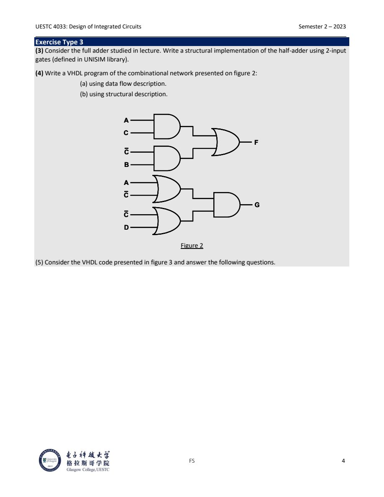

# Lecture 4.2 VHDL Tutorial Patterns

> 对应 UESTC4033 Tutorial VHDL Introduction。
>
> Source notes:
- DIC/DIC_part4_lecture_notes/lec2_vhdl_tutorial_patterns.md


---

## Lec.2 VHDL Tutorial Patterns

> Source: `PPT/UESTC4033_Tutorial_VHDL_Introduction_2024.pdf`

这份 tutorial 训练的是同一件事的三种表达：schematic、Boolean equation、VHDL。考试里常见要求是“根据图写 VHDL”或“根据 VHDL 画图/写 RTL equation”。所以笔记重点放在翻译方法，而不是把每段代码逐字搬过来。

### 1. 三种描述层次

#### 1.1 Entity

`entity` 描述模块的外部接口：

- 左边进入电路的线通常是 `in`；
- 右边输出的线通常是 `out`；
- clock、reset 是普通 port，但语义上决定 sequential behavior；
- 一般不要把内部反馈写成 `inout`，除非题目代码已经这样给出。

基础模板：

```vhdl
library IEEE;
use IEEE.STD_LOGIC_1164.ALL;

entity example is
  port (
    A : in  STD_LOGIC;
    B : in  STD_LOGIC;
    F : out STD_LOGIC
  );
end example;
```

#### 1.2 Dataflow description

Dataflow 用 concurrent signal assignment 写 Boolean equation：

```vhdl
architecture Dataflow of example is
begin
  F <= A and B;
end Dataflow;
```

多个 assignment 是并行执行，不是像 C/Python 那样逐行执行。中间信号可以先声明：

```vhdl
architecture Dataflow of example is
  signal n_b : STD_LOGIC;
  signal t1  : STD_LOGIC;
begin
  n_b <= not B;
  t1  <= A and n_b;
  F   <= t1;
end Dataflow;
```

#### 1.3 Structural description

Structural VHDL 像 netlist：先声明 component 和 internal signals，再实例化 gates。

```vhdl
architecture Structural of example is
  signal s1 : STD_LOGIC;

  component INV
    port (I : in STD_LOGIC; O : out STD_LOGIC);
  end component;
begin
  U0 : INV port map (B, s1);
end Structural;
```

课件使用 `UNISIM.VComponents`：

```vhdl
library UNISIM;
use UNISIM.VComponents.ALL;
```

如果考试指定使用 UNISIM，就按课件写。如果没有指定，写 generic component 或直接 dataflow 更稳。

### 2. 从电路图写 dataflow

Tutorial 的 Figure 1 是：

$$
F=AB+\bar B C
$$

读图方法：

1. 每个 gate 输出先命名为一个 internal signal。
2. Bubble 或带横线输入代表 `not`。
3. 最右侧输出 gate 给出最终 expression。

对应 dataflow：

```vhdl
library IEEE;
use IEEE.STD_LOGIC_1164.ALL;

entity tutorial_q1 is
  port (
    A : in  STD_LOGIC;
    B : in  STD_LOGIC;
    C : in  STD_LOGIC;
    F : out STD_LOGIC
  );
end tutorial_q1;

architecture Dataflow of tutorial_q1 is
  signal n_b : STD_LOGIC;
  signal t1  : STD_LOGIC;
  signal t2  : STD_LOGIC;
begin
  n_b <= not B;
  t1  <= A and B;
  t2  <= n_b and C;
  F   <= t1 or t2;
end Dataflow;
```

也可以写成一行：

```vhdl
F <= (A and B) or ((not B) and C);
```

但考试里如果图比较复杂，分 internal signal 更清楚，也更容易转成 structural VHDL。

### 3. Boolean function with delay

Tutorial 的 Boolean function 是：

$$
F=A\bar B+(C\oplus D)
$$

如果要求“每个 operation 加 10 ns delay”，可以把每一步拆开：

```vhdl
architecture Dataflow of question02 is
  signal n_b : STD_LOGIC;
  signal t1  : STD_LOGIC;
  signal t2  : STD_LOGIC;
begin
  n_b <= not B after 10 ns;
  t1  <= A and n_b after 10 ns;
  t2  <= C xor D after 10 ns;
  F   <= t1 or t2 after 10 ns;
end Dataflow;
```

注意：`after 10 ns` 主要用于 simulation delay。实际 synthesis 通常不会把这种延时综合成真实硬件延迟。考试既然明确要求 delay，就按要求写；真实设计里一般通过 timing constraints、cell delay、routing delay 来处理。

### 4. Structural VHDL 的书写顺序

把 $F=A\bar B+(C\oplus D)$ 写成 structural VHDL：

```text
n_b = not B
t1  = A and n_b
t2  = C xor D
F   = t1 or t2
```

对应结构：

```vhdl
library IEEE;
use IEEE.STD_LOGIC_1164.ALL;

library UNISIM;
use UNISIM.VComponents.ALL;

entity question02 is
  port (
    A : in  STD_LOGIC;
    B : in  STD_LOGIC;
    C : in  STD_LOGIC;
    D : in  STD_LOGIC;
    F : out STD_LOGIC
  );
end question02;

architecture Structural of question02 is
  signal n_b : STD_LOGIC;
  signal t1  : STD_LOGIC;
  signal t2  : STD_LOGIC;
begin
  U0 : INV  port map (I => B,       O => n_b);
  U1 : AND2 port map (I0 => A, I1 => n_b, O => t1);
  U2 : XOR2 port map (I0 => C, I1 => D,   O => t2);
  U3 : OR2  port map (I0 => t1, I1 => t2, O => F);
end Structural;
```

Named association `I0 => A` 比 positional association 更长，但更不容易把 input/output 顺序写反。考试时间很紧时，如果你确定 component port order，也可以用 positional mapping。

### 5. Half-adder structural template

Half-adder 的逻辑：

$$
S=A\oplus B
$$

$$
C_{out}=AB
$$

Structural 写法：

```vhdl
library IEEE;
use IEEE.STD_LOGIC_1164.ALL;

library UNISIM;
use UNISIM.VComponents.ALL;

entity half_adder is
  port (
    A    : in  STD_LOGIC;
    B    : in  STD_LOGIC;
    S    : out STD_LOGIC;
    Cout : out STD_LOGIC
  );
end half_adder;

architecture Structural of half_adder is
begin
  U0 : XOR2 port map (I0 => A, I1 => B, O => S);
  U1 : AND2 port map (I0 => A, I1 => B, O => Cout);
end Structural;
```

如果 library 中没有 `XOR2`，可以用 basic gates 展开：

$$
A\oplus B=A\bar B+\bar A B
$$

### 6. Figure 2: two-output combinational network



Figure 2 里有两个输出：$F$ 和 $G$。

上半部分：

$$
F=AC+\bar C B
$$

这本质上像一个 mux：

- $C=1$ 时，$F=A$；
- $C=0$ 时，$F=B$。

下半部分：

$$
G=(A+\bar C)(\bar C+D)
$$

可以化简为：

$$
G=\bar C+AD
$$

但如果题目要求 structural description，通常按原图 gate structure 写，不要过度化简，否则结构可能和图不一致。

Dataflow 写法：

```vhdl
library IEEE;
use IEEE.STD_LOGIC_1164.ALL;

entity figure2_network is
  port (
    A : in  STD_LOGIC;
    B : in  STD_LOGIC;
    C : in  STD_LOGIC;
    D : in  STD_LOGIC;
    F : out STD_LOGIC;
    G : out STD_LOGIC
  );
end figure2_network;

architecture Dataflow of figure2_network is
  signal n_c : STD_LOGIC;
begin
  n_c <= not C;
  F   <= (A and C) or (n_c and B);
  G   <= (A or n_c) and (n_c or D);
end Dataflow;
```

Structural 写法可按节点拆分：

```vhdl
architecture Structural of figure2_network is
  signal n_c      : STD_LOGIC;
  signal f_t1     : STD_LOGIC;
  signal f_t2     : STD_LOGIC;
  signal g_t1     : STD_LOGIC;
  signal g_t2     : STD_LOGIC;

  component INV
    port (I : in STD_LOGIC; O : out STD_LOGIC);
  end component;
  component AND2
    port (I0, I1 : in STD_LOGIC; O : out STD_LOGIC);
  end component;
  component OR2
    port (I0, I1 : in STD_LOGIC; O : out STD_LOGIC);
  end component;
begin
  U0 : INV  port map (C, n_c);

  U1 : AND2 port map (A, C, f_t1);
  U2 : AND2 port map (n_c, B, f_t2);
  U3 : OR2  port map (f_t1, f_t2, F);

  U4 : OR2  port map (A, n_c, g_t1);
  U5 : OR2  port map (n_c, D, g_t2);
  U6 : AND2 port map (g_t1, g_t2, G);
end Structural;
```

### 7. 从 VHDL code 画电路

Tutorial 的 Figure 3 给了一段含 `FD`、`AND2`、`OR2` 的 structural code。读法和 Lec.1 一样：先读 entity，再读 instance。

关键 port：

```text
x   : in
B   : in
CLK : in
A   : inout, initialized to '1'
```

组件含义：

```text
AND2: C0 = A and x
OR2 : C1 = C0 or B
FD  : A  = C1 sampled on CLK
```

所以它不是纯 combinational circuit，而是带反馈的 sequential circuit：

$$
A_{next}=B+(A\cdot x)
$$

电路结构：

- `A` 是 flip-flop 的输出状态；
- `A` 反馈到 AND gate；
- AND gate 的另一个输入是 `x`；
- OR gate 把 `A and x` 与 `B` 相加；
- OR 的输出进入 D flip-flop；
- clock 为 `CLK`。

更推荐的现代写法是不要把 `A` 写成 `inout`，而是用 internal state：

```vhdl
architecture Behavioral of question1_clean is
  signal a_q : STD_LOGIC := '1';
begin
  process (CLK)
  begin
    if rising_edge(CLK) then
      a_q <= B or (a_q and x);
    end if;
  end process;

  A <= a_q;
end Behavioral;
```

如果考试题只是要求“identify inputs and outputs”，就按给定 entity 回答：`x`、`B`、`CLK` 是输入，`A` 被声明为 `inout`，同时承担状态输出和反馈节点。若按干净硬件理解，`A` 是 D flip-flop 的 output/state。

### 8. VHDL 常见扣分点

- 忘记 `library IEEE; use IEEE.STD_LOGIC_1164.ALL;`。
- `entity` port 方向写错，尤其把 output 误写成 input。
- 在 structural code 里忘记声明 internal `signal`。
- `port map` 中把 output port 接到 input signal 位置。
- `component` 声明放在 `begin` 后面。
- sequential logic 用 concurrent assignment 硬写，导致没有 clocked behavior。
- 把 `after 10 ns` 当成可综合硬件延迟。它主要是 simulation construct。
- 课件中出现 `STD_LOGIC_ARITH`、`STD_LOGIC_UNSIGNED`；真实工程更推荐 `numeric_std`，但考试如果按课件格式给代码，能读懂即可。

### 9. 快速答题流程

1. 先写 `entity`，不要边看图边写 architecture。
2. 给每个 gate output 命名 internal signal。
3. 对 dataflow：直接把每个 internal signal 写成 Boolean expression。
4. 对 structural：每个 gate 一个 instance，每个 instance 一个唯一 label。
5. 对 code-to-circuit：把每行 `port map` 翻译成一条节点方程。
6. 看到 `FD`、`rising_edge`、`CLK`、feedback，就按 sequential circuit 处理。

