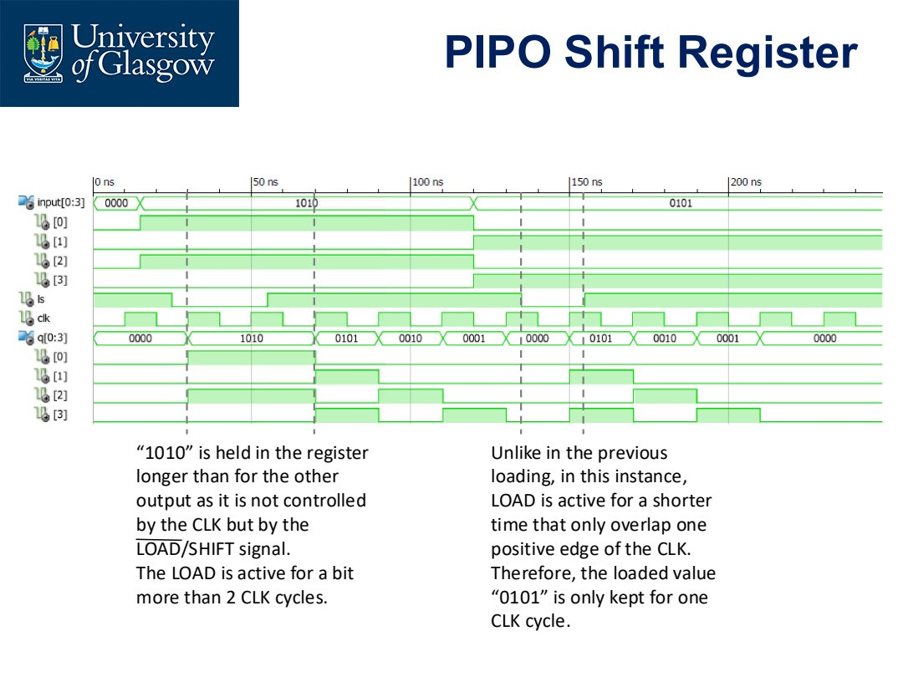
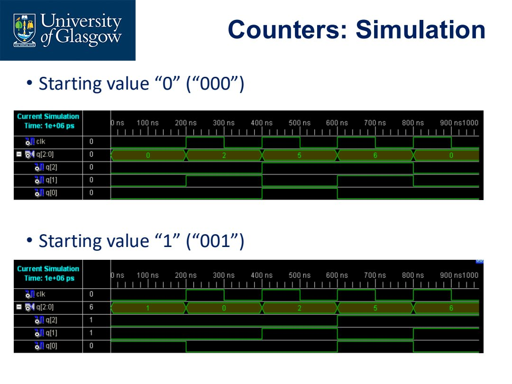

# Lec.4 VHDL Examples and Synthesis Awareness

> Source: `PPT/2/Lecture 2.4_VHDL 2_2026.pdf`

这一讲把 VHDL 语法放回具体电路中：MUX、D flip-flop、shift register、counter。重点不是背代码，而是理解 **同样的功能如何对应硬件，以及写法如何影响 synthesis 结果**。

## 1. 2-to-1 MUX 的 behavioural 写法

组合逻辑可以用 `process` 描述，但 sensitivity list 必须包含所有输入，否则仿真行为可能不像组合电路。

```vhdl
architecture Behavioral of MUX is
begin
  process (S, I0, I1)
  begin
    if S = '0' then
      Y <= I0;
    elsif S = '1' then
      Y <= I1;
    else
      Y <= I1;
    end if;
  end process;
end Behavioral;
```

这里有几个考点：

- `if` 必须在 `process` 中；
- 组合 MUX 的 sensitivity list 是 `S, I0, I1`；
- VHDL 用 `elsif`；
- 当 `S` 只有两种有效选择时，`else` 可以处理非预期值，也可以简化为 `else Y <= I1;`。

同一个 MUX 也可以用 `case`：

```vhdl
architecture Behavioral of MUX is
begin
  process (S, I0, I1)
  begin
    case S is
      when '0' =>
        Y <= I0;
      when '1' =>
        Y <= I1;
      when others =>
        Y <= I1;
    end case;
  end process;
end Behavioral;
```

注意 `when '0' =>` 中的 `=>` 不是 assignment，而是 case branch 的箭头；真正的 signal assignment 是 `<=`。

## 2. D flip-flop：clock 决定输出何时变化

D flip-flop 与组合逻辑的关键差异是：输入 `D` 改变时，输出不一定立即改变；输出通常只在 clock event 上更新。

课程示例的简化写法如下：

```vhdl
entity DFF is
  port (
    D   : in  std_logic;
    CLK : in  std_logic;
    Q   : out std_logic;
    QN  : out std_logic
  );
end DFF;

architecture Behavioral of DFF is
begin
  process (CLK)
  begin
    if CLK = '1' then
      Q  <= D after 5 ns;
      QN <= not D after 5 ns;
    end if;
  end process;
end Behavioral;
```

这段用于解释 process 与 clock 的关系，但工程写法通常会显式检测边沿：

```vhdl
if rising_edge(CLK) then
  Q <= D;
end if;
```

关键理解：

- sensitivity list 里只有 `CLK`，因为只有 clock 触发输出更新；
- `D` 是被采样的数据，不是触发条件；
- `after 5 ns` 更偏向仿真延迟，不一定用于可综合 RTL；
- 如果 `QN` 在 process 外由 `Q` 产生，要注意 `Q` 是否可读以及端口模式问题。

## 3. SIPO shift register：structural description

SIPO 是 Serial-In Parallel-Out。结构上就是多个 D flip-flop 串联：

```text
Input -> DFF0 -> DFF1 -> DFF2 -> DFF3
          |       |       |       |
         Q(0)    Q(1)    Q(2)    Q(3)
```

课程示例使用 component instantiation：

```vhdl
component FD
  port (
    Q    : out std_logic;
    C, D : in  std_logic
  );
end component;

begin
  DFF0: FD port map (Q(0), CLK, Input);
  DFF1: FD port map (Q(1), CLK, Q(0));
  DFF2: FD port map (Q(2), CLK, Q(1));
  DFF3: FD port map (Q(3), CLK, Q(2));
end Behavioral;
```

这个 architecture 里没有显式 `process`，但 `FD` component 内部是 flip-flop，因此整体仍然表现为 sequential circuit。Structural description 的思想是：**当前模块不描述底层行为，只连接已经定义好的硬件块**。

## 4. PIPO shift register：load/shift 控制

PIPO 示例更复杂，因为它既要 parallel load，又要 shift。结构上通常是：

- 每一位前面有选择逻辑；
- `LOAD/SHIFT` 决定输入来自 parallel input 还是上一位输出；
- clock 边沿把选择后的数据装入 DFF。

波形里最重要的是观察 `LOAD/SHIFT` 与 clock edge 的重叠关系：



读图方法：

- 只有在有效 clock edge 附近，register 才真正采样；
- `LOAD` 持续超过两个 clock cycle 时，同一个 parallel value 会保持更久；
- `LOAD` 只覆盖一个 rising edge 时，parallel value 只被装载一次；
- 组合控制信号持续时间会影响 sequential state 的保留周期。

这类波形题的关键不是看每条线，而是抓住：**控制信号是否覆盖了 clock active edge**。

## 5. Counter：用 `case` 描述状态转移

课程示例是同步 counter，序列为：

```text
0 -> 2 -> 5 -> 6 -> 0 -> ...
```

用 3-bit vector 表示：

```text
000 -> 010 -> 101 -> 110 -> 000
```

典型写法：

```vhdl
architecture Behavioral of sync_behav is
begin
  process (CLK)
  begin
    if CLK = '1' then
      case Q is
        when "000" => Q <= "010";
        when "010" => Q <= "101";
        when "101" => Q <= "110";
        when "110" => Q <= "000";
        when others => Q <= "000";
      end case;
    end if;
  end process;
end Behavioral;
```

`when others` 很重要，因为真实/仿真状态可能从非法状态开始。例如若初始值是 `"001"`，设计应能回到合法循环，而不是卡死。



读 counter simulation 时：

- 初值 `"000"` 会按 `0,2,5,6` 循环；
- 初值 `"001"` 属于非法状态，依靠 `others` 被拉回 `"000"`；
- 若没有 `others`，非法状态可能导致不可预期仿真或综合 latch-like 行为。

## 6. Coding vs Synthesis：写法会影响硬件

VHDL statement 最终会被 synthesis tool 翻译成 gates/registers。相同逻辑功能可能对应不同综合结果。

例如：

```vhdl
F <= ((A and B) and (not C)) or (C and not D);
```

与拆成中间 signal：

```vhdl
S1 <= not C;
S2 <= not D;
S3 <= A and B;
S4 <= S3 and S1;
S5 <= C and S2;
F  <= S4 or S5;
```

逻辑函数相同，但 synthesis tool 可能生成不同的中间网络、优化路径和 gate mapping。通常工具会优化，但设计者仍应理解：

- expression 的结构会影响初始 RTL network；
- critical path 可能受写法影响；
- shared sub-expression 是否能复用取决于工具优化；
- structural code 更明确，但也更啰嗦；
- behavioural code 更抽象，但要避免写出不想要的 latch/register。

## 7. `if` vs `case` 描述 MUX

4-to-1 MUX 可用 `if/elsif`：

```vhdl
process (I0, I1, I2, I3, S)
begin
  if S = "00" then
    Y <= I0;
  elsif S = "01" then
    Y <= I1;
  elsif S = "10" then
    Y <= I2;
  else
    Y <= I3;
  end if;
end process;
```

也可用 `case`：

```vhdl
process (I0, I1, I2, I3, S)
begin
  case S is
    when "00" => Y <= I0;
    when "01" => Y <= I1;
    when "10" => Y <= I2;
    when others => Y <= I3;
  end case;
end process;
```

对于这种选择器，`case` 通常更清晰，因为每个 selector value 对应一个 branch。考题如果让你“identify input/output and draw schematic”，输入就是 `I0..I3` 和 `S`，输出是 `Y`，电路是 4-to-1 MUX。

## 8. DFF 条件语句的差异

课程最后比较了两类 DFF process：

```vhdl
process (CLK)
begin
  if CLK = '1' then
    Q  <= D;
    QN <= not D;
  end if;
end process;
```

```vhdl
process (CLK, CLR)
begin
  if CLR = '1' then
    Q  <= '0';
    QN <= '1';
  elsif CLK = '1' and CLK'event then
    Q  <= D;
    QN <= not D;
  end if;
end process;
```

区别：

- 第一段没有 reset，且 `CLK='1'` 更像 level-sensitive 描述，不是严格 edge-triggered 写法；
- 第二段有 asynchronous clear，因为 `CLR` 在 sensitivity list 中且优先级高；
- `CLK'event` 检测 clock 事件，配合 `CLK='1'` 表示 rising edge；
- reset 分支优先，因此 `CLR='1'` 时不等待 clock。

工程上更推荐：

```vhdl
process (CLK, CLR)
begin
  if CLR = '1' then
    Q <= '0';
  elsif rising_edge(CLK) then
    Q <= D;
  end if;
end process;
```

## 9. 本讲必须带走的结论

- 组合逻辑 process 的 sensitivity list 要包含所有输入。
- 时序逻辑 process 由 clock/reset 触发，数据输入通常不放入 sensitivity list。
- Structural description 可以没有显式 process，但实例化的 component 可能内部有 sequential behavior。
- `when others` 是状态机/counter 的安全出口。
- VHDL 写法会影响 synthesis；写代码时要能画出对应电路。
