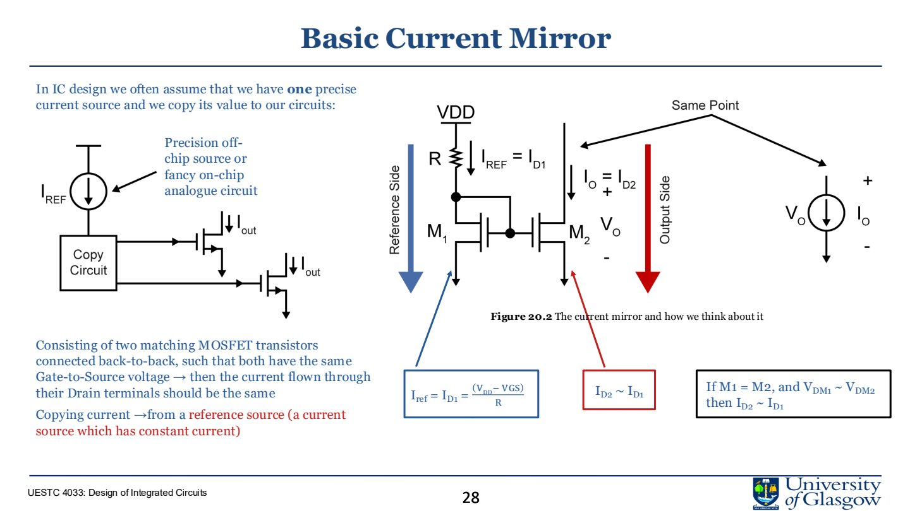
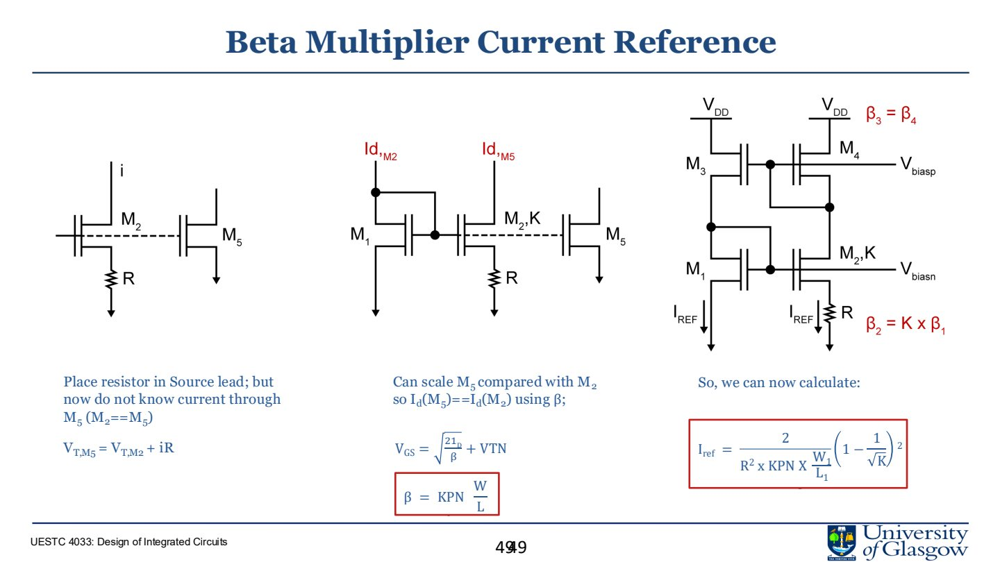
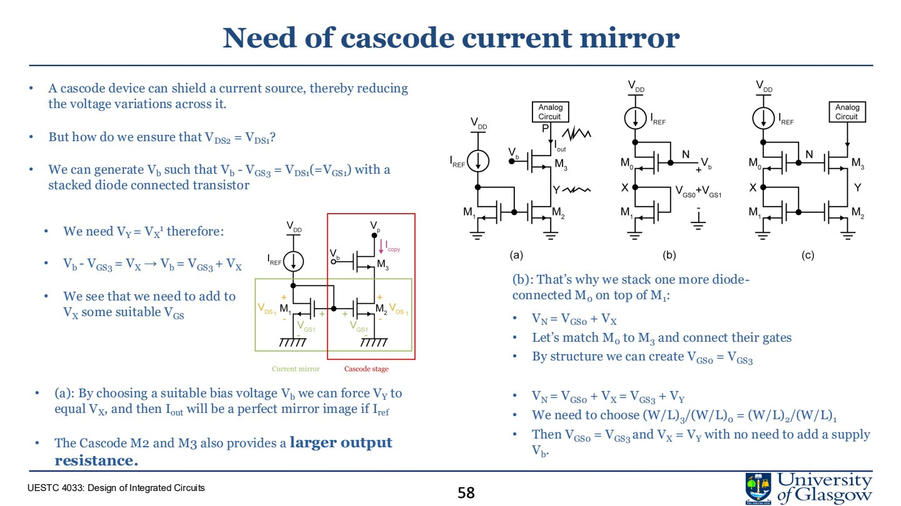

# Lec.4 Current Sources and Current Mirrors

> Source: `PPT/3/Lecture 3.2 Current Source 2.pdf`

Current source/current mirror 是 analog IC 的核心 building block。它们用于 biasing、active load、current scaling 和提高 amplifier gain。本讲主线是：**MOSFET small-signal → common-source gain limit → 用 current source 替代 resistor → current mirror → beta multiplier → cascode mirror**。

## 1. MOSFET 小信号复习

NMOS saturation 条件：

$$
V_{GS}\ge V_{TH},\qquad V_{DS}\ge V_{GS}-V_{TH}
$$

令 overdrive voltage：

$$
V_{OD}=V_{GS}-V_{TH}
$$

长沟道近似下：

$$
I_D=\frac{1}{2}\mu_n C_{ox}\frac{W}{L}(V_{GS}-V_{TH})^2
$$

Transconductance：

$$
g_m=\frac{dI_D}{dV_{GS}}=\beta_n(V_{GS}-V_{TH})=\frac{2I_D}{V_{OD}}
$$

小信号分析的前提是：信号变化足够小，使 MOSFET 仍围绕同一个 operating point 工作。此时可以把非线性器件线性化。

## 2. Common-source amplifier 的增益限制

Common-source stage 的小信号电压增益近似为：

$$
A_v=-g_mR_{out}
$$

若用电阻 $R_D$ 作负载：

$$
R_{out}=R_D\parallel r_o
$$

Channel length modulation 使 saturation 区的电流不是完全恒定：

$$
I_D=\frac{1}{2}\beta_n(V_{GS}-V_{TH})^2(1+\lambda V_{DS})
$$

对应输出电阻：

$$
r_o\approx \frac{1}{\lambda I_D}=\frac{V_A}{I_D}
$$

因此增大 $R_D$ 并不能无限提高增益，还会带来两个问题：

- $R_D$ 上压降变大，MOSFET 可能离开 saturation；
- 需要更高 $V_{DD}$，功耗和热增加，输出摆幅变小。

## 3. 为什么需要 current source

理想 current source 的 I-V 曲线是水平线，输出电流不随端电压变化：

$$
R_{out}\to\infty
$$

在 amplifier 中，它可以作为 active load：

- 提供较高 small-signal resistance；
- 不像大电阻那样占据大量面积；
- 有利于提高 gain；
- 可以复制 bias current 到多个支路。

但真实 MOS current source 仍受 $V_{DS}$、$V_{TH}$、mobility、temperature、process 影响。

## 4. Basic current mirror

Current mirror 的核心思想：

1. 用一个 diode-connected MOS 产生 $V_{GS}$；
2. 把同一个 gate voltage 施加到另一个匹配 MOS；
3. 若两个管子 $W/L$ 相同且都在 saturation，则输出电流近似复制参考电流。

若两个 MOS 尺寸不同：

$$
\frac{I_{out}}{I_{ref}}=
\frac{(W/L)_2}{(W/L)_1}
$$

因此 current mirror 不只复制电流，也可以通过 sizing 做 current scaling。

## 5. Current mirror 的误差来源

实际 current mirror 不是理想复制，主要误差来自：

- channel length modulation：$V_{DS1}\ne V_{DS2}$ 时电流不同；
- threshold mismatch：$V_{TH}$ 不匹配；
- geometry mismatch：$W/L$、layout、temperature gradient；
- finite output resistance；
- supply variation；
- startup condition。

含 channel length modulation 时：

$$
\frac{I_{D2}}{I_{D1}}
=
\frac{(W/L)_2}{(W/L)_1}
\cdot
\frac{1+\lambda V_{DS2}}{1+\lambda V_{DS1}}
$$

如果要提高精度，一个关键目标就是让 $V_{DS2}\approx V_{DS1}$。

## 6. Supply-independent biasing

简单用 resistor + MOS 产生 $I_{ref}$ 会受 $V_{DD}$ 影响：

$$
I_{ref}\approx \frac{V_{DD}}{R+1/g_m}
$$

这意味着 supply fluctuation 会直接变成 current fluctuation。Analog IC 设计希望 bias 对 PVT variation 尽量不敏感。

Supply-independent biasing 的思路是让 $I_{ref}$ 从复制电流本身 bootstrap 出来，而不是直接由 $V_{DD}$ 决定。

## 7. Beta multiplier current reference

Beta multiplier 通过两支路 MOS 尺寸比例 $K$ 和 source resistor $R$ 设定电流。它给设计者一个明确调节参数，而不是完全依赖 threshold/mobility。

典型结果形式：

$$
I_{ref}\propto
\frac{1}{R^2\mu C_{ox}(W/L)}
\left(1-\frac{1}{\sqrt{K}}\right)^2
$$

要点：

- $K$ 是 MOS 尺寸比例；
- $R$ 控制电流大小；
- 对 $V_{DD}$ 更不敏感；
- 仍受 process 和 temperature 影响；
- 可能存在零电流稳定状态，因此需要 startup circuit。

## 8. Startup circuit

Beta multiplier 可能有两个稳定点：

- 所有管子电流为 0；
- 目标 $I_{ref}$ 正常工作点。

真实电源是 ramp up，不是瞬间从 0 到目标值。如果没有 startup circuit，电路可能停在零电流状态。课程强调：**current reference 必须仿真 startup transient**，确认每次上电都能进入正确工作点。

## 9. Cascode current mirror

Cascode mirror 用额外 MOS shield 输出管，使其 $V_{DS}$ 更稳定，从而提高 output resistance 并减少 channel length modulation error。

优点：

- output resistance 大幅提高；
- current 更接近理想；
- 对 output voltage variation 更不敏感；
- amplifier active load gain 更高。

代价：

- 需要更高 voltage headroom；
- 输出摆幅变小；
- 不适合低电源电压下盲目堆叠；
- layout matching 更关键。

简单比较：

| Configuration | Output resistance | Voltage headroom | 适用 |
|---|---|---|---|
| Simple mirror | 低 | 好 | 粗略 bias、电流复制 |
| Cascode mirror | 高 | 差 | 高增益、高精度 current source |
| Low-voltage cascode | 中高 | 改善 | 低电源模拟设计 |
| Wilson mirror | 高 | 中等 | feedback 提高精度 |

## 10. 本讲必须带走的结论

- Current source 的价值来自高 output resistance。
- Current mirror 用相同 $V_{GS}$ 复制电流，电流比例由 $W/L$ 决定。
- Channel length modulation 和 mismatch 是 current mirror 的主要误差。
- Beta multiplier 用 resistor 和 device ratio 生成更独立的 bias current，但需要 startup。
- Cascode mirror 提高 output resistance，但牺牲 voltage swing/headroom。
