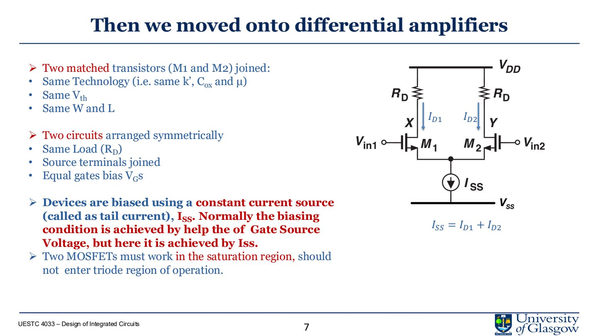

# Lec.5 Differential Pairs

> Source: `PPT/3/Lecture 3.2.2- Differential Pairs and MOSFETs in Frequency domain.pdf` pages 1-25

Differential pair 是 op-amp input stage 的核心。它把两个输入的差值转成电流差/电压差，同时尽量拒绝 common-mode noise。

## 1. Differential pair 的结构

基本结构：

- 两个 matched MOSFET：M1、M2；
- 相同 $W/L$、$V_{TH}$、工艺环境；
- 两个 drain load 通常相同；
- source 连接在一起；
- tail current source 提供 $I_{SS}$。

直流平衡时：

$$
I_{SS}=I_{D1}+I_{D2}
$$

若两边完全对称且输入相同：

$$
I_{D1}=I_{D2}=\frac{I_{SS}}{2}
$$

## 2. Differential signal 与 common-mode signal

对两个输入 $V_{G1},V_{G2}$，定义：

$$
V_{id}=V_{G1}-V_{G2}
$$

$$
V_{cm}=\frac{V_{G1}+V_{G2}}{2}
$$

也可以写成：

$$
V_{G1}=V_{cm}+\frac{V_{id}}{2}
$$

$$
V_{G2}=V_{cm}-\frac{V_{id}}{2}
$$

这很重要：differential mode 是两边等幅反向变化；common mode 是两边同向变化。

## 3. Common-mode operation

Common-mode 下两个 gate 连接到同一个 $V_{cm}$：

$$
V_{id}=0
$$

理想情况下两边完全对称，输出差分电压：

$$
V_{od}=V_{D1}-V_{D2}=0
$$

所以 common-mode gain：

$$
A_{cm}=\frac{V_{od}}{V_{cm}}=0
$$

实际电路中 tail current source output resistance、load mismatch、layout mismatch 会让 $A_{cm}$ 非零。

## 4. Differential operation

若 $V_{G1}$ 上升、$V_{G2}$ 下降，tail current 会从一边 steering 到另一边：

- M1 电流增加；
- M2 电流减少；
- 对应 drain voltage 一边下降，一边上升；
- 输出形成差分信号。

当 differential input 太大时，几乎所有 tail current 都流入一侧，另一侧关断。这时电路不再线性放大，而是进入 saturated/current-steering limit。

## 5. CMRR

输出可写成：

$$
V_o=A_dV_{id}+A_{cm}V_{cm}
$$

Common Mode Rejection Ratio：

$$
CMRR=\frac{A_d}{A_{cm}}
$$

通常用 dB：

$$
CMRR_{dB}=20\log_{10}\left(\frac{A_d}{A_{cm}}\right)
$$

高 CMRR 表示对电源噪声、substrate noise、外部干扰等 common-mode signal 更不敏感。

## 6. Half-circuit analysis

小信号 differential operation 下，tail node 可视为 AC ground。于是完整差分对可拆成两个 half-circuit，每边近似一个 common-source stage。

课程给出的核心结果：

$$
A_v=-g_mR_D
$$

其中：

$$
g_m=\frac{2I_D}{V_{OD}}
$$

Half-circuit 的价值是把对称差分电路简化为单边分析。只要电路严格对称、输入是纯 differential signal，这个近似非常有用。

## 7. Active load differential pair

电阻负载有两个问题：

- 输出是双端的；
- 电阻占面积、限制 gain。

把负载换成 PMOS current mirror 可以得到 single-ended output。电流镜会把左支路电流变化复制到右侧，与右支路 NMOS 电流变化叠加，使输出节点电流变化变大。

理解方式：

- 输入差分信号导致左右支路电流一增一减；
- PMOS mirror 把一侧变化复制到输出侧；
- 输出节点同时受到 “push” 和 “pull” 的变化；
- single-ended gain 因此更高。

## 8. Cascaded stages

实际 op-amp 不只一个差分对。常见结构是：

1. differential input stage；
2. gain stage；
3. output/buffer stage。

多级总增益近似为各级增益相乘：

$$
A_{total}=A_1A_2\cdots A_n
$$

但多级也会引入多个 poles，稳定性和 compensation 会成为后续重点。

## 9. 设计注意点

Differential pair 的性能强依赖：

- transistor matching；
- common centroid layout；
- tail current source output resistance；
- input common-mode range；
- load matching；
- output swing；
- device saturation margin。

如果 M1/M2 不匹配，differential pair 会出现 input offset；如果 tail source 不理想，common-mode rejection 会下降。

## 10. 本讲必须带走的结论

- Differential pair 放大差模、拒绝共模。
- Tail current 决定两边总电流，差分输入负责 current steering。
- 小信号 differential analysis 可用 half-circuit。
- Active load/current mirror 可以把 differential current 转成 single-ended high-gain output。
- Matching 和 layout 是 differential pair 性能的一部分，不是后处理。
