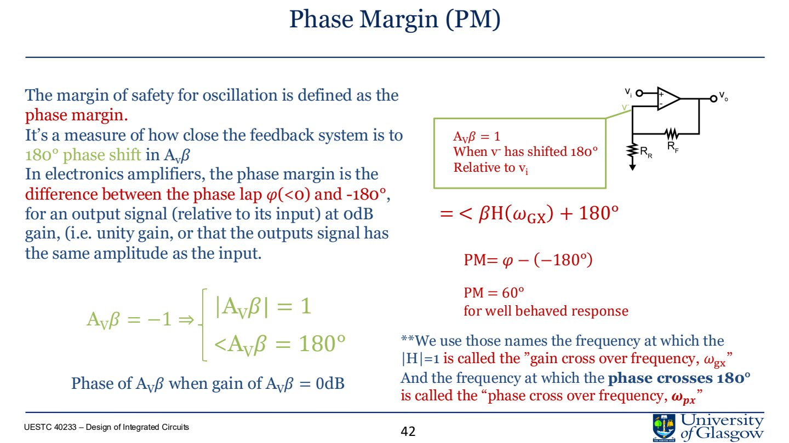
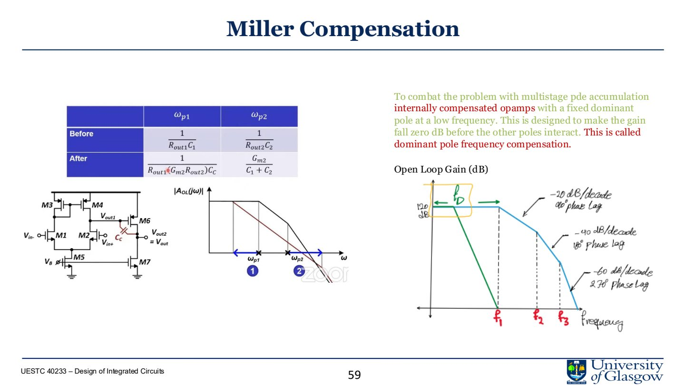

# Lec.7 Frequency Response and Stability

> Source: `PPT/3/Lecture 3.3- frequency Response2.pdf`

这一讲把 amplifier 放进 frequency domain。核心问题是：negative feedback 能稳定 gain、扩展 bandwidth，但如果 loop gain 在相位接近 $-180^\circ$ 时仍然大于 1，系统会振荡。

## 1. 不要让仿真替你思考

Razavi 的提醒非常适合这一讲：短沟道 MOSFET 的精确行为要靠仿真，但如果没有简单直觉，就无法判断仿真结果是否合理。

频率响应笔记要抓三件事：

- poles/zeros 如何改变 magnitude 和 phase；
- feedback loop 的稳定条件；
- Miller compensation 如何制造 dominant pole。

## 2. Non-inverting feedback

Non-inverting amplifier 的 feedback factor：

$$
\beta=\frac{R_2}{R_2+R_f}
$$

闭环增益：

$$
A_{CL}(s)=\frac{A(s)}{1+\beta A(s)}
$$

若 $A(s)$ 很大：

$$
A_{CL}\approx \frac{1}{\beta}
$$

这解释了为什么 negative feedback 能让 closed-loop gain 主要由 resistor ratio 决定。但这个近似只在 loop gain 足够大且系统稳定时成立。

## 3. Bode magnitude

Bode magnitude 的基本规则：

- pole 之前 gain 近似 flat；
- 每个 pole 让 slope 降低 $20\,\text{dB/dec}$；
- 两个 poles 之后 slope 可变成 $-40\,\text{dB/dec}$；
- 每个 left-half-plane zero 让 slope 增加 $20\,\text{dB/dec}$。

因此多级 amplifier 的高频响应会逐渐滚降。多个 poles 靠得太近，会让 phase lag 积累，威胁 stability。

## 4. Bode phase

一个 pole 贡献约 $-90^\circ$ phase shift，变化通常从 pole 前一 decade 开始，到 pole 后一 decade 结束。

一个 zero 的相位贡献取决于位置：

- LHP zero：增加 $+90^\circ$；
- RHP zero：增加额外相位滞后，通常更危险。

## 5. Gain Bandwidth Product

Gain bandwidth product：

$$
GBWP=G\times BW
$$

对 dominant-pole compensated amplifier，闭环 gain 越大，带宽越小；闭环 gain 越小，带宽越大。课程中强调，dominant pole 常由 feedback/Miller capacitance 设置。

简化理解：

$$
GBWP \approx \frac{g_{m1}}{2\pi C_F}
$$

其中 $C_F$ 或 compensation capacitor 决定主要 pole 的位置。

## 6. Loop gain 与振荡条件

闭环系统：

$$
A_{CL}(s)=\frac{A_{OL}(s)}{1+\beta A_{OL}(s)}
$$

若分母为 0，输出会发散：

$$
1+\beta A_{OL}(s)=0
$$

也就是 Barkhausen condition：

$$
|\beta A_{OL}(j\omega)|=1
$$

$$
\angle \beta A_{OL}(j\omega)=-180^\circ
$$

直观说：信号绕反馈环一圈后，幅度没有变小，且相位变成正反馈，就会振荡。

## 7. Phase margin

Gain crossover frequency $\omega_{gx}$：loop gain magnitude 等于 1，也就是 0 dB 的频率。

Phase margin 定义为：

$$
PM=180^\circ+\angle\beta A_{OL}(j\omega_{gx})
$$

经验上：

| Phase Margin | 时域/频域表现 |
|---|---|
| $PM\approx 0^\circ$ | 临界振荡或振荡 |
| $PM$ 很小 | peaking、ringing、overshoot 明显 |
| $PM\approx 60^\circ$ | 通常认为响应较好 |
| $PM$ 很大 | 更稳定但可能更慢 |

## 8. Gain margin

Phase crossover frequency $\omega_{px}$：相位达到 $-180^\circ$ 的频率。

Gain margin 观察在 $\omega_{px}$ 时 loop gain 离 0 dB 还有多远。若相位已经 $-180^\circ$，但 loop gain 低于 1，系统仍有稳定裕度。

## 9. Dominant pole compensation

多级 op-amp 有多个 poles。Miller compensation 的思想是故意放置一个较低频的 dominant pole，让 open-loop gain 在其他 poles 造成严重 phase lag 前先降到 0 dB 以下。

效果：

- 第一 pole 被拉低；
- 第二 pole 被推高或影响变弱；
- unity gain crossing 发生在较安全相位；
- closed-loop overshoot/ringing 减少。

代价：

- bandwidth 下降；
- slew rate 可能受 compensation capacitor 影响；
- 速度和稳定性之间 tradeoff。

## 10. 本讲必须带走的结论

- Feedback gain 近似为 $1/\beta$，但只在 loop stable 时成立。
- 每个 pole 贡献 $-20\,\text{dB/dec}$ 和约 $-90^\circ$ phase lag。
- 振荡条件是 $|\beta A|=1$ 且 phase 为 $-180^\circ$。
- Phase margin 是判断 closed-loop stability 的核心指标，约 $60^\circ$ 通常较稳。
- Miller compensation 用 dominant pole 换稳定性，代价是 bandwidth/speed。
