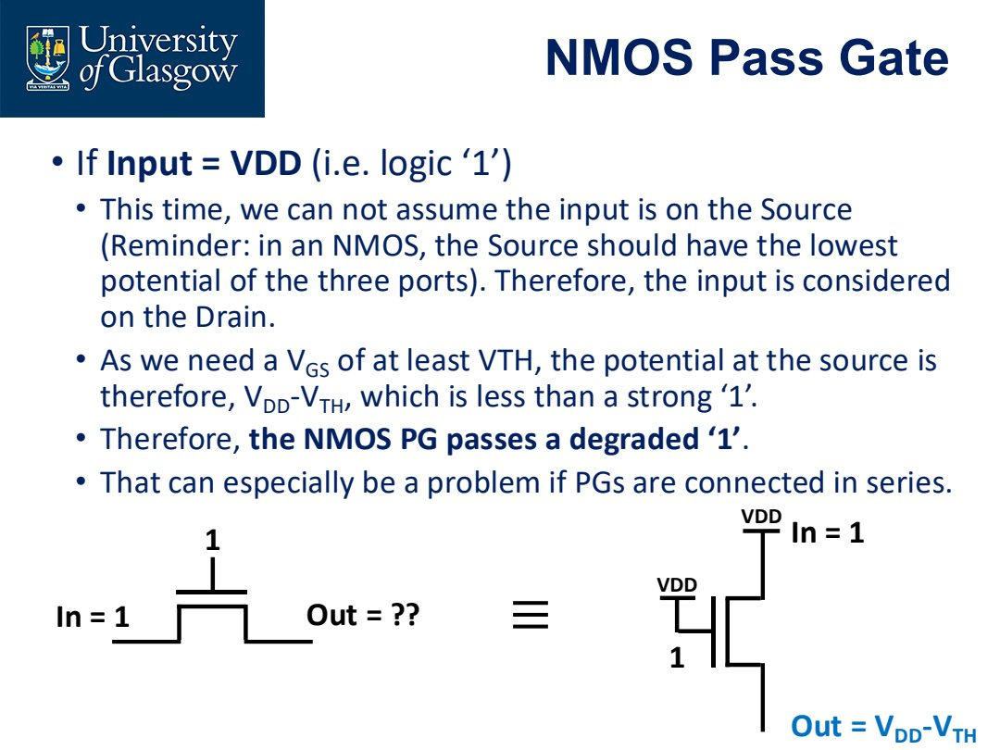

# Lec.9 Pass Gates and Transmission Gates

> Source: `PPT/3/Lecture 3.2.2_Complements_Pass Gates_2026.pdf`

Pass gate 用 MOSFET 作为受控开关。它是 transmission gate、mux、latch、flip-flop 等结构的重要基础。关键不是“能不能导通”，而是 **传 0 和传 1 是否强**。

## 1. NMOS pass gate

NMOS pass gate 就是一个 NMOS transistor，gate 作为控制端：

- gate = 0：OFF；
- gate = 1：ON，可以传递输入。

NMOS 的 source 通常是三个端中电位较低的一端。

## 2. NMOS 传 strong 0

当 input = 0，gate = $V_{DD}$ 时：

- source 在 0 V；
- $V_{GS}=V_{DD}$；
- NMOS 强导通；
- output 可被拉到 0 V。

因此 NMOS pass gate passes a **strong 0**。

## 3. NMOS 传 degraded 1

当 input = $V_{DD}$，gate = $V_{DD}$ 时，输出节点被充电上升。但当输出接近：

$$
V_{out}=V_{DD}-V_{TH}
$$

时：

$$
V_{GS}=V_{TH}
$$

NMOS 无法继续强力拉高。因此 NMOS 传 1 会损失 threshold voltage，称为 degraded 1。多个 NMOS pass gates 串联时，电平退化问题会更严重。

## 4. PMOS pass gate

PMOS 与 NMOS 互补：

- gate = 1：OFF；
- gate = 0：ON。

PMOS source 通常是三个端中电位较高的一端。

## 5. PMOS 传 strong 1

当 input = $V_{DD}$，gate = 0 时：

- source 在高电位；
- $V_{SG}=V_{DD}$；
- PMOS 强导通；
- output 可拉到 $V_{DD}$。

因此 PMOS pass gate passes a **strong 1**。

## 6. PMOS 传 degraded 0

当 input = 0，gate = 0 时，输出节点下降。但当输出接近 $|V_{TP}|$ 附近时，PMOS 不再能强力继续拉低。

所以 PMOS pass gate passes a **degraded 0**。

## 7. Transmission gate

Transmission gate 把 NMOS 和 PMOS 并联，并用互补控制信号驱动：

- NMOS 负责强传 0；
- PMOS 负责强传 1；
- 两者结合后可较好传递 full-swing signal。

这就是为什么 latch、mux、sample switch 中常用 transmission gate，而不是单独 NMOS 或单独 PMOS。

## 8. 本讲必须带走的结论

- NMOS pass gate：strong 0，degraded 1。
- PMOS pass gate：strong 1，degraded 0。
- Degraded level 来自 $V_{TH}$ 限制。
- Transmission gate 用 NMOS + PMOS 互补工作，传 0 和传 1 都更可靠。
- pass gate 串联会累积电平退化和延迟。
