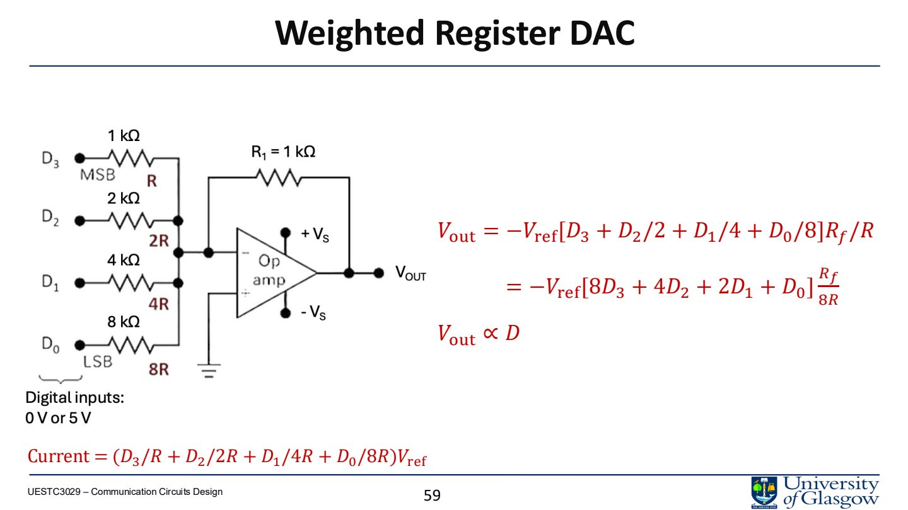
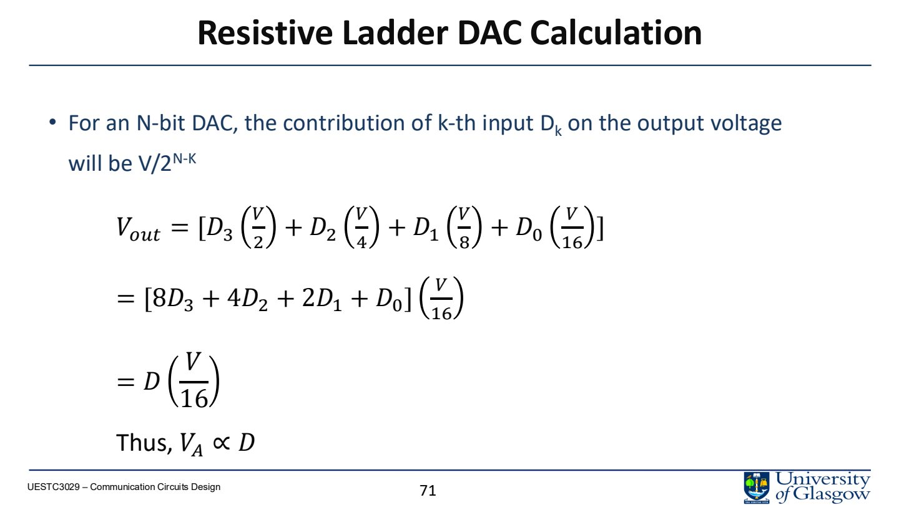

# Lec.11 Digital-to-Analog Converters

> Source: `PPT/3/Lecture 3.3-2 DA Convertors.pdf`

DAC 把 digital code 转换成 analog voltage/current，是数字系统控制真实世界的出口。它常用于 audio output、motor control、communication modulation、industrial control 和 mixed-signal feedback loops。

## 1. DAC 的基本作用

Digital system 只能处理离散 code，但 actuator、speaker、motor、light intensity 等需要连续或近似连续的 analog quantity。DAC 的输入是 binary code，输出通常是：

- voltage；
- current；
- staircase waveform；
- 经 reconstruction/filtering 后的平滑 analog signal。

## 2. Resolution 与 step size

$n$-bit DAC 有：

$$
2^n
$$

个输出 levels。若 code 从 0 到 $2^n-1$ 覆盖 $0$ 到 $V_{ref}$，step size 常写为：

$$
\Delta V=\frac{V_{ref}}{2^n-1}
$$

例如 4-bit、$V_{ref}=5\,\text{V}$：

$$
\Delta V=\frac{5}{15}=0.333\,\text{V}
$$

Resolution 越高，step 越小，输出越接近连续波形，但电路复杂度、面积、功耗和 settling 要求也会上升。

## 3. Staircase output

DAC 输出不是连续曲线，而是离散阶梯：

- 每个 digital code 对应一个固定 analog level；
- code 变化时输出跳到下一阶；
- 阶梯误差表现为 quantization noise；
- 后端常需要 filter 或 buffer。

## 4. Weighted resistor DAC

Weighted resistor DAC 给每个 bit 配一个按二进制权重缩放的 resistor。4-bit 情况：

- MSB 对应 $R$；
- 下一位对应 $2R$；
- 再下一位 $4R$；
- LSB 对应 $8R$。

输出电流在 op-amp summing node 相加：

$$
I=\left(\frac{D_3}{R}+\frac{D_2}{2R}+\frac{D_1}{4R}+\frac{D_0}{8R}\right)V_{ref}
$$

输出：

$$
V_{out}
=-V_{ref}\left[D_3+\frac{D_2}{2}+\frac{D_1}{4}+\frac{D_0}{8}\right]\frac{R_f}{R}
$$

优点：直观、容易理解。  
缺点：高 bit 数需要很大 resistor ratio，例如 16-bit 需要到 $2^{15}R$，制造和匹配困难。

## 5. R-2R ladder DAC

R-2R ladder 只使用两种电阻值：$R$ 和 $2R$。这极大改善 IC 制造一致性。

4-bit R-2R 输出可写为：

$$
V_{out}
=
\left[
D_3\frac{V}{2}
D_2\frac{V}{4}
D_1\frac{V}{8}
D_0\frac{V}{16}
\right]
$$

也就是：

$$
V_{out}=\frac{V}{16}(8D_3+4D_2+2D_1+D_0)
$$

优点：

- 只需两种 resistor；
- scalable；
- 更适合高 resolution；
- layout 重复性好；
- 线性和匹配更容易控制。

## 6. Current steering DAC

Current steering DAC 用数字码控制电流源是否接入输出节点。它适合高速应用。

优点：

- speed high；
- 可直接输出 current；
- 常用于 RF/communication DAC。

挑战：

- current source matching；
- switching glitch；
- output impedance；
- dynamic linearity。

## 7. Settling time

Settling time 是输入 code 改变后，输出进入并保持在目标值误差带内所需时间。常见误差带是：

$$
\pm \frac{1}{2}LSB
$$

Settling time 由 op-amp、switch、load capacitance、parasitics、feedback stability 共同决定。

## 8. Overshoot

Overshoot 指输出先超过目标值，再回到稳定值。原因可能是：

- output stage damping 不足；
- capacitive/inductive parasitics；
- feedback loop tuning 不当；
- high gain/high speed output buffer。

Overshoot 会影响 signal integrity、控制精度，甚至造成器件 stress。

## 9. DAC error types

| Error | 含义 |
|---|---|
| Offset error | 整条 transfer curve 上下平移 |
| Gain error | transfer curve slope 偏离理想 |
| INL | 实际 transfer curve 相对理想直线的最大偏差 |
| DNL | 相邻 code step 大小不一致 |
| Missing code | 某些输出 level 被跳过，通常 DNL 超过 1 LSB |
| Monotonicity error | digital code 增加时，analog output 反而下降 |

高精度 DAC 设计最怕 resistor/current source mismatch，因为它直接造成 DNL/INL。

## 10. 本讲必须带走的结论

- DAC resolution 决定输出 levels 数和 step size。
- Weighted resistor DAC 直观但不适合高 bit 数。
- R-2R ladder 只用 $R$ 和 $2R$，更适合 IC 实现。
- Settling time、overshoot、glitch 会影响动态性能。
- Offset/gain/INL/DNL/monotonicity 是 DAC 关键误差指标。
