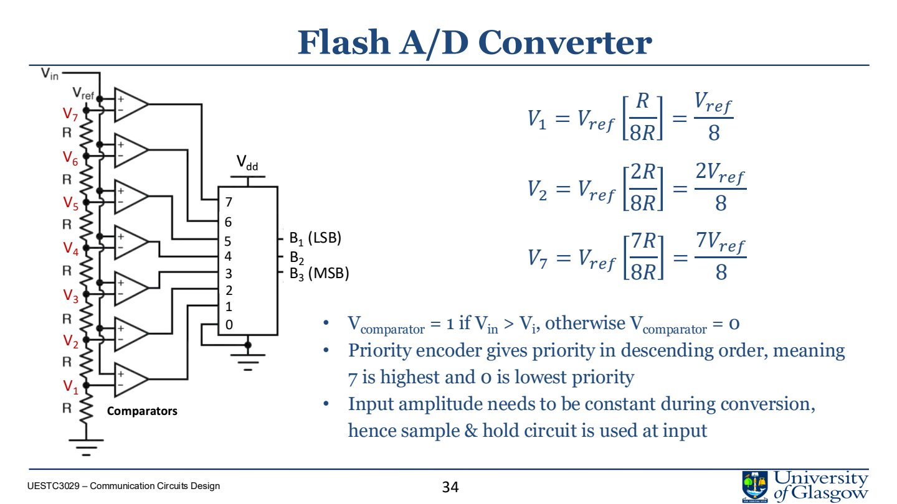
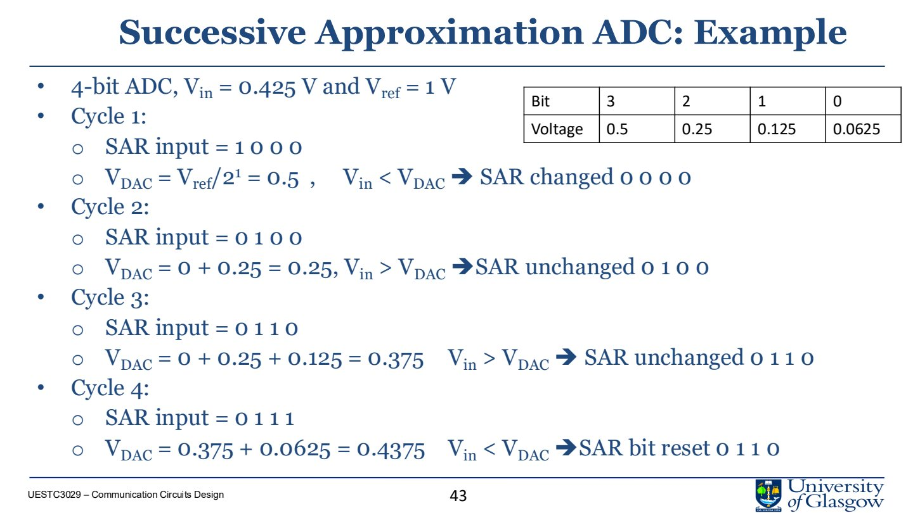
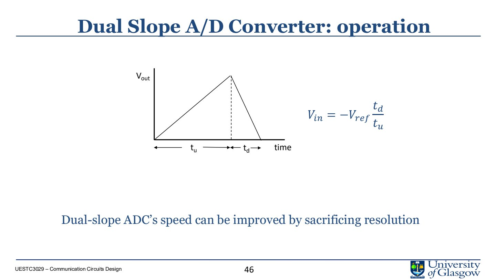

# Lec.12 Analog-to-Digital Converters

> Source: `PPT/3/Lecture 3-3 _ADC.pdf`

ADC 把 analog continuous signal 转换为 digital discrete code，是数字系统感知真实世界的入口。它的核心过程是：**sampling and holding → quantization → encoding**。

## 1. ADC 的两个核心步骤

1. Sampling and holding：按固定时间间隔测量 analog signal，并在转换期间保持；
2. Quantization and encoding：把连续幅度映射到有限 levels，再编码成 binary code。

## 2. Sampling

Sampling interval：

$$
T_s
$$

Sampling frequency：

$$
f_s=\frac{1}{T_s}
$$

三种 sampling：

| Type | 特点 |
|---|---|
| Ideal sampling | Dirac impulse，理论分析用 |
| Natural sampling | pulse 顶部跟随 analog slope |
| Flat-top sampling | sample-and-hold，实际 ADC 常用 |

Flat-top sampling 在转换期间保持电压稳定，便于 comparator/quantizer 判断。

## 3. Nyquist-Shannon theorem

对最高频率为 $f_{max}$ 的 band-limited signal，最低 sampling rate：

$$
f_s\ge 2f_{max}
$$

Nyquist rate：

$$
2f_{max}
$$

例：voice bandwidth 为 $0$ 到 $4\,\text{kHz}$，最低采样率：

$$
f_s=2\times 4\,\text{kHz}=8\,\text{kHz}
$$

若每个 sample 8 bits：

$$
bit\ rate=8\,\text{k samples/s}\times 8=64\,\text{kbps}
$$

## 4. Aliasing

如果信号不是 band-limited，或采样率低于 Nyquist rate，高频分量会伪装成低频分量，这就是 aliasing。

解决：

- ADC 前加 anti-aliasing low-pass filter；
- sampling rate 略高于 Nyquist rate；
- 确认输入频谱在采样前已被限制。

## 5. Quantization

Quantization 把连续幅度分成有限 levels。

若输入范围为 $V_{min}$ 到 $V_{max}$，bit 数为 $n$：

$$
L=2^n
$$

Zone width / LSB：

$$
\Delta=\frac{V_{max}-V_{min}}{L}
$$

每个 sample 被近似到所在 zone 的 midpoint，因此会产生 quantization error。

例：$V_{min}=-12\,\text{V}$，$V_{max}=12\,\text{V}$，$L=8$：

$$
\Delta=\frac{12-(-12)}{8}=3\,\text{V}
$$

8 个区间分别编码成 3-bit code：`000` 到 `111`。

## 6. Resolution 与 quantization noise

$n$-bit ADC 有 $2^n$ 个 levels。bit 数越高：

- LSB 越小；
- quantization error 越小；
- dynamic range 越大；
- data rate 和电路复杂度越高。

例：16-bit ADC，范围 0 到 5 V：

$$
\Delta=\frac{5}{2^{16}}=76\,\mu\text{V}
$$

## 7. Flash ADC

Flash ADC 用并行 comparators 一次完成转换。

对 $N$-bit ADC：

- comparators 数量：$2^N-1$；
- resistor ladder 产生 thresholds；
- priority encoder 把 thermometer-like comparator outputs 转成 binary code；
- sample-and-hold 保证转换期间输入稳定。

优点：

- fastest；
- 可达 GSample/s；
- 适合 high bandwidth。

缺点：

- comparator 数指数增长；
- power 和 area 大；
- resolution 通常有限。

## 8. Successive Approximation ADC

SAR ADC 使用 binary search。每轮尝试一个 bit，并用 DAC/comparator 判断保留还是清零。

算法：

1. MSB 先置 1；
2. DAC 生成试探电压 $V_{DAC}$；
3. comparator 比较 $V_{in}$ 与 $V_{DAC}$；
4. 若 $V_{in}<V_{DAC}$，当前 bit 清零；否则保留；
5. 继续下一 bit，直到 LSB。

$N$-bit SAR ADC 需要 $N$ 个 comparison cycles。

特点：

- low cost；
- low power；
- medium-to-high resolution；
- 常见 8-18 bits；
- 速度中等。

## 9. Dual-slope ADC

Dual-slope ADC 是 integrating ADC。

工作过程：

1. 未知输入 $V_{in}$ 积分固定时间 $t_u$；
2. 切换到相反极性的 reference $V_{ref}$；
3. 记录积分输出回到零所需时间 $t_d$；
4. 由时间比例求输入：

$$
V_{in}=-V_{ref}\frac{t_d}{t_u}
$$

特点：

- speed slow；
- resolution high；
- 对某些 noise 有良好平均效果；
- 常用于 digital multimeter 等精密低速测量。

## 10. ADC 类型比较

| Type | Speed | Cost/Power | Resolution | 典型用途 |
|---|---|---|---|---|
| Flash | very fast | high | low-medium | high-speed sampling |
| SAR | medium-fast | low | medium-high | MCU、data acquisition |
| Dual-slope | slow | medium | high | precision instrumentation |

## 11. 本讲必须带走的结论

- ADC 包含 sampling、quantization、encoding。
- Nyquist rate 至少为最高频率的 2 倍。
- Anti-aliasing filter 是采样前的关键模块。
- Quantization error 来自有限 resolution。
- Flash 快但耗面积/功耗；SAR 折中；dual-slope 慢但精度高。
