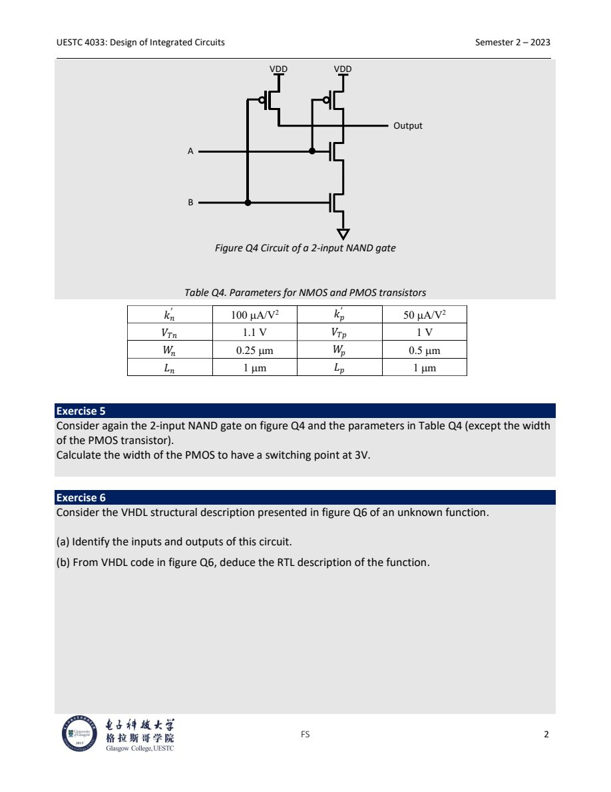
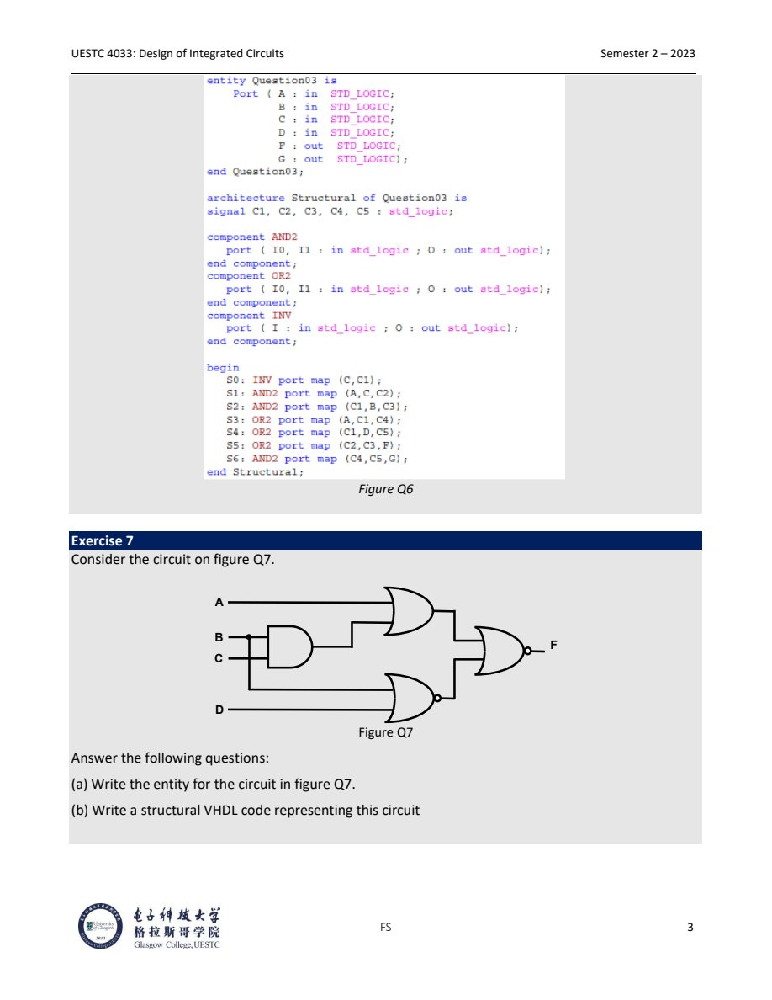

# Lec.1 Digital Exam Question Patterns

> Source: `PPT/UESTC4033_Examples of Exam questions - Digital.pdf`

这一份材料的价值在于复习“数字电路考试会怎么问”。它覆盖的不是新 lecture，而是几类高频操作：用 AOI/OAI cell 实现 Boolean function、用 switching model 估算 propagation delay、求 CMOS gate 的 switching point、从 VHDL structural code 读出 RTL、写 flip-flop behavioral VHDL。

## 1. AOI/OAI 实现 XOR

XOR 的两个常用形式：

$$
A\oplus B=A\bar B+\bar A B
$$

$$
\overline{A\oplus B}=AB+\bar A\bar B
$$

考试题里如果限定只能使用某类 complex gate，先不要急着画 transistor。先把 XOR 改写成这个 cell 的自然形式。

### 1.1 用 AOI cell

AND-OR-Invert cell 的典型输出为：

$$
Y=\overline{X_1X_2+X_3X_4}
$$

要得到 XOR，可以让 AOI 的内部 OR-of-ANDs 先形成 XNOR：

$$
F=\overline{AB+\bar A\bar B}=A\oplus B
$$

实现思路：

- 先产生 $\bar A$ 和 $\bar B$；
- 第一组 AND 输入为 $A,B$；
- 第二组 AND 输入为 $\bar A,\bar B$；
- AOI 的 inverted output 直接就是 XOR。

这类题常考的是“把目标函数变成 cell 的输出形式”。AOI 自带最后的 inversion，所以内部最好构造目标函数的反函数。

### 1.2 用 OAI cell

OR-AND-Invert cell 的典型输出为：

$$
Y=\overline{(X_1+X_2)(X_3+X_4)}
$$

使用恒等式：

$$
(A+\bar B)(\bar A+B)=AB+\bar A\bar B=\overline{A\oplus B}
$$

所以：

$$
F=\overline{(A+\bar B)(\bar A+B)}=A\oplus B
$$

实现思路：

- 先产生 $\bar A$ 和 $\bar B$；
- 第一组 OR 输入为 $A,\bar B$；
- 第二组 OR 输入为 $\bar A,B$；
- OAI 的 inverted output 直接得到 XOR。

## 2. Inverter propagation delay

CMOS inverter 的一阶 switching model 可以看成：

- output node 上有负载电容 $C_L$；
- PMOS on 时用等效电阻 $R_p$ 给 $C_L$ 充电；
- NMOS on 时用等效电阻 $R_n$ 给 $C_L$ 放电。

Propagation delay 的常用一阶近似：

$$
t_p\approx0.69R_{eq}C_L
$$

注意 delay 名字通常按输出变化命名：

| Input transition | Output transition | Conducting path | Standard delay name |
|---|---|---|---|
| $0\to1$ | $1\to0$ | NMOS discharges $C_L$ | $t_{PHL}\approx0.69R_nC_L$ |
| $1\to0$ | $0\to1$ | PMOS charges $C_L$ | $t_{PLH}\approx0.69R_pC_L$ |

如果题目文字把 $t_{PLH}$ 和 $t_{PHL}$ 按输入变化命名，需要在答案里明确说明物理过程：input $0\to1$ 时输出实际是 high-to-low，input $1\to0$ 时输出实际是 low-to-high。这样即使沿用题目符号，也不会把 charge/discharge path 写反。

解题步骤：

1. 判断 input transition 后哪个 transistor on、哪个 transistor off。
2. 把 on 的 transistor 替换为 $R_{eq}$，off 的 transistor 视为 open circuit。
3. 输出端 load 用 $C_L$ 表示。
4. 用 $0.69R_{eq}C_L$ 估算 50% crossing delay。

## 3. NAND switching point



Switching point 定义为：

$$
V_{out}=V_{in}=V_{SP}
$$

对 2-input NAND，如果考题默认两个输入一起扫动，即 $A=B=V_{in}$，可以把网络先等效成一个 inverter：

- 两个 NMOS series，等效强度约为单个 NMOS 的一半：

$$
\beta_{n,eq}\approx\frac{\beta_n}{2}
$$

- 两个 PMOS parallel，等效强度约为单个 PMOS 的两倍：

$$
\beta_{p,eq}\approx2\beta_p
$$

其中：

$$
\beta_n=k'_n\frac{W_n}{L_n},\quad
\beta_p=k'_p\frac{W_p}{L_p}
$$

忽略 channel-length modulation 且采用 long-channel square-law 近似时，在 switching point 附近令 pull-up current 与 pull-down current 相等：

$$
\beta_{n,eq}(V_{SP}-V_{Tn})^2=
\beta_{p,eq}(V_{DD}-V_{SP}-|V_{Tp}|)^2
$$

整理得：

$$
V_{SP}=
\frac{\sqrt{\beta_{n,eq}/\beta_{p,eq}}V_{Tn}+V_{DD}-|V_{Tp}|}
{1+\sqrt{\beta_{n,eq}/\beta_{p,eq}}}
$$

课件参数：

$$
k'_n=100\ \mu A/V^2,\quad W_n=0.25\ \mu m,\quad L_n=1\ \mu m
$$

$$
k'_p=50\ \mu A/V^2,\quad W_p=0.5\ \mu m,\quad L_p=1\ \mu m
$$

所以：

$$
\beta_n=100\times0.25=25\ \mu A/V^2
$$

$$
\beta_p=50\times0.5=25\ \mu A/V^2
$$

等效后：

$$
\beta_{n,eq}=12.5,\quad \beta_{p,eq}=50
$$

$$
\sqrt{\beta_{n,eq}/\beta_{p,eq}}=\sqrt{12.5/50}=0.5
$$

若 $V_{DD}=5V$，$V_{Tn}=1.1V$，$|V_{Tp}|=1V$：

$$
V_{SP}=\frac{0.5\times1.1+5-1}{1+0.5}\approx3.03V
$$

这个结果也解释了为什么 NAND 的 switching point 可能偏高：series NMOS 变弱、parallel PMOS 变强，输出更倾向于保持 high。

## 4. PMOS sizing for target switching point

如果题目要求把 NAND 的 switching point 设计为 $V_{SP}=3V$，反过来求 PMOS width。

由电流相等式：

$$
r=\sqrt{\beta_{n,eq}/\beta_{p,eq}}
=\frac{V_{DD}-V_{SP}-|V_{Tp}|}{V_{SP}-V_{Tn}}
$$

代入 $V_{DD}=5V$，$V_{SP}=3V$，$|V_{Tp}|=1V$，$V_{Tn}=1.1V$：

$$
r=\frac{5-3-1}{3-1.1}=\frac{1}{1.9}\approx0.526
$$

因此：

$$
\beta_{p,eq}=\frac{\beta_{n,eq}}{r^2}
\approx\frac{12.5}{0.526^2}\approx45.1\ \mu A/V^2
$$

对两个 parallel PMOS：

$$
\beta_{p,eq}=2k'_p\frac{W_p}{L_p}
$$

$$
45.1=2\times50\times\frac{W_p}{1}
$$

得到：

$$
W_p\approx0.45\ \mu m
$$

答题时要写清楚采用的等效假设：两个输入一起切换、two series NMOS 约等于 $\beta_n/2$、two parallel PMOS 约等于 $2\beta_p$。不同老师若采用更精细的 internal node 分析，数值可能略有差别，但方法核心仍然是 current balance。

## 5. 从 structural VHDL 读出 RTL



Structural VHDL 题通常不是考语法记忆，而是考你能不能把 component instance 还原成信号网络。

读题顺序：

1. 先看 `entity`：列出 inputs、outputs。
2. 看 `signal`：这些是 internal nodes。
3. 看 `component`：知道每个 instance 是 AND、OR、INV、FF 还是别的元件。
4. 看每个 `port map`：把输出信号写成输入信号的函数。
5. 从 internal node 开始逐层代入，得到 RTL equation。

课件中的 Figure Q6 可以这样读：

```text
C1 = not C
C2 = A and C
C3 = C1 and B = (not C) and B
C4 = A or C1 = A or (not C)
C5 = C1 or D = (not C) or D
F  = C2 or C3
G  = C4 and C5
```

因此：

$$
F=AC+\bar C B
$$

$$
G=(A+\bar C)(\bar C+D)
$$

这里的 $F$ 像一个 2-to-1 mux 形式：当 $C=1$ 时 $F=A$，当 $C=0$ 时 $F=B$。

## 6. 根据电路图写 structural VHDL

Figure Q7 这类题要求从图写 `entity` 和 `architecture`。先把图拆成 gate-level nodes，再写 VHDL。

按图可定义：

```text
s_and       = B and C
s_or_top    = A or s_and
s_or_bottom = B or D
s_nor_bot   = not s_or_bottom
F           = not (s_or_top or s_nor_bot)
```

对应逻辑：

$$
F=\overline{(A+BC)+\overline{(B+D)}}
$$

一个简洁的 structural 写法：

```vhdl
library IEEE;
use IEEE.STD_LOGIC_1164.ALL;

entity question_q7 is
  port (
    A : in  STD_LOGIC;
    B : in  STD_LOGIC;
    C : in  STD_LOGIC;
    D : in  STD_LOGIC;
    F : out STD_LOGIC
  );
end question_q7;

architecture Structural of question_q7 is
  signal s_and       : STD_LOGIC;
  signal s_or_top    : STD_LOGIC;
  signal s_or_bottom : STD_LOGIC;
  signal s_nor_bot   : STD_LOGIC;
  signal s_or_final  : STD_LOGIC;

  component AND2
    port (I0, I1 : in STD_LOGIC; O : out STD_LOGIC);
  end component;

  component OR2
    port (I0, I1 : in STD_LOGIC; O : out STD_LOGIC);
  end component;

  component INV
    port (I : in STD_LOGIC; O : out STD_LOGIC);
  end component;
begin
  G0 : AND2 port map (B, C, s_and);
  G1 : OR2  port map (A, s_and, s_or_top);
  G2 : OR2  port map (B, D, s_or_bottom);
  G3 : INV  port map (s_or_bottom, s_nor_bot);
  G4 : OR2  port map (s_or_top, s_nor_bot, s_or_final);
  G5 : INV  port map (s_or_final, F);
end Structural;
```

如果考试允许使用 `NOR2` component，可以把 `OR2 + INV` 合成一个 `NOR2`，但用 basic gates 更不容易因为 library 名字扣分。

## 7. JK flip-flop behavioral VHDL

Positive-edge triggered JK flip-flop 的状态表：

| J | K | Next Q |
|---|---|---|
| 0 | 0 | hold |
| 0 | 1 | reset to 0 |
| 1 | 0 | set to 1 |
| 1 | 1 | toggle |

推荐用 internal signal 保存状态，再把它接到 output。这样避免在旧版 VHDL 中直接读 `out` port 的问题。

```vhdl
library IEEE;
use IEEE.STD_LOGIC_1164.ALL;

entity jk_ff is
  port (
    J   : in  STD_LOGIC;
    K   : in  STD_LOGIC;
    CLK : in  STD_LOGIC;
    Q   : out STD_LOGIC;
    QN  : out STD_LOGIC
  );
end jk_ff;

architecture Behavioral of jk_ff is
  signal q_int : STD_LOGIC := '0';
begin
  process (CLK)
  begin
    if rising_edge(CLK) then
      case J & K is
        when "00" =>
          q_int <= q_int;
        when "01" =>
          q_int <= '0';
        when "10" =>
          q_int <= '1';
        when "11" =>
          q_int <= not q_int;
        when others =>
          q_int <= q_int;
      end case;
    end if;
  end process;

  Q  <= q_int;
  QN <= not q_int;
end Behavioral;
```

加入 asynchronous reset 时，reset 必须放进 sensitivity list，并且放在 clock edge 判断之前：

```vhdl
architecture Behavioral of jk_ff is
  signal q_int : STD_LOGIC := '0';
begin
  process (CLK, RESET)
  begin
    if RESET = '1' then
      q_int <= '0';
    elsif rising_edge(CLK) then
      case J & K is
        when "00" =>
          q_int <= q_int;
        when "01" =>
          q_int <= '0';
        when "10" =>
          q_int <= '1';
        when "11" =>
          q_int <= not q_int;
        when others =>
          q_int <= q_int;
      end case;
    end if;
  end process;

  Q  <= q_int;
  QN <= not q_int;
end Behavioral;
```

对应 entity 需要加入：

```vhdl
RESET : in STD_LOGIC
```

## 8. 考试检查清单

- AOI/OAI：先把 Boolean function 改写成 cell 的 natural form，再画门。
- Inverter delay：按输出变化命名 $t_{PHL}$ 和 $t_{PLH}$，不要按输入变化误判 charge/discharge path。
- Switching point：写出 $V_{out}=V_{in}=V_{SP}$，再用 pull-up current = pull-down current。
- NAND/NOR sizing：先说明 series/parallel transistor 的等效强度假设。
- Structural VHDL：`entity` 定端口，`signal` 定内部节点，`port map` 决定连线。
- Flip-flop：sequential logic 用 `process` 和 `rising_edge(CLK)`；asynchronous reset 放在 clock 判断之前。
