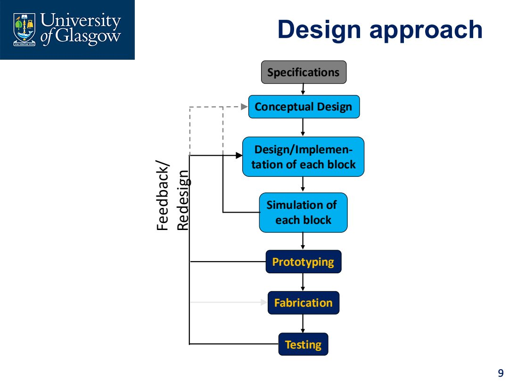
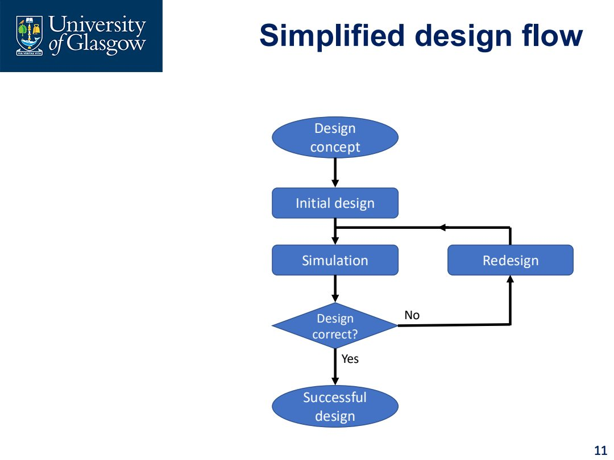
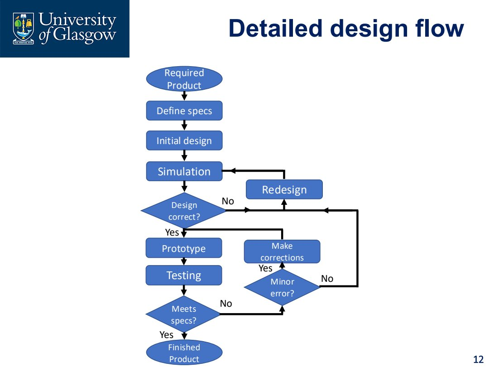
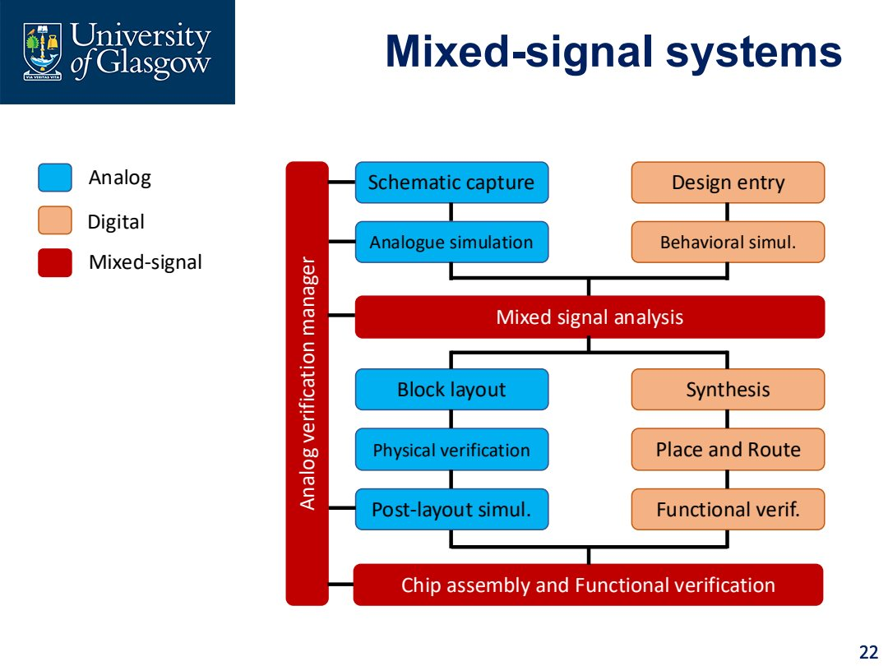
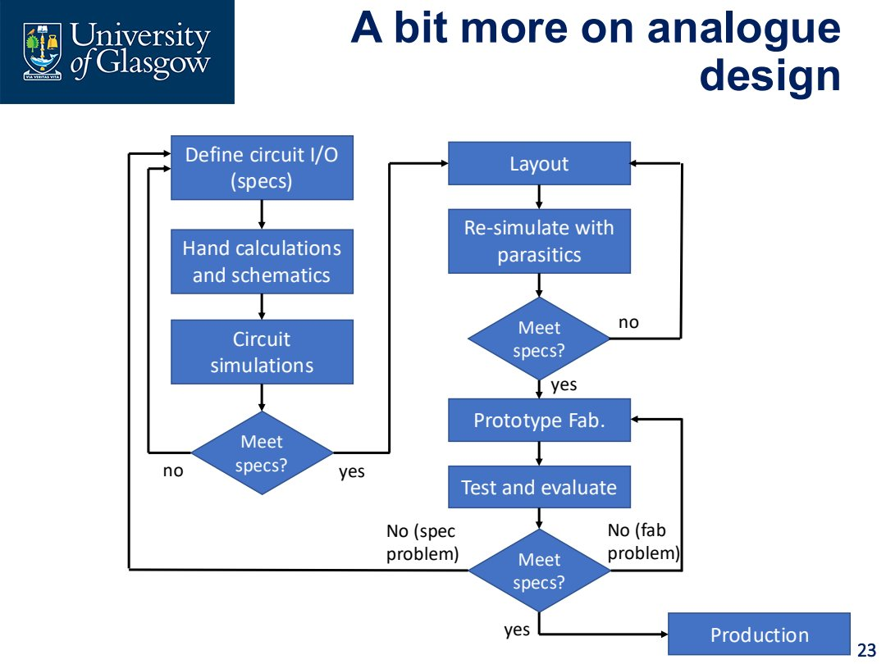

# Lec.4 集成电路设计流程

> **_Design Process_**

IC 是复杂系统。设计流程的意义不是“形式主义”，而是避免团队在复杂问题中靠直觉乱试，尤其避免在错误方向上投入太多时间。Integrated circuit design 必须用清晰的 process 把 specification、conceptual design、block implementation、simulation、layout、testing 串起来。

## 为什么 IC 设计需要 process？

IC 设计常见问题有：

- 系统太复杂，单靠局部直觉容易漏掉 constraint；
- requirement 不完整或不够具体；
- 同一功能存在多个 architecture；
- cost、area、power、speed、noise 等目标互相冲突；
- 早期 warning signs 容易被忽略；
- fabricated chip 出错后修改代价非常高。

所以一个设计流程要做三件事：

1. 让团队知道当前阶段应该完成什么；
2. 用客观 criteria 判断是否进入下一阶段；
3. 尽早 kill bad design，避免后期返工。

## Stage-Gate 思想

Stage-Gate process 的核心不是某张固定流程图，而是这个原则：

- follow the process；
- do not skip steps；
- 每个 gate 都要有 clear pass criteria；
- **kill early, kill quick**。

在 IC 里，这个思想非常重要。因为越往后，错误越贵：

- specification 阶段发现问题：改文档；
- schematic 阶段发现问题：改电路；
- layout 阶段发现问题：改版图；
- tape-out 后发现问题：改 mask / respin，成本巨大。

## General Design Flow

课件给出的通用流程可以整理为：

> 图示保留原因：这里是 Part 1 后续所有设计方法的骨架。

1. **Specifications**
   - 明确系统要做什么；
   - 给出 voltage、gain、bandwidth、power、area、temperature、interface 等指标。
2. **Conceptual Design**
   - 把 specification 转成 block diagram；
   - 决定 analog/digital/mixed-signal partition。
3. **Block Implementation**
   - 为每个 block 选择 topology；
   - 做 hand calculation 和初步 sizing。
4. **Simulation**
   - 验证每个 block；
   - 如果不满足要求，反馈到 design。
5. **Prototyping / Fabrication**
   - 在课程中多是工具级或项目级 prototype；
   - 工业中对应 silicon implementation。
6. **Testing**
   - 对真实或后仿结果做 measurement；
   - 判断是否满足 datasheet specification。

## Specification 到 Conceptual Design

Specification 是设计的入口，但通常不是直接可实现的电路图。把 specs 转成 conceptual design 是最难的一步之一。

难点包括：

- requirements may not be specific enough；
- more than one solution is possible；
- 需要理解系统工作方式；
- constraints may conflict，例如 cost、space、power；
- 经验会帮助减少无效搜索。

例如“设计一个 amplifier”不能只说“gain 高”。必须明确：

- gain = ? dB；
- bandwidth = ?；
- supply voltage range = ?；
- ripple / noise / distortion limit = ?；
- load 是什么；
- process / area / power 限制是什么。

## Simplified vs Detailed Design Flow

简化流程通常是：

Design concept → initial design → simulation → redesign，直到 design correct。

更完整的产品流程还包括 prototype、testing、minor correction、final product：

区别在于：

- simplified flow 适合解释 iteration；
- detailed flow 更接近工程项目，会区分 simulation pass 和 prototype/test pass。

## Documentation 与 Datasheet

Documentation 不是最后才写的报告，而是贯穿设计流程的工程记录。

Data sheet / specs sheet 用来描述 device 或 system 的 performance and characteristics。电子器件 datasheet 通常包含：

- features；
- key parameters；
- pin configuration；
- absolute maximum ratings；
- DC performance；
- AC performance；
- parameter graphs；
- application circuits。

关键点：datasheet 不只是产品完成后给客户看的。设计早期就要定义 preliminary datasheet，因为它实际上规定了 design target。

## Datasheet 如何反过来驱动设计？

假设要设计一个 amplifier：

- Gain = 60 dB；
- Bandwidth = 600 Hz to 25 kHz；
- $V_{DD}$ between 7 V and 12 V；
- Ripple < 1 dB；
- Max gain for amplifier stage = 40 dB。

这些 specs 会直接决定 architecture：

- 单级最大 40 dB，但总 gain 需要 60 dB，因此至少需要多级；
- bandwidth 限制会影响 compensation 和 pole placement；
- supply range 会限制 output swing 和 bias；
- ripple/noise 会影响 topology 和 filtering。

所以 datasheet 是 design 的输入，不只是输出。

## Mixed-Signal Design Flow

Mixed-signal system 的困难在于 analog 和 digital 的设计方法不同，但最后必须在同一 chip 上合并。

一个典型流程可以理解为：

- Analog side:
  - schematic capture；
  - analog simulation；
  - block layout；
  - physical verification；
  - post-layout simulation。
- Digital side:
  - design entry；
  - behavioral simulation；
  - synthesis；
  - place and route；
  - functional verification。
- Mixed-signal integration:
  - mixed-signal analysis；
  - chip assembly；
  - analog verification manager / functional verification。

关键问题是 interface：analog continuous signal 和 digital discrete state 必须通过 ADC、DAC、clock、comparator、level shifter 等边界模块连接。

## Analog Design Flow

Analog design 的流程通常更依赖 hand calculation、simulation、layout parasitics 和测试反馈。

典型步骤：

1. define circuit I/O specs；
2. hand calculations and schematics；
3. circuit simulation；
4. layout；
5. re-simulate with parasitics；
6. prototype fabrication；
7. test and evaluate；
8. 判断是 specification problem 还是 fabrication problem。

Analog 电路尤其怕 parasitics。schematic pass 不代表 layout 后还能 pass。

## Testing

Testing 虽然常在流程后段出现，但测试计划应当提前考虑。

Testing 的目的：

- validate design / IC；
- 通过 measurement 判断是否满足 specification；
- 用 statistical methods 评估 process variation；
- 为 datasheet 提供真实数据。

Testing process 通常包括：

1. determine test objective；
2. select measurement technique and test procedure；
3. plan how to analyse / present / use data；
4. take measurement；
5. compare against specs。

## Critical Design Review

IC 设计中必须主动寻找可能失败的地方：

- 某些 digital input combination 造成 hazard；
- user misuse 造成 product failure；
- analog corner case 造成 performance violation；
- layout parasitic 造成 oscillation / delay；
- process variation 造成 yield 问题。

越早识别风险，越能降低 time-to-market、extra cost 和 PR disaster。

## Design Reuse

Design reuse 指复用已经设计、仿真、验证过的 block，例如 standard cell、op-amp topology、bias circuit、ADC sub-block。

好处：

- reduce design cost；
- reduce design time；
- lower verification risk。

风险：

- reused block 的 performance 未必满足新 specs；
- old block 的 assumptions 可能不同；
- process、supply、temperature、load 改变后需要重新验证。

## 本讲要点

- IC design process 是为了降低复杂度和返工风险。
- Specification 是设计入口，datasheet 要在早期定义。
- Conceptual design 是把 specs 转成 block architecture。
- Simulation pass 不等于 final pass，layout parasitics 和 testing 会改变结论。
- Mixed-signal design 需要同时处理 analog flow、digital flow 和二者接口。
- Design reuse 有价值，但必须重新检查 context 和 assumptions。
