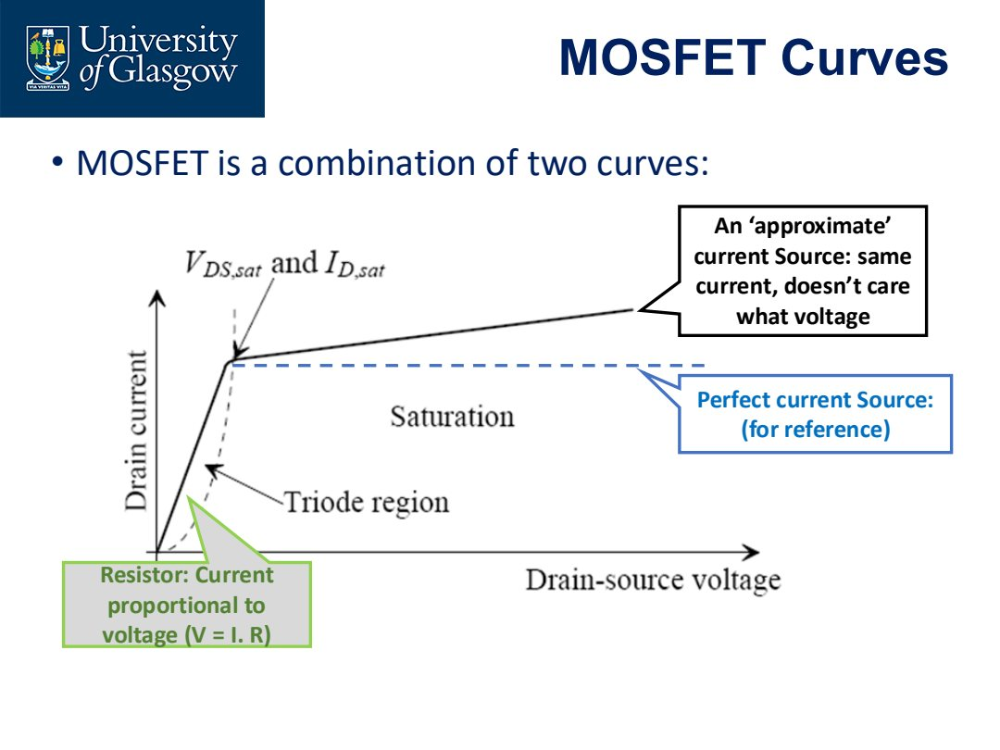
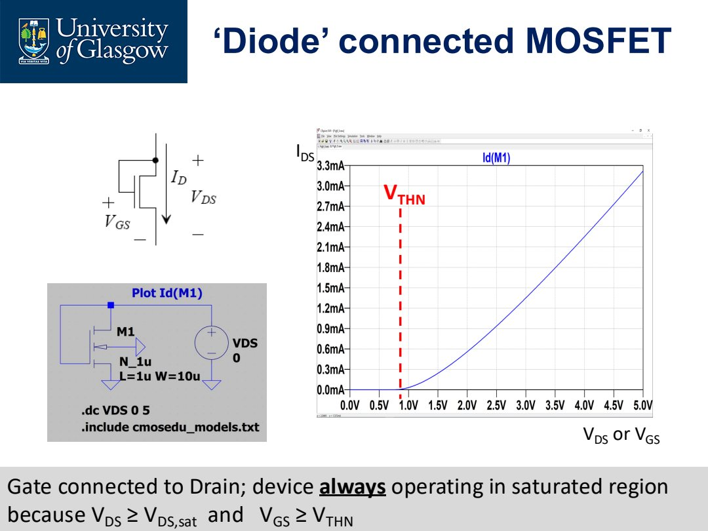
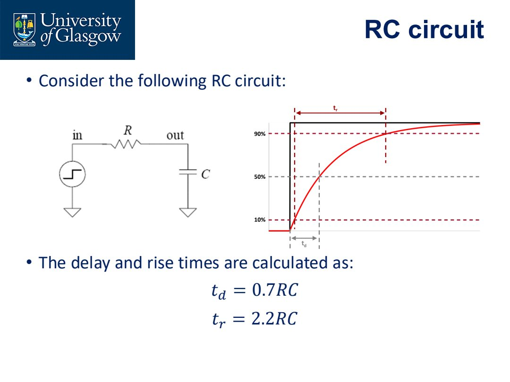
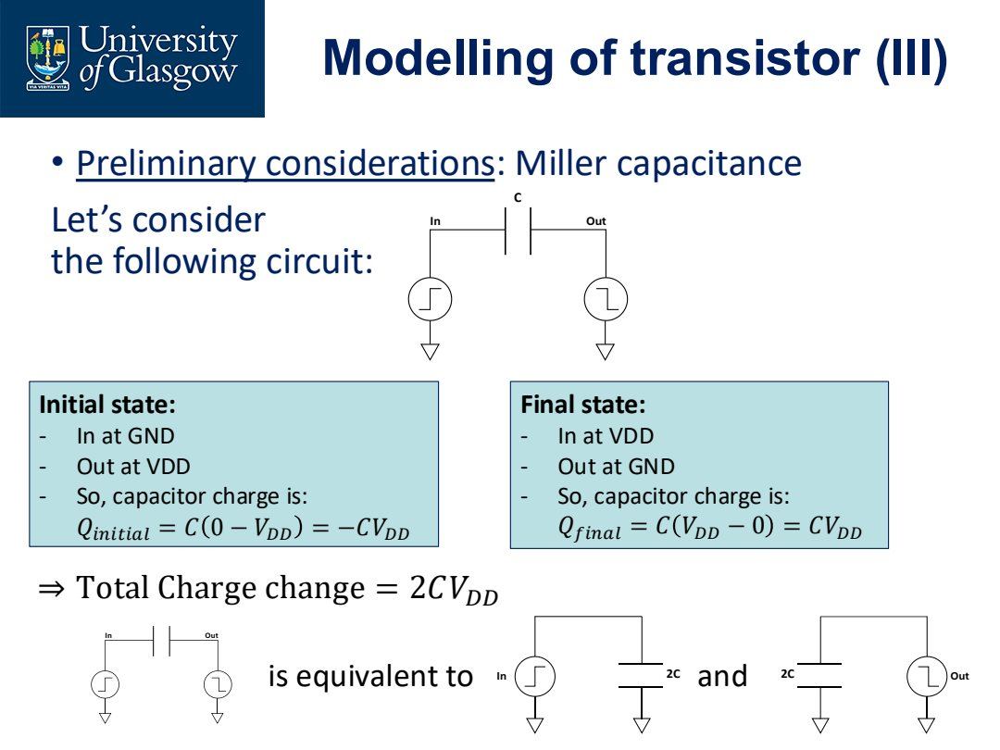
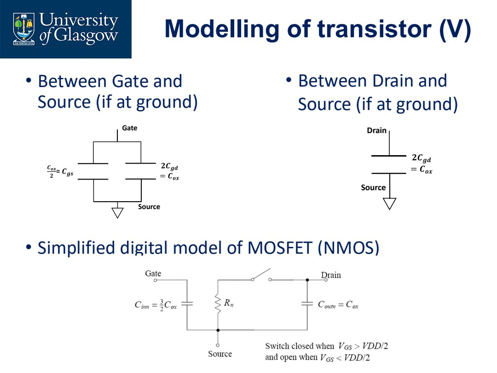

# Lec.7 Analog vs Digital

> **_Analog vs Digital_**

这一讲把 MOSFET 放到两个不同设计视角里：analog design 和 digital design。同一个 transistor，在 analog 里常被看作 current source / controlled device；在 digital 里常被看作 switch + resistance + capacitance。

## Analog 和 Digital 的核心区别

Analog design 关心 continuous values。信号通常在 supply rails 之间变化，目标是避免不该碰 rail 的地方碰到 rail。

Analog 关键指标：

- accuracy；
- gain；
- bandwidth；
- frequency response；
- transient response；
- noise；
- distortion；
- bias stability。

Digital design 关心 discrete states。理想情况下信号只表示 0 和 1，应该尽快离开中间区域。

Digital 关键指标：

- logic function；
- propagation delay；
- transition time；
- setup/hold；
- synchronization；
- noise margin；
- hazards。

> Analog 追求“中间值有意义且准确”；digital 追求“中间值尽快过去，最后只剩 0/1”。

## Analog Perspective: MOSFET as Current Source + Resistor

从 analog 角度看，MOSFET 的 I-V 曲线像两类行为的组合：

- resistor-like behavior：电流随电压明显变化；
- current-source-like behavior：电流对输出电压不太敏感。

理想 current source 是 horizontal I-V curve。真实 MOSFET 在 saturation 中接近 current source，但仍有 slope，这个 slope 对应有限 output resistance $r_o$。

## Long-Channel NMOS Square Law

对于长沟道 NMOS，在 saturation 区：

$$
I_D=\frac{K'_n}{2}\frac{W}{L}(V_{GS}-V_{THN})^2(1+\lambda V_{DS})
$$

课件中更精细地写到 $V_{DS,sat}$：

$$
V_{DS,sat}=V_{GS}-V_{THN}
$$

其中：

- $K'_n$ 是 process transconductance parameter；
- $W/L$ 是器件尺寸比；
- $\lambda$ 描述 channel-length modulation；
- $r_o$ 与 $\lambda I_D$ 相关。

常用近似：

$$
r_o \approx \frac{1}{\lambda I_D}
$$

Analog 设计里，$r_o$ 决定 gain 上限，所以不能只看 $I_D$。

## Long-Channel PMOS Square Law

PMOS 对应写法：

$$
I_D=\frac{K'_p}{2}\frac{W}{L}(V_{SG}-V_{THP})^2(1+\lambda V_{SD})
$$

以及：

$$
V_{SD,sat}=V_{SG}-V_{THP}
$$

PMOS 和 NMOS 的曲线形状相似，只是电压方向反过来。

## Diode-Connected MOSFET

Diode-connected MOSFET 指 gate 和 drain 短接。

对 NMOS：

$$
V_{DS}=V_{GS}
$$

Saturation 条件为：

$$
V_{DS}\ge V_{GS}-V_T
$$

代入 $V_{DS}=V_{GS}$：

$$
V_{GS}\ge V_{GS}-V_T
$$

只要 $V_T>0$ 且器件导通，这个条件成立。因此 diode-connected MOSFET 一旦导通，通常处于 saturation。

这在 current mirror、bias circuit 中非常常见。

## NMOS 与 PMOS 的 qualitative operation

对 NMOS：

- 从 drain 注入电流，$V_{DS}$ 增加，$I_D$ 增加；
- 从 drain 抽走电流，$V_{DS}$ 减小，$I_D$ 减小。

对 PMOS：

- 电压方向相反，用 $V_{SD}$ 理解更自然；
- source 通常在高电位，current direction 和 NMOS 相反；
- 曲线形状类似，但上下翻转。

设计者需要知道曲线“怎么动”，而不一定每次都从 semiconductor physics 重新推导。

## Digital Perspective: Delay and Transition

Digital circuit 中，MOSFET 主要被看作 switch。问题从“电流多准”变成：

- logic output 什么时候翻转？
- output 从 10% 到 90% 要多久？
- propagation delay 由什么决定？
- capacitance 从哪里来？

常见时间定义：

- $t_{PLH}$：output 从 low 到 high 的 propagation delay；
- $t_{PHL}$：output 从 high 到 low 的 propagation delay；
- $t_{LH}$：low-to-high transition time / rise time；
- $t_{HL}$：high-to-low transition time / fall time。

## RC Delay Model

Digital delay 的一阶模型来自 RC circuit：

$$
t_d \approx 0.7RC
$$

$$
t_r \approx 2.2RC
$$

其中：

- $0.7RC$ 近似对应到 50% crossing；
- $2.2RC$ 近似对应从 10% 到 90% 的 transition。

所以 digital speed 的核心是：

> reduce resistance, reduce capacitance, or both.

## MOSFET Switching Resistance

在 digital model 中，导通的 NMOS/PMOS 可近似成 resistor。

长沟道推导给出 switching resistance 与 $L/W$ 成正比：

$$
R_n \propto \frac{L}{W}
$$

课件给出短沟道近似：

$$
R_n = 34k\frac{L}{W}
$$

$$
R_p = 68k\frac{L}{W}
$$

PMOS resistance 大约是 NMOS 的两倍，这是因为 hole mobility 低于 electron mobility。为了让 rise/fall delay 接近，PMOS 往往需要做得比 NMOS 更宽。

## Miller Capacitance

当 input 从 0 到 $V_{DD}$，output 从 $V_{DD}$ 到 0 时，gate-drain capacitance 两端电压变化不是 $V_{DD}$，而是约 $2V_{DD}$。

因此 charge change：

$$
\Delta Q \approx 2C V_{DD}
$$

这可以等效成更大的 input/output capacitance，即 Miller effect。

Digital timing 中，capacitance 不只是 load capacitor，还包括：

- gate capacitance；
- drain/source diffusion capacitance；
- gate-drain Miller capacitance；
- wire capacitance；
- fanout load。

## Simplified Digital MOSFET Model

简化模型把 MOSFET 看成：

- on-resistance；
- capacitance to ground；
- switch controlled by gate。

这个模型不精确，但足以估算 propagation delay 和 transition time。

## Delay Formula

课件给出的近似：

$$
t_{PHL}\approx0.7R_nC_{tot}
$$

$$
t_{PLH}\approx0.7R_pC_{tot}
$$

Transition time：

$$
t_{HL}\approx2.2R_nC_{tot}
$$

$$
t_{LH}\approx2.2R_pC_{tot}
$$

其中 $C_{tot}$ 是 output node 到 ground 的总电容，常包括：

$$
C_{tot}=C_{ds}+C_L
$$

或者在更完整模型中加入 gate/drain/wire parasitics。

## CMOS Inverter

CMOS inverter 是最简单也最重要的 digital gate：

- input = 0：PMOS on，NMOS off，output 被拉到 $V_{DD}$；
- input = 1：NMOS on，PMOS off，output 被拉到 ground。

从 analog 角度看，inverter 有 transfer characteristic；从 digital 角度看，它是 logic NOT gate；从 timing 角度看，它是 charge/discharge capacitor 的 RC network。

## Analog vs Digital 的统一视角

同一个 MOSFET 可以有两种模型：

| View | MOSFET model | 主要问题 |
| --- | --- | --- |
| Analog | controlled current source + $r_o$ | gain, bias, swing, noise, bandwidth |
| Digital | switch + resistance + capacitance | logic level, delay, rise/fall time |

两种模型不是互相矛盾，而是针对不同问题的近似。

## 本讲要点

- Analog signal 在 rails 之间有意义，digital signal 只希望稳定在 0/1。
- Analog MOSFET model 重视 square law、saturation、$r_o$、gain。
- Diode-connected MOSFET 通常在导通时处于 saturation，是 current mirror 的基础。
- Digital MOSFET model 重视 switching resistance 和 capacitance。
- Delay 近似由 $RC$ 决定：$t_d\approx0.7RC$，transition $\approx2.2RC$。
- PMOS mobility 较低，常需要比 NMOS 更宽来平衡 rise/fall time。
- Miller capacitance 会放大 switching 时看到的有效 capacitance。
