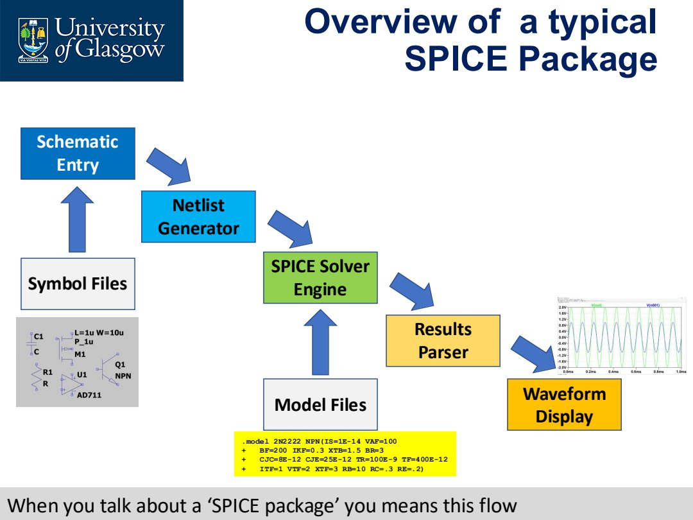
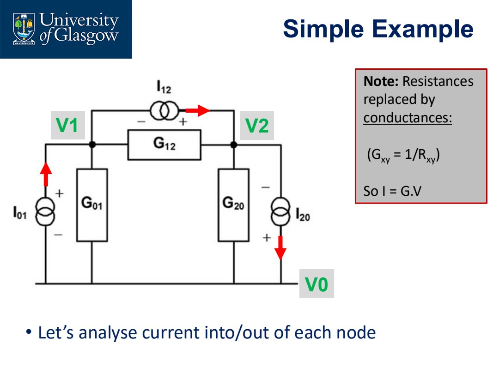

# Lec.1 SPICE Fundamentals

> Source: `PPT/2/Lecture 2.1.1_SPICE_2026.pdf`

这一讲的核心不是学习 LTSpice 的按钮，而是理解 **SPICE package 背后到底在做什么**：你画的 schematic 最终会被翻译成 netlist，solver 再用器件模型和电路方程求解节点电压/电流。

## 1. SPICE 是什么

**SPICE** 是 *Simulation Program with Integrated Circuit Emphasis*，最早由 UC Berkeley 在 1975 年开发。它不是某一个软件界面，而是一类电路仿真求解引擎的基础思想。LTSpice、PSpice、HSPICE 等工具的界面和语法细节不同，但核心都围绕同一件事：

- 用电路拓扑和器件模型建立方程；
- 根据选定的 analysis type 求解电压、电流或频率响应；
- 把结果解析成波形、表格或日志。

在 IC 设计里，SPICE 很重要，因为很多内部节点在真实芯片上很难直接测量。好的模型加上正确的仿真设置，可以在流片前暴露大量设计问题。但它不会替你判断结果是否合理：**仿真之前要先用手算或直觉估计答案范围**。

## 2. 一个 SPICE package 的数据流

SPICE 工具不是只有 solver。完整流程通常是：



| 阶段 | 作用 | 容易误解的点 |
|---|---|---|
| Schematic Entry | 画人能读懂的电路图 | schematic 本身只是图形描述，不等于 netlist |
| Symbol Files | 定义符号外观和 pin table | 真正决定连接关系的是 pin，不是图标长相 |
| Netlist Generator | 把 schematic 转成 electrical descriptor | solver 实际运行的是 netlist |
| Model Files | 提供 MOSFET、diode、BJT 等器件参数 | 模型质量直接决定仿真可信度 |
| SPICE Solver Engine | 建立并求解电路方程 | 会给出答案，但不保证是你想要的物理答案 |
| Results Parser / Waveform Display | 把文本结果变成可读波形 | 好看的波形不代表电路正确 |

一句话记忆：**schematic 给人看，netlist 给 SPICE 跑，model file 告诉 SPICE 器件长什么样。**

## 3. Schematic 不是 netlist

在 LTSpice 里，`.asc` schematic 文件记录的是 wires、symbols、labels、directives 等图形和属性信息。它可以包含大量坐标与窗口信息，但这不是电路求解器最终直接使用的形式。

真正送入 SPICE engine 的是 netlist，例如：

```text
VDD N01 0 3.3 AC 1
Rfeed N02 N01 2.2k
R_in N02 0 23.97k
I_diode V_out 0 0.9m
D1 N02 V_out 1N4148
.model D D
.lib .../standard.dio
.op
.backanno
.end
```

读 netlist 时要抓住四类信息：

- component name：如 `Rfeed`、`VDD`、`D1`；
- connected nodes：如 `N02 N01`；
- value/model：如 `2.2k`、`1N4148`；
- directive：如 `.op`、`.lib`、`.backanno`。

SPICE 出错时，不要只盯 schematic。很多问题要回到 netlist 看节点有没有接错、单位有没有写错、model 有没有正确载入。

## 4. SPICE 如何求节点电压

SPICE 以 Kirchhoff's laws 为基础。对一般电路，它通常把电阻改写成 conductance：

$$
G_{xy}=\frac{1}{R_{xy}},\qquad I=GV
$$

然后对每个节点写 KCL 方程。下面这个三节点例子说明了“对每个节点统计流入/流出电流”的思想：



若未知量为节点电压 $V_0,V_1,V_2$，方程可写成矩阵形式：

$$
\begin{bmatrix}
G_{01}+G_{20} & -G_{01} & -G_{20}\\
-G_{01} & G_{12}+G_{01} & -G_{12}\\
-G_{20} & -G_{12} & G_{20}+G_{12}
\end{bmatrix}
\begin{bmatrix}
V_0\\V_1\\V_2
\end{bmatrix}
=
\begin{bmatrix}
I_{20}-I_{01}\\
I_{01}-I_{12}\\
I_{12}-I_{20}
\end{bmatrix}
$$

这就是 nodal analysis 的核心：**用导纳矩阵描述电路，用矩阵求解满足 KCL 的节点电压**。

## 5. 为什么需要迭代

线性 DC 电阻网络可以一次建立矩阵求解。但 IC 里的 MOSFET、diode、BJT 都是非线性器件，电容/电感又会引入时间变化。因此 SPICE 通常需要：

- 先找 DC operating point；
- 把非线性器件在当前工作点附近线性化；
- 对瞬态或非线性问题不断迭代；
- 检查是否收敛到稳定解。

这解释了为什么复杂电路会遇到 convergence problems。很多时候，问题不是“软件坏了”，而是电路初始条件、偏置点、模型或仿真设置让 solver 很难找到一致解。

## 6. Model files 的意义

模型文件是 SPICE 和真实器件之间的桥。一个 diode 或 MOSFET model 可能包含阈值、电容、迁移率、结电容、沟道长度调制、温度参数等大量信息。

课程中使用的 `1 um` CMOS model 是简化模型，适合教学和初步理解，但不能等同于真实工艺 PDK。工程上要注意：

- model 来源要可靠，优先使用 foundry/厂商模型；
- 不同 analysis 对模型质量敏感度不同；
- 如果模型本身不覆盖温度、noise、寄生效应，仿真再精细也没有意义；
- 结果和手算差很多时，先怀疑连接、单位、偏置、模型，而不是盲目改 solver options。

## 7. 读 SPICE 结果的正确姿势

SPICE engine 的原始输出可以是文本文件，waveform viewer 只是把结果可视化。看波形时应该同步问三件事：

1. 这个节点的 DC operating point 是否合理？
2. 这个波形对应的是 small-signal、large-signal 还是 transient 行为？
3. 当前模型是否包含我关心的物理效应？

特别要警惕“精确的错误答案”。SPICE 给出的数字可能有很多小数位，但如果电路本身设置错了、分析类型选错了、模型不可靠，这些小数位没有工程意义。

## 8. 本讲必须带走的结论

- SPICE 是求解引擎思想，不只是 LTSpice 这个软件。
- schematic 是图形入口，netlist 才是 solver 真正使用的电路描述。
- SPICE 基于 KCL/KVL 和矩阵求解，非线性/瞬态问题需要迭代。
- model files 是仿真的可信度基础。
- 仿真前要先估计结果；仿真后要判断结果是否物理合理。
