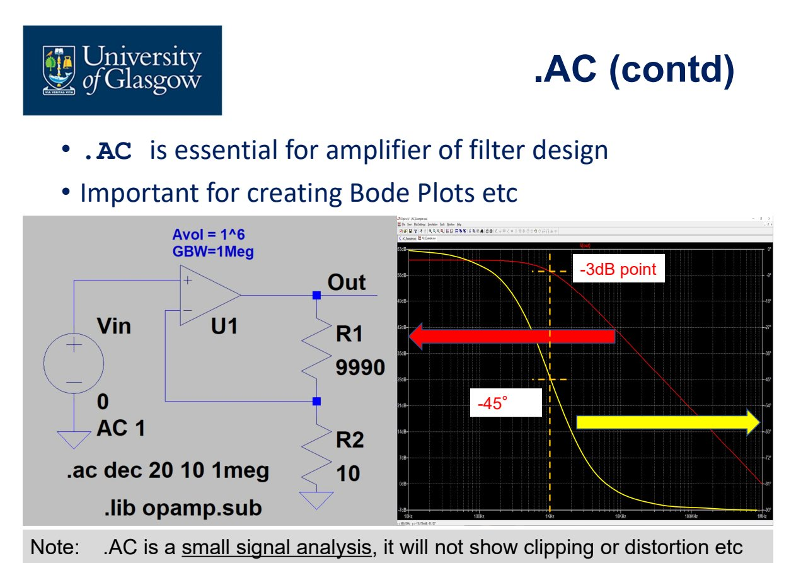

# Lec.2 SPICE Analysis Types

> Source: `PPT/2/Lecture 2.1.2 Complement_SPICE Analysis.pdf`

这一讲的重点是：**不同 SPICE analysis 回答不同问题**。不要把 `.OP`、`.DC`、`.AC`、`.TRAN` 当成“换个按钮跑一下”。在 IC 设计里，选错 analysis type，得到的结果往往非常漂亮，但解释完全错误。

## 1. 总原则：先 DC，再复杂

模拟电路仿真通常应按这个顺序推进：

1. 先用手算估计关键节点电压、电流和工作区；
2. 用 `.OP` 确认 biasing 是否合理；
3. 再做 `.DC`、`.AC`、`.TRAN` 等更具体的分析；
4. 最后再碰 noise、distortion、temperature、options。

课程里的重要提醒可以浓缩成一句话：**SPICE 会给你答案，但你必须知道哪个答案才是正确答案。**

## 2. `.OP`：DC operating point

`.OP` 用来求电路的直流工作点。仿真时电容开路、 电感短路，求每个节点的 DC voltage 和器件 current。

适合使用 `.OP` 的情况：

- schematic 刚画完，检查节点电压是否符合预期；
- 检查电阻、电流源、电压源的单位是否写错，例如 `MEG` 和 `M` 混淆；
- 检查 MOSFET、BJT、diode 等是否过压、过流；
- 为 `.AC`、`.TRAN` 等分析建立初始偏置点。

不适合使用 `.OP` 的情况：

- 你完全不知道电路应该怎么工作；
- 想看 transfer function、timing、frequency response；
- 试图用 `.OP` 替代设计理解。

`.backanno` 的作用是把 `.OP` 结果反标到 schematic 上，方便快速检查节点电压和支路电流。

## 3. `.DC`：扫 DC 源

`.DC` 在一个或多个 DC source 上做 sweep，用于得到静态 transfer curve 或器件 I-V curve。

典型语法：

```text
.dc <srcnam> <Vstart> <Vstop> <Vincr>
```

适合使用 `.DC` 的情况：

- 扫 MOSFET 的 $I_D$-$V_{DS}$ 或 $I_D$-$V_{GS}$ 特性；
- 研究某个输入电压变化时输出如何变化；
- 找 output driver 的 operating envelope；
- 检查输入超过电源轨时的过载行为；
- 分析 CMOS logic 的 cross-over supply current。

需要注意：

- `.DC` 是静态大信号分析，不回答 timing 问题；
- 每个 sweep point 都重新计算工作点；
- 多个源同时 sweep 时很容易把结果解释错；
- 如果想看电路速度、settling、overshoot，要用 `.TRAN`。

## 4. `.TF`：小信号 DC transfer function

`.TF` 计算某个输出节点或支路电流相对某个独立源的小信号 DC 传递函数。

典型语法：

```text
.tf V(out) Vin
.tf I(Vsense) Vin
```

它适合用来测试 DC sensitivity，例如：

- 输出对 reference voltage 的灵敏度；
- 输出对 power supply 的 DC sensitivity，也就是低频 PSRR 思路；
- 在复杂 amplifier 中不破坏 bias 的前提下看某节点对输出的影响。

但 `.TF` 很容易误用：它不是拿来查节点电压的，节点电压用 `.OP`；它也不是完整频率响应，频率响应用 `.AC`。

## 5. `.AC`：小信号频域分析

`.AC` 是 analog IC 设计中最常用也最容易误解的分析之一。它的流程是：

1. 先求 DC operating point；
2. 在该工作点线性化所有非线性器件；
3. 用 small-signal model 在频域求解；
4. 输出 gain/phase 随 frequency 的变化。

典型语法：

```text
.ac dec 20 10 1meg
```

其中 `dec 20` 表示每 decade 取 20 个点，频率从 `10 Hz` 到 `1 MHz`。



适合使用 `.AC` 的情况：

- amplifier gain、bandwidth、phase margin；
- filter response；
- stability / compensation；
- Bode plot；
- pole-zero 对系统响应的影响。

不适合使用 `.AC` 的情况：

- 电路没有稳定 DC operating point；
- 关心 clipping、slew rate、overload、distortion；
- 输入信号太大，已经不是 small-signal；
- 还没理解 poles and zeros。

关键句：**`.AC` 是 small-signal analysis，不会显示 clipping 或 nonlinear distortion。**

## 6. `.TRAN`：transient analysis

`.TRAN` 计算电路随时间变化的响应，是最接近“示波器看波形”的分析。

典型语法：

```text
.tran <Tstep> <Tstop> [Tstart [dTmax]]
```

适合使用 `.TRAN` 的情况：

- power-up / switch-on behavior；
- overload recovery；
- load transient；
- settling time；
- digital switching waveform；
- op-amp input inversion 等动态异常。

需要特别小心：

- `.TRAN` 很强，但 convergence problem 会更明显；
- 如果不知道电路应该怎么动，很难判断波形是否可信；
- transient model 对 overload、temperature、parasitics 很敏感；
- 时间步长太粗会漏掉尖峰，太细又会极慢。

`.TRAN` 给的是动态趋势和时域行为，不要拿它替代 `.AC` 的精确 small-signal frequency response。

## 7. `.TEMP` / `.STEP TEMP`：温度扫描

`.TEMP` 是较旧写法，更推荐用：

```text
.step temp list -40 25 85
```

它用来观察温度变化对电路性能的影响。但温度仿真的前提是模型支持温度参数，而且你理解 global temperature 和 local device self-heating 的区别。

适合：

- 检查温漂；
- 验证温度范围内的 bias 和 gain；
- 比较不同温度下 reference、amplifier、oscillator 等性能。

不适合：

- 模型来源不清楚；
- 模型没有温度参数；
- 想靠仿真“自动”解决温度设计问题。

## 8. `.NOISE`：噪声频谱

`.NOISE` 是频域分析，计算 Johnson noise、shot noise、flicker noise 等对输出的贡献，结果通常以 noise spectral density 表示，例如 $\mathrm{nV}/\sqrt{\mathrm{Hz}}$。

典型语法：

```text
.noise V(out) Vin dec 20 1 1meg
```

它适合：

- 分析 resistor network 的噪声；
- 估算 ADC/DAC 前端或放大器的 noise contribution；
- 把 output-referred noise 除以 gain 换成 input-referred noise。

但 noise simulation 很容易“看起来很科学”。如果你不知道主要噪声源应来自哪里，不理解 bandwidth integration，不了解模型是否包含 flicker/noise 参数，结果就很难解释。

## 9. `.FOUR`：谐波/失真后处理

`.FOUR` 在 transient analysis 后对结果做 Fourier analysis，用来观察 harmonic distortion。现代工具中，waveform viewer 的 FFT 往往更直观。

适合：

- amplifier linearity；
- distortion source debug；
- filter distortion；
- 周期信号的 harmonic content。

不适合：

- 不理解 Fourier series；
- 想让 SPICE 自动告诉你“为什么失真”；
- transient 还没设置好就急着做 distortion。

## 10. `.OPTIONS`：不要轻易动 solver

`.OPTIONS` 会改变 SPICE solver 的精度、收敛策略或矩阵求解方式。它可以帮助某些难收敛电路跑起来，但也可能掩盖真正的电路问题。

使用原则：

- 先检查电路连接、单位、模型、bias；
- 再检查初始条件、source ramp、仿真时间步；
- 最后才考虑 options；
- 改 options 后要记录原因，不能把它当玄学开关。

## 11. Analysis type 速查表

| 想回答的问题 | 优先 analysis | 不要误用 |
|---|---|---|
| 节点 DC 电压/支路电流对不对 | `.OP` | 不要用它看频响或速度 |
| 输入慢慢变，输出静态怎么变 | `.DC` | 不要用它看 delay |
| 某节点对某源的 DC 小信号灵敏度 | `.TF` | 不要把它当 `.OP` |
| gain / phase / bandwidth / stability | `.AC` | 不要用它看 clipping |
| time-domain waveform / start-up / settling | `.TRAN` | 不要用它替代 Bode plot |
| 温度变化 | `.STEP TEMP` | 模型不可靠时别过度相信 |
| 噪声谱密度 | `.NOISE` | 不懂噪声源就别强行解释 |
| 谐波失真 | `.FOUR` 或 FFT | 不能自动定位失真原因 |

## 12. 本讲必须带走的结论

- `.OP` 是模拟仿真的地基，先确认 bias 再做复杂分析。
- `.AC` 是 small-signal，不看 clipping/distortion。
- `.TRAN` 是 time-domain，不等于精确频域分析。
- `.NOISE`、`.TEMP`、`.FOUR` 都依赖模型和设计理解。
- “近似估算”通常比“盲目的精确仿真”更有价值。
